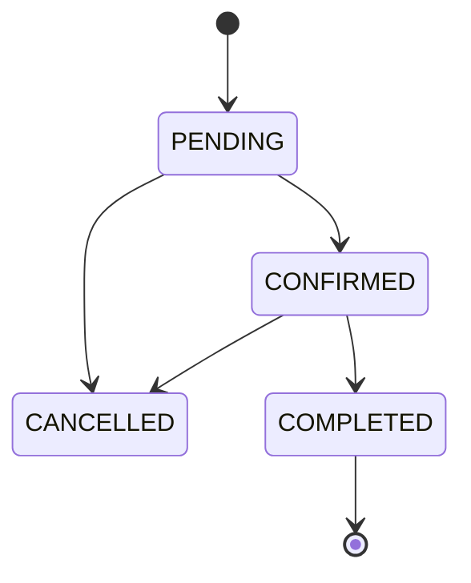

# {{EMOJI}} {{PROJECT_NAME}} — ERD 문서 v1.0

> **문서 버전:** v1.0
> **작성일:** YYYY-MM-DD
> **연관 문서:** 프로젝트 계획서 v1.0 / API 명세서 v1.0

---

## 목차
1. ERD 전체 다이어그램
2. 테이블 정의서
3. 관계 정의
4. 상태 코드 정의
5. 변경 내역
6. 설계 결정 사항 & 주의사항

---

## 1. ERD 전체 다이어그램

```mermaid
erDiagram
    {{ENTITY_1}} ||--o{ {{ENTITY_2}} : "1:N 관계명"
    {{ENTITY_1}} {
        BIGINT id PK
        VARCHAR name
        DATETIME created_at
    }
    {{ENTITY_2}} {
        BIGINT id PK
        BIGINT {{ENTITY_1_id}} FK
        VARCHAR status
    }
```

---

## 2. 테이블 정의서

### 2.1 {{ENTITY_1}} — {{한글 설명}}

| 컬럼 | 타입 | NULL | 기본값 | PK/FK/UK | 설명 |
| --- | --- | --- | --- | --- | --- |
| id | BIGINT | N | AUTO_INCREMENT | PK | |
| name | VARCHAR(100) | N | — | | |
| status | VARCHAR(20) | N | 'ACTIVE' | | 상태코드: 섹션 4 참조 |
| created_at | DATETIME | N | CURRENT_TIMESTAMP | | |
| updated_at | DATETIME | Y | NULL | | |

**인덱스**
- `idx_{entity}_status` ON (status)
- `uk_{entity}_name` UNIQUE ON (name)

---

### 2.2 {{ENTITY_2}} — ...

| 컬럼 | 타입 | NULL | 기본값 | PK/FK/UK | 설명 |
| --- | --- | --- | --- | --- | --- |
| id | BIGINT | N | AUTO_INCREMENT | PK | |
| ... | ... | ... | ... | ... | ... |

---

<!-- 필요한 만큼 복제 -->

---

## 3. 관계 정의

### 3.1 관계 목록

| 부모 | 자식 | 카디널리티 | 의미 |
| --- | --- | --- | --- |
| {{ENTITY_1}} | {{ENTITY_2}} | 1:N | ... |

### 3.2 외래 키(FK) 목록

| 자식 테이블 | FK 컬럼 | 참조 테이블 | 참조 컬럼 | ON DELETE | ON UPDATE |
| --- | --- | --- | --- | --- | --- |
| {{ENTITY_2}} | {{ENTITY_1}}_id | {{ENTITY_1}} | id | RESTRICT | CASCADE |

---

## 4. 상태 코드 정의

### 4.1 {{ENTITY}}.status 상태 흐름



### 4.2 상태별 상세 정의

| 상태 | 설명 | 다음 상태 | 전이 트리거 | 전이 권한 |
| --- | --- | --- | --- | --- |
| PENDING | 생성 직후 | CONFIRMED, CANCELLED | ... | {{ROLE}} |
| CONFIRMED | 확정 | COMPLETED, CANCELLED | ... | {{ROLE}} |
| COMPLETED | 완료 | - | - | - |
| CANCELLED | 취소 | - | - | - |

### 4.3 Role 코드

| 코드 | 설명 | 주요 권한 |
| --- | --- | --- |
| ROLE_ADMIN | 관리자 | 전체 CRUD |
| ROLE_{{X}} | ... | ... |

---

## 5. v0 → v1.0 변경 내역

- 초기 작성

---

## 6. 설계 결정 사항 & 주의사항

### 6.1 핵심 설계 결정
1. **{{결정 1}}** — 근거: ...
2. **{{결정 2}}** — 근거: ...

### 6.2 MVP 범위에서 의도적으로 제외한 설계 요소
- {{제외 1}} — 이유
- {{제외 2}} — 이유

### 6.3 인덱스 권장사항
- 조회 빈도 높은 컬럼: ...
- 복합 인덱스: ...

### 6.4 JPA 엔티티 패키지 구조 (권장)

```
com.example.{{project}}.domain
├── {{entity1}}/
│   ├── {{Entity1}}.java
│   └── {{Entity1}}Repository.java
└── {{entity2}}/
    ├── {{Entity2}}.java
    └── {{Entity2}}Repository.java
```

---

## 📋 전체 테이블 요약

| # | 테이블 | 설명 | 주요 FK |
| --- | --- | --- | --- |
| 1 | {{ENTITY_1}} | ... | - |
| 2 | {{ENTITY_2}} | ... | {{ENTITY_1}}_id |

---

## 7. BaseEntity (공통 Audit 컬럼) 패턴

> 모든 엔티티에 공통으로 적용하는 생성일·수정일 자동 관리 패턴.

```java
// Lead가 작성하고 팀 전체가 상속받는다
@MappedSuperclass
@EntityListeners(AuditingEntityListener.class)
@Getter
public abstract class BaseEntity {

    @CreatedDate
    @Column(updatable = false)
    private LocalDateTime createdAt;

    @LastModifiedDate
    private LocalDateTime updatedAt;
}

// 사용 예
@Entity
public class {{Entity}} extends BaseEntity {
    @Id @GeneratedValue(strategy = GenerationType.IDENTITY)
    private Long id;
    // ...
}

// Application 클래스에 활성화
@EnableJpaAuditing  // ← 필수
@SpringBootApplication
public class {{Project}}Application { ... }
```

**DB 컬럼 기준**

| 컬럼 | 타입 | NULL | 기본값 | 설명 |
| --- | --- | --- | --- | --- |
| created_at | DATETIME(6) | N | CURRENT_TIMESTAMP(6) | 자동 삽입 |
| updated_at | DATETIME(6) | Y | NULL | 자동 갱신 |

---

## 8. 소프트 딜리트 (Soft Delete) 전략

> 데이터를 실제로 삭제하지 않고 `deleted_at` 컬럼으로 논리 삭제하는 전략.
> **핵심 도메인 엔티티**({{예: Member, {{ENTITY_1}}}})에 적용 여부를 킥오프 시 결정한다.

### 8.1 적용 여부 결정 기준

| 기준 | 소프트 딜리트 권장 | 하드 딜리트 권장 |
| --- | --- | --- |
| 삭제 후 복구 필요 | ✅ | |
| 감사(Audit) 이력 필요 | ✅ | |
| 단순 임시 데이터 | | ✅ |
| 연관 FK 복잡도 낮음 | | ✅ |

### 8.2 구현 방법 (적용 시)

```java
@Entity
@SQLRestriction("deleted_at IS NULL")  // 조회 시 자동 필터
public class {{Entity}} extends BaseEntity {

    @Column
    private LocalDateTime deletedAt;

    public void softDelete() {
        this.deletedAt = LocalDateTime.now();
    }
}

// 실제 삭제 대신 softDelete() 호출
@Transactional
public void delete(Long id) {
    {{Entity}} entity = repository.findById(id)
        .orElseThrow(() -> new BusinessException(ErrorCode.NOT_FOUND));
    entity.softDelete();  // deleted_at 세팅, DB는 유지
}
```

---

## 9. 인덱스 전략 가이드

> 조회 성능에 직접 영향. 킥오프 시 Lead + 각 Dev가 함께 결정.

### 9.1 인덱스 설계 원칙

| 원칙 | 설명 |
| --- | --- |
| **조회 빈도** | 자주 WHERE / ORDER BY에 쓰이는 컬럼에 인덱스 추가 |
| **카디널리티** | 카디널리티가 높을수록(다양한 값) 인덱스 효과 큼 |
| **복합 인덱스** | 자주 함께 쓰이는 컬럼은 복합 인덱스로 묶음. 순서: 동등 조건 먼저 |
| **쓰기 비용** | 인덱스가 많을수록 INSERT/UPDATE 성능 저하. 필요한 것만 |
| **페이징 성능** | `ORDER BY created_at DESC` + `LIMIT` 패턴은 `(created_at)` 인덱스 필수 |

### 9.2 이 프로젝트 핵심 인덱스

| 테이블 | 컬럼 | 인덱스 종류 | 이유 |
| --- | --- | --- | --- |
| member | email | UNIQUE | 로그인·중복 검증 |
| {{ENTITY_1}} | status | INDEX | 상태별 목록 조회 빈번 |
| {{ENTITY_1}} | created_at | INDEX | 최신순 정렬·페이징 |
| {{ENTITY_2}} | {{ENTITY_1}}_id | INDEX | FK 조회 (JPA 연관관계) |
| {{ENTITY_2}} | (status, created_at) | 복합 INDEX | 상태별 최신순 정렬 |

---

## 📌 변경 이력

| 버전 | 날짜 | 작성자 | 주요 변경 |
| --- | --- | --- | --- |
| v1.0 | YYYY-MM-DD | Lead | 초기 작성 |
