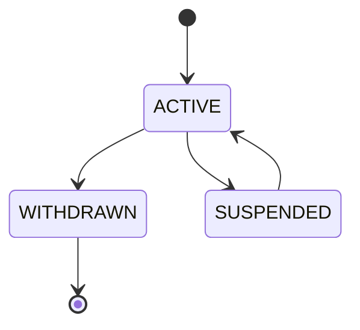
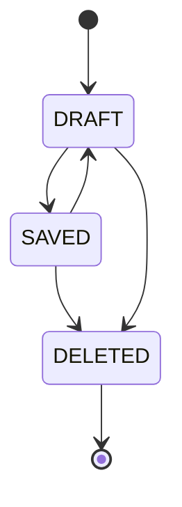
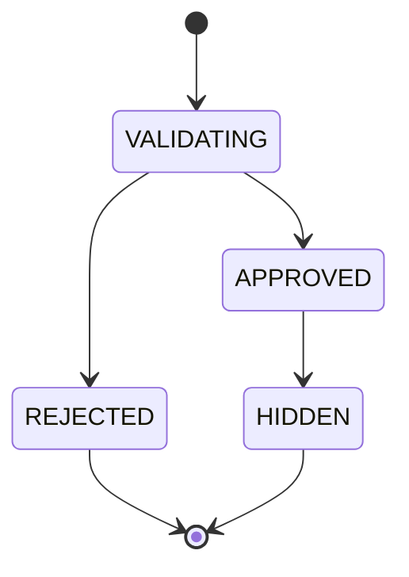

# QT-AI — ERD 문서 v2.0

> **문서 버전:** v2.0  
> **작성일:** 2026-05-17  
> **연관 문서:** 01.요구사항명세서_현재완성v1.md

---

## 목차
1. ERD 전체 다이어그램
2. 테이블 정의서
3. 관계 정의
4. 상태 코드 정의
5. 변경 내역
6. 설계 결정 사항 & 주의사항
7. 전체 테이블 요약
8. BaseEntity 및 삭제 전략
9. 인덱스 전략

---

## 1. ERD 전체 다이어그램

```mermaid
erDiagram
    members ||--o{ member_auth_providers : "소셜 인증"
    members ||--o{ notes : "작성"
    members ||--o{ sharing_posts : "공유"
    members ||--o{ comments : "댓글 작성"
    members ||--o{ likes : "좋아요"
    members ||--o{ reports : "신고"
    members ||--o{ notifications : "알림 수신"
    members ||--o{ member_praise_songs : "찬양 저장"
    members ||--o{ ai_qa_requests : "AI 질문"
    members ||--o{ member_mission_progress : "미션 진행"

    bible_books ||--o{ bible_verses : "절"
    qt_passages ||--o{ qt_passage_verses : "QT 포함 절"
    bible_verses ||--o{ qt_passage_verses : "QT 매핑"
    bible_verses ||--o{ verse_explanations : "해설"
    bible_verses ||--o{ glossary_terms : "용어"
    bible_verses ||--o{ commentary_material_verses : "주석 절 매핑"
    commentary_sources ||--o{ commentary_materials : "생성용 주석 출처"
    commentary_materials ||--o{ commentary_material_verses : "주석 포함 절"
    qt_passages ||--o{ simulator_clips : "시뮬레이터"
    qt_passages ||--o{ notes : "묵상 노트 연결"

    notes ||--o{ note_verses : "선택 구절"
    bible_verses ||--o{ note_verses : "노트 연결"
    notes ||--o| sharing_posts : "나눔 게시"
    sharing_posts ||--o{ comments : "댓글"
    sharing_posts ||--o{ likes : "좋아요"
    sharing_posts ||--o{ reports : "게시글 신고"
    notices ||--o{ notifications : "공지 알림"

    praise_songs ||--o{ member_praise_songs : "사용자 저장"
    mission_definitions ||--o{ member_mission_progress : "진행률"
    ai_prompt_versions ||--o{ ai_generation_jobs : "생성 지시 버전"
    ai_generation_jobs ||--o{ ai_generated_assets : "생성 결과"
    ai_generated_assets ||--o{ ai_validation_logs : "검증 로그"
    validation_reference_jobs ||--o{ ai_validation_logs : "검증 참조 작업"
    ai_validation_checklist_versions ||--o{ ai_validation_logs : "체크리스트 버전"
    ai_qa_requests ||--o{ ai_generated_assets : "Q&A 응답 산출물"
    ai_qa_requests ||--o{ reports : "Q&A 신고"
    ai_generated_assets ||--o{ reports : "AI 산출물 신고"
    ai_evaluation_sets ||--o{ ai_evaluation_cases : "평가 케이스"
    simulator_component_library_versions ||--o{ simulator_clips : "라이브러리 버전"

    admin_users ||--o{ notices : "공지 발행"
    admin_users ||--o{ reports : "신고 처리"
    admin_users ||--o{ ai_validation_checklist_versions : "체크리스트 작성"
    admin_users ||--o{ ai_evaluation_cases : "평가 케이스 검토"
    admin_users ||--o{ audit_logs : "관리자 감사"
    service_accounts ||--o{ audit_logs : "시스템 감사"

    members {
        BIGINT id PK
        VARCHAR nickname UK
        VARCHAR role
        VARCHAR status
        DATETIME withdrawn_at
    }
    member_auth_providers {
        BIGINT id PK
        BIGINT member_id FK
        VARCHAR provider
        VARCHAR provider_user_id UK
    }
    bible_books {
        SMALLINT id PK
        VARCHAR code UK
        VARCHAR korean_name
        SMALLINT display_order UK
    }
    bible_verses {
        BIGINT id PK
        SMALLINT book_id FK
        SMALLINT chapter_no
        SMALLINT verse_no
        TEXT korean_text
        TEXT english_text
    }
    qt_passages {
        BIGINT id PK
        DATE qt_date UK
        BIGINT start_verse_id FK
        BIGINT end_verse_id FK
        VARCHAR status
    }
    qt_passage_verses {
        BIGINT id PK
        BIGINT qt_passage_id FK
        BIGINT bible_verse_id FK
        SMALLINT display_order
    }
    verse_explanations {
        BIGINT id PK
        BIGINT bible_verse_id FK
        BIGINT ai_asset_id FK
        VARCHAR status
    }
    glossary_terms {
        BIGINT id PK
        BIGINT bible_verse_id FK
        VARCHAR term
        VARCHAR status
    }
    commentary_sources {
        BIGINT id PK
        VARCHAR source_key UK
        VARCHAR usage_type
        VARCHAR access_level
    }
    commentary_materials {
        BIGINT id PK
        BIGINT source_id FK
        VARCHAR refs
        VARCHAR content_hash
        VARCHAR status
    }
    commentary_material_verses {
        BIGINT id PK
        BIGINT commentary_material_id FK
        BIGINT bible_verse_id FK
        VARCHAR match_type
    }
    simulator_clips {
        BIGINT id PK
        BIGINT qt_passage_id FK
        BIGINT ai_asset_id FK
        BIGINT component_library_version_id FK
        JSON scene_script_json
        VARCHAR status
    }
    notes {
        BIGINT id PK
        BIGINT member_id FK
        BIGINT qt_passage_id FK
        VARCHAR category
        VARCHAR status
        VARCHAR visibility
    }
    note_verses {
        BIGINT id PK
        BIGINT note_id FK
        BIGINT bible_verse_id FK
        SMALLINT display_order
    }
    sharing_posts {
        BIGINT id PK
        BIGINT note_id FK_UK
        BIGINT member_id FK
        VARCHAR nickname_snapshot
        VARCHAR title_snapshot
        JSON verse_snapshot_json
        VARCHAR status
    }
    comments {
        BIGINT id PK
        BIGINT sharing_post_id FK
        BIGINT member_id FK
        VARCHAR status
    }
    likes {
        BIGINT id PK
        BIGINT sharing_post_id FK
        BIGINT member_id FK
    }
    reports {
        BIGINT id PK
        BIGINT reporter_member_id FK
        VARCHAR target_type
        BIGINT target_id
        VARCHAR status
    }
    notifications {
        BIGINT id PK
        BIGINT member_id FK
        BIGINT notice_id FK
        DATETIME read_at
    }
    notices {
        BIGINT id PK
        BIGINT admin_user_id FK
        VARCHAR status
        DATETIME published_at
    }
    praise_songs {
        BIGINT id PK
        VARCHAR title
        VARCHAR source_type
        VARCHAR status
    }
    member_praise_songs {
        BIGINT id PK
        BIGINT member_id FK
        BIGINT praise_song_id FK
        VARCHAR device_song_key
    }
    mission_definitions {
        BIGINT id PK
        VARCHAR code UK
        VARCHAR metric_type
        VARCHAR status
    }
    member_mission_progress {
        BIGINT id PK
        BIGINT member_id FK
        BIGINT mission_definition_id FK
        DATE period_start_date
        DECIMAL progress_rate
    }
    ai_prompt_versions {
        BIGINT id PK
        VARCHAR prompt_type
        VARCHAR version
        VARCHAR content_hash
        VARCHAR status
    }
    ai_generation_jobs {
        BIGINT id PK
        BIGINT prompt_version_id FK
        VARCHAR job_type
        VARCHAR target_type
        VARCHAR status
    }
    ai_generated_assets {
        BIGINT id PK
        BIGINT generation_job_id FK
        VARCHAR asset_type
        VARCHAR target_type
        BIGINT target_id
        VARCHAR status
    }
    validation_reference_jobs {
        BIGINT id PK
        VARCHAR source_file_hash
        VARCHAR status
        DATETIME expires_at
    }
    ai_validation_logs {
        BIGINT id PK
        BIGINT ai_asset_id FK
        BIGINT validation_reference_job_id FK
        BIGINT checklist_version_id FK
        TINYINT layer
        VARCHAR result
    }
    ai_qa_requests {
        BIGINT id PK
        BIGINT member_id FK
        BIGINT bible_verse_id FK
        BIGINT qa_response_asset_id FK
        VARCHAR status
    }
    admin_users {
        BIGINT id PK
        BIGINT member_id FK_UK
        VARCHAR admin_role
        VARCHAR status
    }
    audit_logs {
        BIGINT id PK
        BIGINT admin_user_id FK
        VARCHAR actor_type
        BIGINT actor_id
        VARCHAR action_type
        VARCHAR target_type
    }
    ai_validation_checklist_versions {
        BIGINT id PK
        VARCHAR checklist_type
        VARCHAR version
        VARCHAR content_hash
        VARCHAR status
    }
    ai_evaluation_sets {
        BIGINT id PK
        VARCHAR eval_type
        VARCHAR version
        VARCHAR status
    }
    ai_evaluation_cases {
        BIGINT id PK
        BIGINT evaluation_set_id FK
        VARCHAR target_type
        VARCHAR source_type
        VARCHAR status
    }
    service_accounts {
        BIGINT id PK
        VARCHAR account_name UK
        VARCHAR account_type
        VARCHAR status
    }
    simulator_component_library_versions {
        BIGINT id PK
        VARCHAR version UK
        VARCHAR content_hash
        VARCHAR status
    }
```

---

## 2. 테이블 정의서

### 2.1 members — 회원

| 컬럼 | 타입 | NULL | 기본값 | PK/FK/UK | 설명 |
| --- | --- | --- | --- | --- | --- |
| id | BIGINT | N | AUTO_INCREMENT | PK | 회원 ID |
| nickname | VARCHAR(30) | N | - | UK | 나눔 공간에 노출되는 닉네임 |
| role | VARCHAR(20) | N | 'USER' | | USER, ADMIN, SYSTEM |
| status | VARCHAR(20) | N | 'ACTIVE' | | ACTIVE, WITHDRAWN, SUSPENDED |
| tutorial_completed_at | DATETIME(6) | Y | NULL | | 첫 실행 튜토리얼 완료 시각 |
| withdrawn_at | DATETIME(6) | Y | NULL | | 탈퇴 처리 시각 |
| legal_retention_until | DATETIME(6) | Y | NULL | | 법적 보존 종료 예정일 |
| created_at | DATETIME(6) | N | CURRENT_TIMESTAMP(6) | | 생성 시각 |
| updated_at | DATETIME(6) | Y | NULL | | 수정 시각 |

**인덱스**
- `uk_members_nickname` UNIQUE ON (nickname)
- `idx_members_status` ON (status)
- `idx_members_legal_retention_until` ON (legal_retention_until)

---

### 2.2 member_auth_providers — 회원 소셜 인증

| 컬럼 | 타입 | NULL | 기본값 | PK/FK/UK | 설명 |
| --- | --- | --- | --- | --- | --- |
| id | BIGINT | N | AUTO_INCREMENT | PK | 인증 ID |
| member_id | BIGINT | N | - | FK | members.id |
| provider | VARCHAR(20) | N | 'KAKAO' | | KAKAO 우선, 후속 GOOGLE/APPLE 가능 |
| provider_user_id | VARCHAR(100) | N | - | UK | 공급자 회원 식별자 |
| connected_at | DATETIME(6) | N | CURRENT_TIMESTAMP(6) | | 연결 시각 |
| created_at | DATETIME(6) | N | CURRENT_TIMESTAMP(6) | | 생성 시각 |
| updated_at | DATETIME(6) | Y | NULL | | 수정 시각 |

**인덱스**
- `uk_auth_provider_user` UNIQUE ON (provider, provider_user_id)
- `idx_auth_member_id` ON (member_id)

---

### 2.3 bible_books — 성경 권

| 컬럼 | 타입 | NULL | 기본값 | PK/FK/UK | 설명 |
| --- | --- | --- | --- | --- | --- |
| id | SMALLINT | N | - | PK | 성경 권 ID |
| testament | VARCHAR(10) | N | - | | OLD, NEW |
| code | VARCHAR(20) | N | - | UK | 예: GENESIS, MATTHEW |
| korean_name | VARCHAR(30) | N | - | | 한글 권명 |
| english_name | VARCHAR(50) | N | - | | 영문 권명 |
| display_order | SMALLINT | N | - | UK | 정렬 순서 |

---

### 2.4 bible_verses — 성경 절

| 컬럼 | 타입 | NULL | 기본값 | PK/FK/UK | 설명 |
| --- | --- | --- | --- | --- | --- |
| id | BIGINT | N | AUTO_INCREMENT | PK | 절 ID |
| book_id | SMALLINT | N | - | FK | bible_books.id |
| chapter_no | SMALLINT | N | - | | 장 |
| verse_no | SMALLINT | N | - | | 절 |
| korean_text | TEXT | N | - | | 저작권 문제 없는 한글 본문 |
| english_text | TEXT | N | - | | 저작권 문제 없는 영어 본문 |
| created_at | DATETIME(6) | N | CURRENT_TIMESTAMP(6) | | 생성 시각 |
| updated_at | DATETIME(6) | Y | NULL | | 수정 시각 |

**인덱스**
- `uk_bible_verse_coord` UNIQUE ON (book_id, chapter_no, verse_no)
- `idx_bible_verses_book_chapter` ON (book_id, chapter_no)

**본문 데이터 적재 정책**
- 한글 본문은 `88.json`의 개역한글(KRV)을 사용한다.
- 영어 본문은 `KJV.json`의 King James Version을 사용한다.
- 두 파일은 원본 JSON 구조가 다르므로, 적재 시 `book_order + chapter_no + verse_no` 좌표를 기준으로 병합해 `bible_verses.korean_text`, `bible_verses.english_text`에 저장한다.
- 앱 화면에서는 원본 JSON을 직접 조회하지 않고, 정규화된 `bible_verses`를 조회한다.

---

### 2.5 qt_passages — 오늘의 QT 본문

| 컬럼 | 타입 | NULL | 기본값 | PK/FK/UK | 설명 |
| --- | --- | --- | --- | --- | --- |
| id | BIGINT | N | AUTO_INCREMENT | PK | QT 본문 ID |
| qt_date | DATE | N | - | UK | QT 날짜 |
| title | VARCHAR(100) | Y | NULL | | 운영자 입력 제목 |
| start_verse_id | BIGINT | N | - | FK | 시작 절 |
| end_verse_id | BIGINT | N | - | FK | 종료 절 |
| status | VARCHAR(20) | N | 'DRAFT' | | DRAFT, PUBLISHED, HIDDEN |
| published_at | DATETIME(6) | Y | NULL | | 게시 시각 |
| created_at | DATETIME(6) | N | CURRENT_TIMESTAMP(6) | | 생성 시각 |
| updated_at | DATETIME(6) | Y | NULL | | 수정 시각 |

**인덱스**
- `uk_qt_passages_date` UNIQUE ON (qt_date)
- `idx_qt_passages_status_date` ON (status, qt_date)

---

### 2.6 qt_passage_verses — QT 본문 절 매핑

| 컬럼 | 타입 | NULL | 기본값 | PK/FK/UK | 설명 |
| --- | --- | --- | --- | --- | --- |
| id | BIGINT | N | AUTO_INCREMENT | PK | 매핑 ID |
| qt_passage_id | BIGINT | N | - | FK | qt_passages.id |
| bible_verse_id | BIGINT | N | - | FK | bible_verses.id |
| display_order | SMALLINT | N | - | | QT 내 절 표시 순서 |

**인덱스**
- `uk_qt_passage_verse` UNIQUE ON (qt_passage_id, bible_verse_id)
- `idx_qt_passage_verses_order` ON (qt_passage_id, display_order)

---

### 2.7 verse_explanations — 절별 해설

| 컬럼 | 타입 | NULL | 기본값 | PK/FK/UK | 설명 |
| --- | --- | --- | --- | --- | --- |
| id | BIGINT | N | AUTO_INCREMENT | PK | 해설 ID |
| bible_verse_id | BIGINT | N | - | FK | bible_verses.id |
| summary | VARCHAR(300) | Y | NULL | | 한 줄 요약 |
| explanation | TEXT | N | - | | 사용자 노출 해설 |
| source_label | VARCHAR(200) | N | - | | 사용자 노출용 출처 표기 |
| status | VARCHAR(20) | N | 'PENDING' | | PENDING, APPROVED, REJECTED, HIDDEN |
| ai_asset_id | BIGINT | Y | NULL | FK | ai_generated_assets.id |
| approved_at | DATETIME(6) | Y | NULL | | 검증 통과 시각 |
| created_at | DATETIME(6) | N | CURRENT_TIMESTAMP(6) | | 생성 시각 |
| updated_at | DATETIME(6) | Y | NULL | | 수정 시각 |

**인덱스**
- `idx_explanations_verse_status` ON (bible_verse_id, status)
- `idx_explanations_status` ON (status)

---

### 2.8 glossary_terms — 용어 풀이

| 컬럼 | 타입 | NULL | 기본값 | PK/FK/UK | 설명 |
| --- | --- | --- | --- | --- | --- |
| id | BIGINT | N | AUTO_INCREMENT | PK | 용어 ID |
| bible_verse_id | BIGINT | N | - | FK | bible_verses.id |
| term | VARCHAR(100) | N | - | | 본문 내 용어 |
| meaning | TEXT | N | - | | 풀이 |
| source_label | VARCHAR(200) | N | - | | 출처 표기 |
| status | VARCHAR(20) | N | 'APPROVED' | | APPROVED, HIDDEN |
| created_at | DATETIME(6) | N | CURRENT_TIMESTAMP(6) | | 생성 시각 |
| updated_at | DATETIME(6) | Y | NULL | | 수정 시각 |

**인덱스**
- `idx_glossary_verse_status` ON (bible_verse_id, status)

---

### 2.9 commentary_sources — 생성용 주석 출처

| 컬럼 | 타입 | NULL | 기본값 | PK/FK/UK | 설명 |
| --- | --- | --- | --- | --- | --- |
| id | BIGINT | N | AUTO_INCREMENT | PK | 주석 출처 ID |
| source_key | VARCHAR(80) | N | - | UK | 예: TYNDALE_OPEN_STUDY_NOTES |
| name | VARCHAR(150) | N | - | | 출처명 |
| product | VARCHAR(100) | Y | NULL | | 원본 상품/데이터셋명 |
| language | VARCHAR(10) | N | - | | eng, kor 등 |
| usage_type | VARCHAR(30) | N | 'GENERATION_INPUT' | | GENERATION_INPUT 우선 |
| license | VARCHAR(100) | Y | NULL | | 예: CC BY-SA 4.0 |
| attribution | TEXT | Y | NULL | | 출처 표기 문구 |
| access_level | VARCHAR(30) | N | 'INTERNAL' | | PUBLIC_ATTRIBUTION, INTERNAL, RESTRICTED |
| status | VARCHAR(20) | N | 'ACTIVE' | | ACTIVE, HIDDEN |
| created_at | DATETIME(6) | N | CURRENT_TIMESTAMP(6) | | 생성 시각 |
| updated_at | DATETIME(6) | Y | NULL | | 수정 시각 |

**인덱스**
- `uk_commentary_sources_key` UNIQUE ON (source_key)
- `idx_commentary_sources_usage_status` ON (usage_type, status)

> `refer.jsonl`의 Tyndale Open Study Notes처럼 생성 입력으로 사용할 주석 데이터의 출처와 라이선스, 출처 표기 문구를 관리한다.

---

### 2.10 commentary_materials — 생성용 주석 원문

| 컬럼 | 타입 | NULL | 기본값 | PK/FK/UK | 설명 |
| --- | --- | --- | --- | --- | --- |
| id | BIGINT | N | AUTO_INCREMENT | PK | 주석 원문 ID |
| source_id | BIGINT | N | - | FK | commentary_sources.id |
| external_id | VARCHAR(200) | N | - | | 원본 데이터 ID |
| material_type | VARCHAR(30) | N | - | | study_note, theme_note, profile 등 |
| refs | VARCHAR(100) | N | - | | 원본 참조 범위. 예: Gen.1.1-2.3 |
| book_code | VARCHAR(20) | N | - | | 원본 권 코드. 예: Gen |
| chapter_start | SMALLINT | N | - | | 시작 장 |
| verse_start | SMALLINT | N | - | | 시작 절 |
| chapter_end | SMALLINT | N | - | | 종료 장 |
| verse_end | SMALLINT | N | - | | 종료 절 |
| title | VARCHAR(200) | Y | NULL | | 원본 제목 |
| keywords_json | JSON | Y | NULL | | 원본 키워드 배열 |
| content_text | TEXT | N | - | | 생성 입력용 순수 텍스트 |
| content_html | TEXT | Y | NULL | | 원본 HTML |
| content_hash | VARCHAR(100) | N | - | | 중복/변경 감지용 해시 |
| status | VARCHAR(20) | N | 'ACTIVE' | | ACTIVE, HIDDEN |
| created_at | DATETIME(6) | N | CURRENT_TIMESTAMP(6) | | 생성 시각 |
| updated_at | DATETIME(6) | Y | NULL | | 수정 시각 |

**인덱스**
- `uk_commentary_material_source_external` UNIQUE ON (source_id, external_id)
- `idx_commentary_material_range` ON (book_code, chapter_start, verse_start, chapter_end, verse_end)
- `idx_commentary_material_status` ON (status)

> 이 테이블은 `refer.jsonl` 한 줄을 거의 그대로 보존하는 원문 단위 테이블이다. `Gen.1.1` 같은 단일 절 주석도, `Gen.1.1-2.3` 같은 범위 주석도 한 건으로 저장한다.

---

### 2.11 commentary_material_verses — 생성용 주석 절 매핑

| 컬럼 | 타입 | NULL | 기본값 | PK/FK/UK | 설명 |
| --- | --- | --- | --- | --- | --- |
| id | BIGINT | N | AUTO_INCREMENT | PK | 매핑 ID |
| commentary_material_id | BIGINT | N | - | FK | commentary_materials.id |
| bible_verse_id | BIGINT | N | - | FK | bible_verses.id |
| display_order | SMALLINT | N | - | | 원문 refs 범위 안에서의 절 순서 |
| match_type | VARCHAR(20) | N | 'RANGE_EXPANDED' | | EXACT, RANGE_EXPANDED |

**인덱스**
- `uk_commentary_material_verse` UNIQUE ON (commentary_material_id, bible_verse_id)
- `idx_commentary_material_verses_verse` ON (bible_verse_id)
- `idx_commentary_material_verses_material_order` ON (commentary_material_id, display_order)

> 범위 주석을 절별로 복사 저장하지 않고, 원문은 `commentary_materials`에 한 번만 저장한다. 특정 절의 해설 생성 시 이 매핑을 통해 해당 절에 걸친 단일 절 주석과 범위 주석을 함께 찾는다.

---

### 2.12 simulator_clips — QT 시뮬레이터 클립

| 컬럼 | 타입 | NULL | 기본값 | PK/FK/UK | 설명 |
| --- | --- | --- | --- | --- | --- |
| id | BIGINT | N | AUTO_INCREMENT | PK | 클립 ID |
| qt_passage_id | BIGINT | N | - | FK | qt_passages.id |
| title | VARCHAR(100) | N | - | | 클립 제목 |
| scene_script_json | JSON | N | - | | 검증된 장면 스크립트 |
| component_library_version_id | BIGINT | N | - | FK | simulator_component_library_versions.id |
| status | VARCHAR(20) | N | 'PENDING' | | PENDING, APPROVED, REJECTED, HIDDEN |
| ai_asset_id | BIGINT | Y | NULL | FK | ai_generated_assets.id |
| created_at | DATETIME(6) | N | CURRENT_TIMESTAMP(6) | | 생성 시각 |
| updated_at | DATETIME(6) | Y | NULL | | 수정 시각 |

**인덱스**
- `idx_simulator_qt_status` ON (qt_passage_id, status)
- `idx_simulator_component_version` ON (component_library_version_id)

> 시뮬레이터는 자유 형식 코드나 검증되지 않은 외부 자산을 직접 노출하지 않고, 승인된 컴포넌트 라이브러리 버전과 장면 스크립트를 기준으로 구성한다.
---

### 2.13 notes — 노트

| 컬럼 | 타입 | NULL | 기본값 | PK/FK/UK | 설명 |
| --- | --- | --- | --- | --- | --- |
| id | BIGINT | N | AUTO_INCREMENT | PK | 노트 ID |
| member_id | BIGINT | N | - | FK | 작성자 |
| category | VARCHAR(30) | N | - | | MEDITATION, SERMON, PRAYER, REPENTANCE, GRATITUDE |
| status | VARCHAR(20) | N | 'DRAFT' | | DRAFT, SAVED, DELETED |
| visibility | VARCHAR(20) | N | 'PRIVATE' | | PRIVATE, SHARED |
| title | VARCHAR(100) | Y | NULL | | 제목 |
| qt_passage_id | BIGINT | Y | NULL | FK | 묵상 노트 연결 QT |
| active_unique_key | VARCHAR(20) | Y | 'ACTIVE' | | 활성 묵상 노트 중복 방지용 키 |
| feeling | TEXT | Y | NULL | | 묵상 노트: 느낀 점 |
| memory_verse | TEXT | Y | NULL | | 묵상 노트: 기억할 구절 |
| application | TEXT | Y | NULL | | 묵상 노트: 적용할 점 |
| prayer | TEXT | Y | NULL | | 묵상 노트: 기도 |
| body | TEXT | Y | NULL | | 1섹션 노트 본문 |
| saved_at | DATETIME(6) | Y | NULL | | 저장 확정 시각 |
| deleted_at | DATETIME(6) | Y | NULL | | 논리 삭제 시각 |
| created_at | DATETIME(6) | N | CURRENT_TIMESTAMP(6) | | 생성 시각 |
| updated_at | DATETIME(6) | Y | NULL | | 수정 시각 |

**인덱스**
- `idx_notes_member_category_created` ON (member_id, category, created_at)
- `idx_notes_member_status` ON (member_id, status)
- `idx_notes_qt_passage` ON (qt_passage_id)
- `uk_notes_active_qt_meditation` UNIQUE ON (member_id, qt_passage_id, category, active_unique_key)

> 묵상 노트는 `category = MEDITATION`, `qt_passage_id IS NOT NULL`, `active_unique_key = 'ACTIVE'` 상태에서만 사용자별 QT 1건을 허용한다. 소프트 삭제 시 `deleted_at`을 세팅하고 `active_unique_key = NULL`로 변경하여 같은 QT 본문에 새 묵상 노트를 다시 작성할 수 있게 한다. 설교 노트와 개인 노트는 `qt_passage_id`가 없거나 카테고리가 달라 이 유니크 정책의 대상이 아니다.

---

### 2.14 note_verses — 노트 선택 구절

| 컬럼 | 타입 | NULL | 기본값 | PK/FK/UK | 설명 |
| --- | --- | --- | --- | --- | --- |
| id | BIGINT | N | AUTO_INCREMENT | PK | 매핑 ID |
| note_id | BIGINT | N | - | FK | notes.id |
| bible_verse_id | BIGINT | N | - | FK | bible_verses.id |
| display_order | SMALLINT | N | - | | 선택 순서 |

**인덱스**
- `idx_note_verses_note_order` ON (note_id, display_order)
- `uk_note_verse` UNIQUE ON (note_id, bible_verse_id)

---

### 2.15 sharing_posts — 닉네임 나눔 게시글

| 컬럼 | 타입 | NULL | 기본값 | PK/FK/UK | 설명 |
| --- | --- | --- | --- | --- | --- |
| id | BIGINT | N | AUTO_INCREMENT | PK | 게시글 ID |
| note_id | BIGINT | N | - | FK/UK | 원본 노트 ID |
| member_id | BIGINT | N | - | FK | 작성자 |
| nickname_snapshot | VARCHAR(30) | N | - | | 공유 시점 닉네임 |
| note_category_snapshot | VARCHAR(30) | N | - | | 공유 시점 노트 카테고리 |
| title_snapshot | VARCHAR(100) | Y | NULL | | 공유 시점 제목 |
| feeling_snapshot | TEXT | Y | NULL | | QT 노트 느낀 점 스냅샷 |
| memory_verse_snapshot | TEXT | Y | NULL | | QT 노트 기억할 구절 스냅샷 |
| application_snapshot | TEXT | Y | NULL | | QT 노트 적용할 점 스냅샷 |
| prayer_snapshot | TEXT | Y | NULL | | QT 노트 기도 스냅샷 |
| body_snapshot | TEXT | Y | NULL | | 자유 노트 본문 스냅샷 |
| verse_snapshot_json | JSON | Y | NULL | | 공유 시점 선택 구절 목록 |
| comments_enabled | BOOLEAN | N | TRUE | | 댓글 허용 여부 |
| status | VARCHAR(20) | N | 'PUBLISHED' | | PUBLISHED, HIDDEN, DELETED |
| source_note_deleted_at | DATETIME(6) | Y | NULL | | 원본 노트 삭제 감지 시각 |
| published_at | DATETIME(6) | N | CURRENT_TIMESTAMP(6) | | 게시 시각 |
| hidden_at | DATETIME(6) | Y | NULL | | 숨김 처리 시각 |
| created_at | DATETIME(6) | N | CURRENT_TIMESTAMP(6) | | 생성 시각 |
| updated_at | DATETIME(6) | Y | NULL | | 수정 시각 |

**인덱스**
- `uk_sharing_posts_note_id` UNIQUE ON (note_id)
- `idx_sharing_posts_status_published` ON (status, published_at)
- `idx_sharing_posts_member` ON (member_id)
- `idx_sharing_posts_source_deleted` ON (source_note_deleted_at)

**제약 정책**
- 나눔 게시글은 묵상 기록 공유 정책에 따라 QT 노트와 자유 노트 모두 생성할 수 있다.
- 공유 허용 카테고리는 `MEDITATION`, `SERMON`, `PRAYER`, `REPENTANCE`, `GRATITUDE`이다.
- 공유 대상 노트는 `notes.status = SAVED`, `notes.deleted_at IS NULL`이어야 한다.
- 공유 생성 시점에 원본 노트의 공개 대상 데이터를 스냅샷 컬럼에 복사한다.
- 원본 노트가 이후 수정되어도 공유글은 자동 변경되지 않는다.
- 원본 노트가 삭제되어도 공유글 노출 여부는 `sharing_posts.status`로 별도 관리한다.
---

### 2.16 comments — 댓글

| 컬럼 | 타입 | NULL | 기본값 | PK/FK/UK | 설명 |
| --- | --- | --- | --- | --- | --- |
| id | BIGINT | N | AUTO_INCREMENT | PK | 댓글 ID |
| sharing_post_id | BIGINT | N | - | FK | 게시글 |
| member_id | BIGINT | N | - | FK | 작성자 |
| body | TEXT | N | - | | 댓글 내용 |
| status | VARCHAR(20) | N | 'PUBLISHED' | | PUBLISHED, HIDDEN, DELETED |
| deleted_at | DATETIME(6) | Y | NULL | | 논리 삭제 시각 |
| created_at | DATETIME(6) | N | CURRENT_TIMESTAMP(6) | | 생성 시각 |
| updated_at | DATETIME(6) | Y | NULL | | 수정 시각 |

**인덱스**
- `idx_comments_post_created` ON (sharing_post_id, created_at)
- `idx_comments_member` ON (member_id)

---

### 2.17 likes — 좋아요

| 컬럼 | 타입 | NULL | 기본값 | PK/FK/UK | 설명 |
| --- | --- | --- | --- | --- | --- |
| id | BIGINT | N | AUTO_INCREMENT | PK | 좋아요 ID |
| sharing_post_id | BIGINT | N | - | FK | 게시글 |
| member_id | BIGINT | N | - | FK | 누른 회원 |
| created_at | DATETIME(6) | N | CURRENT_TIMESTAMP(6) | | 생성 시각 |

**인덱스**
- `uk_likes_post_member` UNIQUE ON (sharing_post_id, member_id)
- `idx_likes_member` ON (member_id)

---

### 2.18 reports — 신고

| 컬럼 | 타입 | NULL | 기본값 | PK/FK/UK | 설명 |
| --- | --- | --- | --- | --- | --- |
| id | BIGINT | N | AUTO_INCREMENT | PK | 신고 ID |
| reporter_member_id | BIGINT | N | - | FK | 신고자 |
| target_type | VARCHAR(30) | N | - | | POST, COMMENT, AI_QA_REQUEST, AI_ASSET |
| target_id | BIGINT | N | - | | 대상 ID |
| reason | VARCHAR(50) | N | - | | 신고 사유 코드 |
| detail | TEXT | Y | NULL | | 상세 내용 |
| status | VARCHAR(20) | N | 'RECEIVED' | | RECEIVED, REVIEWING, RESOLVED, REJECTED |
| processed_by_admin_id | BIGINT | Y | NULL | FK | 처리 관리자 |
| processed_at | DATETIME(6) | Y | NULL | | 처리 시각 |
| created_at | DATETIME(6) | N | CURRENT_TIMESTAMP(6) | | 생성 시각 |
| updated_at | DATETIME(6) | Y | NULL | | 수정 시각 |

**인덱스**
- `idx_reports_target` ON (target_type, target_id)
- `idx_reports_status_created` ON (status, created_at)
- `idx_reports_reporter` ON (reporter_member_id)
- `idx_reports_processed_admin` ON (processed_by_admin_id, processed_at)

**AI 신고 사유 코드**
- `FACT_ERROR`: 사실 오류
- `UNSAFE_ADVICE`: 위험하거나 부적절한 조언
- `UNSOURCED_ANSWER`: 출처 또는 근거 부족
- `POLICY_VIOLATION`: 정책 위반
---

### 2.19 notifications — 인앱 알림

| 컬럼 | 타입 | NULL | 기본값 | PK/FK/UK | 설명 |
| --- | --- | --- | --- | --- | --- |
| id | BIGINT | N | AUTO_INCREMENT | PK | 알림 ID |
| member_id | BIGINT | N | - | FK | 수신 회원 |
| type | VARCHAR(30) | N | - | | LIKE, COMMENT, REPORT_RESULT, NOTICE |
| title | VARCHAR(100) | N | - | | 알림 제목 |
| body | VARCHAR(500) | Y | NULL | | 알림 내용 |
| notice_id | BIGINT | Y | NULL | FK | 공지 알림인 경우 notices.id |
| link_type | VARCHAR(30) | Y | NULL | | 이동 대상 타입 |
| link_id | BIGINT | Y | NULL | | 이동 대상 ID |
| read_at | DATETIME(6) | Y | NULL | | 읽음 시각 |
| created_at | DATETIME(6) | N | CURRENT_TIMESTAMP(6) | | 생성 시각 |

**인덱스**
- `idx_notifications_member_read_created` ON (member_id, read_at, created_at)

---

### 2.20 notices — 공지사항

| 컬럼 | 타입 | NULL | 기본값 | PK/FK/UK | 설명 |
| --- | --- | --- | --- | --- | --- |
| id | BIGINT | N | AUTO_INCREMENT | PK | 공지 ID |
| admin_user_id | BIGINT | N | - | FK | 발행 관리자 |
| title | VARCHAR(120) | N | - | | 공지 제목 |
| body | TEXT | N | - | | 공지 내용 |
| status | VARCHAR(20) | N | 'DRAFT' | | DRAFT, PUBLISHED, HIDDEN |
| published_at | DATETIME(6) | Y | NULL | | 발행 시각 |
| created_at | DATETIME(6) | N | CURRENT_TIMESTAMP(6) | | 생성 시각 |
| updated_at | DATETIME(6) | Y | NULL | | 수정 시각 |

**인덱스**
- `idx_notices_status_published` ON (status, published_at)
- `idx_notices_admin_created` ON (admin_user_id, created_at)

> `notices`는 공지 원본이며, `notifications`는 특정 회원에게 전달된 알림 인스턴스다. 시스템 공지 발행 시 전체 또는 대상 회원에게 `notifications.type = NOTICE`를 생성하고 `notice_id`로 원본 공지를 연결한다.

---

### 2.21 praise_songs — 찬양 큐레이션 곡

| 컬럼 | 타입 | NULL | 기본값 | PK/FK/UK | 설명 |
| --- | --- | --- | --- | --- | --- |
| id | BIGINT | N | AUTO_INCREMENT | PK | 곡 ID |
| title | VARCHAR(100) | N | - | | 곡명 |
| artist | VARCHAR(100) | Y | NULL | | 아티스트 |
| source_type | VARCHAR(20) | N | 'CURATED' | | CURATED, DEVICE |
| license_note | VARCHAR(300) | Y | NULL | | 저작권 확인 메모 |
| status | VARCHAR(20) | N | 'ACTIVE' | | ACTIVE, HIDDEN |
| created_at | DATETIME(6) | N | CURRENT_TIMESTAMP(6) | | 생성 시각 |
| updated_at | DATETIME(6) | Y | NULL | | 수정 시각 |

**주의**
- 서버에는 가사와 음원 파일을 저장하지 않는다.
- 사용자 디바이스 음원은 로컬 재생만 수행하므로 서버에는 별도 파일 경로를 저장하지 않는다.

---

### 2.22 member_praise_songs — 내 찬양 목록

| 컬럼 | 타입 | NULL | 기본값 | PK/FK/UK | 설명 |
| --- | --- | --- | --- | --- | --- |
| id | BIGINT | N | AUTO_INCREMENT | PK | 저장 ID |
| member_id | BIGINT | N | - | FK | 회원 |
| praise_song_id | BIGINT | Y | NULL | FK | 큐레이션 곡 |
| device_song_key | VARCHAR(200) | Y | NULL | | 디바이스 음원 식별자 |
| display_title | VARCHAR(100) | N | - | | 목록 표시명 |
| created_at | DATETIME(6) | N | CURRENT_TIMESTAMP(6) | | 저장 시각 |

**인덱스**
- `idx_member_praise_member` ON (member_id, created_at)
- `uk_member_praise_curated` UNIQUE ON (member_id, praise_song_id)

---

### 2.23 mission_definitions — 미션 정의

| 컬럼 | 타입 | NULL | 기본값 | PK/FK/UK | 설명 |
| --- | --- | --- | --- | --- | --- |
| id | BIGINT | N | AUTO_INCREMENT | PK | 미션 ID |
| code | VARCHAR(50) | N | - | UK | 미션 코드 |
| title | VARCHAR(100) | N | - | | 미션명 |
| metric_type | VARCHAR(30) | N | - | | MEDITATION_SAVED_DAYS, NOTE_SAVED_COUNT, STREAK_DAYS |
| period_type | VARCHAR(20) | N | 'MONTHLY' | | DAILY, WEEKLY, MONTHLY |
| target_count | INT | N | - | | 달성 기준 수치 |
| status | VARCHAR(20) | N | 'ACTIVE' | | ACTIVE, HIDDEN |
| created_at | DATETIME(6) | N | CURRENT_TIMESTAMP(6) | | 생성 시각 |
| updated_at | DATETIME(6) | Y | NULL | | 수정 시각 |

**인덱스**
- `uk_mission_definitions_code` UNIQUE ON (code)
- `idx_mission_definitions_status` ON (status)

---

### 2.24 member_mission_progress — 회원 미션 진행률

| 컬럼 | 타입 | NULL | 기본값 | PK/FK/UK | 설명 |
| --- | --- | --- | --- | --- | --- |
| id | BIGINT | N | AUTO_INCREMENT | PK | 진행률 ID |
| member_id | BIGINT | N | - | FK | 회원 |
| mission_definition_id | BIGINT | N | - | FK | 미션 |
| period_start_date | DATE | N | - | | 집계 시작일 |
| period_end_date | DATE | N | - | | 집계 종료일 |
| current_count | INT | N | 0 | | 현재 달성 수치 |
| target_count_snapshot | INT | N | - | | 집계 당시 목표 수치 |
| progress_rate | DECIMAL(5,2) | N | 0.00 | | 0.00~100.00 |
| completed_at | DATETIME(6) | Y | NULL | | 달성 시각 |
| last_calculated_at | DATETIME(6) | Y | NULL | | 마지막 계산 시각 |
| created_at | DATETIME(6) | N | CURRENT_TIMESTAMP(6) | | 생성 시각 |
| updated_at | DATETIME(6) | Y | NULL | | 수정 시각 |

**인덱스**
- `uk_member_mission_period` UNIQUE ON (member_id, mission_definition_id, period_start_date)
- `idx_member_mission_member_period` ON (member_id, period_start_date, period_end_date)

**계산 기준**
- MVP 미션 진행률은 `notes.status = SAVED`, `notes.deleted_at IS NULL`인 저장 확정 노트만 집계한다.
- 묵상 습관 미션은 `category = MEDITATION`인 묵상 노트의 `saved_at` 날짜 기준으로 일별 1회만 인정한다.
- 설교/기도/회개/감사 노트 개수형 미션을 추가할 경우 `category`와 `saved_at` 기준으로 집계하되, 임시저장(`DRAFT`)은 제외한다.
- 진행률은 `LEAST(current_count / target_count_snapshot * 100, 100)`으로 계산한다.
- 소프트 삭제된 노트는 다음 재계산 시 진행률에서 제외한다.

---

### 2.25 ai_prompt_versions — AI 생성 지시 버전

| 컬럼 | 타입 | NULL | 기본값 | PK/FK/UK | 설명 |
| --- | --- | --- | --- | --- | --- |
| id | BIGINT | N | AUTO_INCREMENT | PK | 버전 ID |
| prompt_type | VARCHAR(30) | N | - | | EXPLANATION, SIMULATOR, QA |
| version | VARCHAR(30) | N | - | | 예: 2026.05.17-1 |
| content_hash | VARCHAR(100) | N | - | | 원문 해시 |
| status | VARCHAR(20) | N | 'ACTIVE' | | ACTIVE, RETIRED |
| created_at | DATETIME(6) | N | CURRENT_TIMESTAMP(6) | | 생성 시각 |

**인덱스**
- `uk_prompt_type_version` UNIQUE ON (prompt_type, version)

---

### 2.26 ai_generation_jobs — AI 사전 생성 작업

| 컬럼 | 타입 | NULL | 기본값 | PK/FK/UK | 설명 |
| --- | --- | --- | --- | --- | --- |
| id | BIGINT | N | AUTO_INCREMENT | PK | 작업 ID |
| job_type | VARCHAR(30) | N | - | | EXPLANATION, SIMULATOR, QA |
| target_type | VARCHAR(30) | N | - | | QT_PASSAGE, BIBLE_VERSE, QA_REQUEST |
| target_id | BIGINT | N | - | | 대상 ID |
| prompt_version_id | BIGINT | N | - | FK | 사용한 지시 버전 |
| status | VARCHAR(20) | N | 'QUEUED' | | QUEUED, RUNNING, SUCCEEDED, FAILED, CANCELLED |
| requested_by_admin_id | BIGINT | Y | NULL | FK | 수동 트리거 관리자 |
| started_at | DATETIME(6) | Y | NULL | | 시작 시각 |
| finished_at | DATETIME(6) | Y | NULL | | 종료 시각 |
| error_message | TEXT | Y | NULL | | 실패 사유 |
| created_at | DATETIME(6) | N | CURRENT_TIMESTAMP(6) | | 생성 시각 |
| updated_at | DATETIME(6) | Y | NULL | | 수정 시각 |

**인덱스**
- `idx_ai_jobs_status_created` ON (status, created_at)
- `idx_ai_jobs_target` ON (target_type, target_id)

> Q&A 응답도 실시간 단발 요청이지만 AI 생성 실행 이력이므로 `job_type = QA`, `target_type = QA_REQUEST`, `target_id = ai_qa_requests.id`인 생성 작업을 반드시 생성한다. 이를 통해 모든 AI 산출물이 `ai_generation_jobs.prompt_version_id`를 거쳐 생성 지시 버전을 추적할 수 있다.

---

### 2.27 ai_generated_assets — AI 생성 산출물

| 컬럼 | 타입 | NULL | 기본값 | PK/FK/UK | 설명 |
| --- | --- | --- | --- | --- | --- |
| id | BIGINT | N | AUTO_INCREMENT | PK | 산출물 ID |
| generation_job_id | BIGINT | N | - | FK | 생성 작업 |
| asset_type | VARCHAR(30) | N | - | | EXPLANATION, SUMMARY, GLOSSARY, SIMULATOR, QA_RESPONSE |
| target_type | VARCHAR(30) | N | - | | BIBLE_VERSE, QT_PASSAGE, QA_REQUEST |
| target_id | BIGINT | N | - | | 대상 ID |
| payload_json | JSON | N | - | | 산출물 원본 |
| status | VARCHAR(20) | N | 'VALIDATING' | | VALIDATING, APPROVED, REJECTED, HIDDEN |
| created_at | DATETIME(6) | N | CURRENT_TIMESTAMP(6) | | 생성 시각 |
| updated_at | DATETIME(6) | Y | NULL | | 수정 시각 |

**인덱스**
- `idx_ai_assets_target_status` ON (target_type, target_id, status)
- `idx_ai_assets_job` ON (generation_job_id)

> Q&A 응답은 `asset_type = QA_RESPONSE`로 저장하되, 반드시 `ai_generation_jobs`를 먼저 생성한 뒤 `generation_job_id`로 연결한다. 검증 실패 또는 차단된 Q&A는 사용자 노출 응답으로 확정하지 않는다.
---

### 2.28 validation_reference_jobs — 임시 검증용 주석 작업

| 컬럼 | 타입 | NULL | 기본값 | PK/FK/UK | 설명 |
| --- | --- | --- | --- | --- | --- |
| id | BIGINT | N | AUTO_INCREMENT | PK | 검증 참조 작업 ID |
| source_name | VARCHAR(150) | N | - | | 예: IVP 성경배경주석 |
| source_file_name | VARCHAR(255) | N | - | | 원본 파일명 |
| source_file_hash | VARCHAR(100) | N | - | | 원본 파일 해시 |
| storage_uri | VARCHAR(500) | Y | NULL | | 제한 저장소의 임시 파일 위치 |
| index_storage_uri | VARCHAR(500) | Y | NULL | | agent용 임시 색인 위치 |
| status | VARCHAR(20) | N | 'ACTIVE' | | ACTIVE, EXPIRED, DELETED |
| expires_at | DATETIME(6) | Y | NULL | | 삭제 예정 시각 |
| deleted_at | DATETIME(6) | Y | NULL | | 실제 삭제 시각 |
| created_at | DATETIME(6) | N | CURRENT_TIMESTAMP(6) | | 생성 시각 |
| updated_at | DATETIME(6) | Y | NULL | | 수정 시각 |

**인덱스**
- `idx_validation_reference_status_expires` ON (status, expires_at)
- `idx_validation_reference_hash` ON (source_file_hash)

> 검증용 IVP PDF 원문은 영구 주석 테이블에 넣지 않는다. 이 테이블은 agent가 검증 중 사용할 임시 파일/색인의 위치와 삭제 시점만 관리한다. 검증 완료 후 `storage_uri`, `index_storage_uri`의 실물 파일과 색인을 삭제하고 `status = DELETED`, `deleted_at`을 기록한다.

---

### 2.29 ai_validation_logs — AI 검증 로그

| 컬럼 | 타입 | NULL | 기본값 | PK/FK/UK | 설명 |
| --- | --- | --- | --- | --- | --- |
| id | BIGINT | N | AUTO_INCREMENT | PK | 검증 로그 ID |
| ai_asset_id | BIGINT | N | - | FK | 산출물 |
| validation_reference_job_id | BIGINT | Y | NULL | FK | 사용한 임시 검증용 주석 작업 |
| checklist_version_id | BIGINT | N | - | FK | ai_validation_checklist_versions.id |
| layer | TINYINT | N | - | | 1, 2, 3 |
| result | VARCHAR(20) | N | - | | PASSED, REJECTED, NEEDS_REVIEW |
| checklist_json | JSON | Y | NULL | | 체크리스트 결과 |
| reviewer_type | VARCHAR(20) | N | 'AUTO' | | AUTO, ADMIN, ADVISOR |
| reviewer_admin_id | BIGINT | Y | NULL | FK | 검토 관리자 |
| created_at | DATETIME(6) | N | CURRENT_TIMESTAMP(6) | | 검증 시각 |

**인덱스**
- `idx_validation_asset_layer` ON (ai_asset_id, layer)
- `idx_validation_result_created` ON (result, created_at)
- `idx_validation_reference_job` ON (validation_reference_job_id)
- `idx_validation_checklist_version` ON (checklist_version_id)

> `checklist_json`에는 검증 결과, 사용한 참조 자료명, 파일 해시, 짧은 판단 메모만 남긴다. 검증용 주석 원문 전체나 긴 본문 인용은 저장하지 않는다.
---

### 2.30 ai_qa_requests — 사실 기반 Q&A 요청

| 컬럼 | 타입 | NULL | 기본값 | PK/FK/UK | 설명 |
| --- | --- | --- | --- | --- | --- |
| id | BIGINT | N | AUTO_INCREMENT | PK | 질문 ID |
| member_id | BIGINT | N | - | FK | 질문자 |
| context_type | VARCHAR(20) | N | - | | QT, BIBLE |
| bible_verse_id | BIGINT | Y | NULL | FK | 질문 맥락 절 |
| question | VARCHAR(500) | N | - | | 단발 질문 |
| answer | TEXT | Y | NULL | | 검증 통과 응답 |
| source_label | VARCHAR(300) | Y | NULL | | 출처 표기 |
| qa_response_asset_id | BIGINT | Y | NULL | FK | 검증 로그와 연결되는 Q&A 응답 산출물 |
| status | VARCHAR(20) | N | 'REQUESTED' | | REQUESTED, ANSWERED, BLOCKED, FAILED |
| blocked_reason | VARCHAR(100) | Y | NULL | | 가치 판단형 등 차단 사유 |
| created_at | DATETIME(6) | N | CURRENT_TIMESTAMP(6) | | 요청 시각 |
| answered_at | DATETIME(6) | Y | NULL | | 응답 시각 |

**인덱스**
- `idx_ai_qa_member_created` ON (member_id, created_at)
- `idx_ai_qa_verse_created` ON (bible_verse_id, created_at)
- `idx_ai_qa_status_created` ON (status, created_at)

> Q&A 응답도 먼저 `ai_generation_jobs.job_type = QA` 생성 작업을 만들고, 그 결과를 `ai_generated_assets.asset_type = QA_RESPONSE`로 저장한다. 이후 `ai_validation_logs`의 1·2층 검증 로그를 남긴다. 검증 통과 후 `ai_qa_requests.qa_response_asset_id`를 연결하고 `answer`, `source_label`, `answered_at`을 확정한다. 차단된 질문은 `status = BLOCKED`와 `blocked_reason`만 남기며 사용자 노출 응답 산출물은 만들지 않는다.

---

### 2.31 admin_users — 관리자 계정

| 컬럼 | 타입 | NULL | 기본값 | PK/FK/UK | 설명 |
| --- | --- | --- | --- | --- | --- |
| id | BIGINT | N | AUTO_INCREMENT | PK | 관리자 ID |
| member_id | BIGINT | N | - | FK/UK | 연결 회원 |
| admin_role | VARCHAR(30) | N | 'OPERATOR' | | SUPER_ADMIN, OPERATOR, REVIEWER, CONTENT_CREATOR |
| status | VARCHAR(20) | N | 'ACTIVE' | | ACTIVE, DISABLED |
| created_at | DATETIME(6) | N | CURRENT_TIMESTAMP(6) | | 생성 시각 |
| updated_at | DATETIME(6) | Y | NULL | | 수정 시각 |

**역할 정책**
- `CONTENT_CREATOR`는 검증용 자료 제작 또는 내부 콘텐츠 제작 권한을 가진다.
- 일반 `OPERATOR`는 검증용 한국어 주석 원문에 직접 접근할 수 없다.
- 자동 배치나 검증 agent는 관리자 계정이 아니라 `service_accounts`로 관리한다.
---

### 2.32 audit_logs — 운영 감사 로그

| 컬럼 | 타입 | NULL | 기본값 | PK/FK/UK | 설명 |
| --- | --- | --- | --- | --- | --- |
| id | BIGINT | N | AUTO_INCREMENT | PK | 감사 로그 ID |
| admin_user_id | BIGINT | Y | NULL | FK | 기존 관리자 참조. 하위 호환용 |
| actor_type | VARCHAR(30) | N | - | | ADMIN, SYSTEM_BATCH, CONTENT_CREATOR |
| actor_id | BIGINT | Y | NULL | | admin_users.id 또는 service_accounts.id |
| actor_label | VARCHAR(100) | N | - | | 표시용 수행 주체명 |
| action_type | VARCHAR(50) | N | - | | QT 변경, 해설 변경, 신고 처리, 검증 버전 변경 등 |
| target_type | VARCHAR(50) | N | - | | 대상 타입 |
| target_id | BIGINT | Y | NULL | | 대상 ID |
| before_json | JSON | Y | NULL | | 변경 전 |
| after_json | JSON | Y | NULL | | 변경 후 |
| created_at | DATETIME(6) | N | CURRENT_TIMESTAMP(6) | | 기록 시각 |

**인덱스**
- `idx_audit_target` ON (target_type, target_id)
- `idx_audit_admin_created` ON (admin_user_id, created_at)
- `idx_audit_actor_created` ON (actor_type, actor_id, created_at)
- `idx_audit_action_created` ON (action_type, created_at)
---

### 2.33 ai_validation_checklist_versions — AI 검증 체크리스트 버전

| 컬럼 | 타입 | NULL | 기본값 | PK/FK/UK | 설명 |
| --- | --- | --- | --- | --- | --- |
| id | BIGINT | N | AUTO_INCREMENT | PK | 체크리스트 버전 ID |
| checklist_type | VARCHAR(30) | N | - | | EXPLANATION, SIMULATOR, QA |
| version | VARCHAR(30) | N | - | | 예: 2026.05.17-1 |
| content_hash | VARCHAR(100) | N | - | | 체크리스트 원문 해시 |
| status | VARCHAR(20) | N | 'DRAFT' | | DRAFT, ACTIVE, RETIRED |
| created_by_admin_id | BIGINT | Y | NULL | FK | 생성 관리자 |
| created_at | DATETIME(6) | N | CURRENT_TIMESTAMP(6) | | 생성 시각 |
| activated_at | DATETIME(6) | Y | NULL | | 활성화 시각 |
| retired_at | DATETIME(6) | Y | NULL | | 폐기 시각 |

**인덱스**
- `uk_checklist_type_version` UNIQUE ON (checklist_type, version)
- `idx_checklist_type_status` ON (checklist_type, status)
- `idx_checklist_hash` ON (content_hash)

---

### 2.34 ai_evaluation_sets — AI 평가 셋

| 컬럼 | 타입 | NULL | 기본값 | PK/FK/UK | 설명 |
| --- | --- | --- | --- | --- | --- |
| id | BIGINT | N | AUTO_INCREMENT | PK | 평가 셋 ID |
| name | VARCHAR(100) | N | - | | 평가 셋 이름 |
| eval_type | VARCHAR(30) | N | - | | EXPLANATION, SIMULATOR, QA |
| version | VARCHAR(30) | N | - | | 평가 셋 버전 |
| status | VARCHAR(20) | N | 'DRAFT' | | DRAFT, ACTIVE, RETIRED |
| created_at | DATETIME(6) | N | CURRENT_TIMESTAMP(6) | | 생성 시각 |
| activated_at | DATETIME(6) | Y | NULL | | 활성화 시각 |
| retired_at | DATETIME(6) | Y | NULL | | 폐기 시각 |

**인덱스**
- `uk_evaluation_set_type_version` UNIQUE ON (eval_type, version)
- `idx_evaluation_sets_status` ON (status, created_at)

**정책**
- 활성 평가 셋은 최소 10개 이상의 승인된 평가 케이스를 가져야 한다.
- 검증 실패, 사용자 신고, 관리자 직접 등록을 평가 케이스 후보로 받을 수 있다.

---

### 2.35 ai_evaluation_cases — AI 평가 케이스

| 컬럼 | 타입 | NULL | 기본값 | PK/FK/UK | 설명 |
| --- | --- | --- | --- | --- | --- |
| id | BIGINT | N | AUTO_INCREMENT | PK | 평가 케이스 ID |
| evaluation_set_id | BIGINT | N | - | FK | ai_evaluation_sets.id |
| target_type | VARCHAR(30) | N | - | | BIBLE_VERSE, QT_PASSAGE, QA_REQUEST |
| target_id | BIGINT | Y | NULL | | 대상 ID |
| input_json | JSON | N | - | | 평가 입력 |
| expected_policy_json | JSON | Y | NULL | | 기대 검증 기준 |
| status | VARCHAR(20) | N | 'CANDIDATE' | | CANDIDATE, APPROVED, REJECTED |
| source_type | VARCHAR(30) | N | - | | VALIDATION_FAILURE, USER_REPORT, ADMIN_CREATED |
| source_id | BIGINT | Y | NULL | | 원천 로그 또는 신고 ID |
| reviewed_by_admin_id | BIGINT | Y | NULL | FK | 검토 관리자 |
| reviewed_at | DATETIME(6) | Y | NULL | | 검토 시각 |
| created_at | DATETIME(6) | N | CURRENT_TIMESTAMP(6) | | 생성 시각 |

**인덱스**
- `idx_eval_cases_set_status` ON (evaluation_set_id, status)
- `idx_eval_cases_source` ON (source_type, source_id)
- `idx_eval_cases_target` ON (target_type, target_id)
- `idx_eval_cases_reviewed_admin` ON (reviewed_by_admin_id, reviewed_at)

---

### 2.36 service_accounts — 시스템 계정

| 컬럼 | 타입 | NULL | 기본값 | PK/FK/UK | 설명 |
| --- | --- | --- | --- | --- | --- |
| id | BIGINT | N | AUTO_INCREMENT | PK | 시스템 계정 ID |
| account_name | VARCHAR(100) | N | - | UK | 배치 또는 시스템 주체명 |
| account_type | VARCHAR(30) | N | - | | BATCH, VALIDATION_AGENT |
| status | VARCHAR(20) | N | 'ACTIVE' | | ACTIVE, DISABLED |
| created_at | DATETIME(6) | N | CURRENT_TIMESTAMP(6) | | 생성 시각 |
| updated_at | DATETIME(6) | Y | NULL | | 수정 시각 |

**인덱스**
- `uk_service_accounts_name` UNIQUE ON (account_name)
- `idx_service_accounts_type_status` ON (account_type, status)

---

### 2.37 simulator_component_library_versions — 시뮬레이터 컴포넌트 라이브러리 버전

| 컬럼 | 타입 | NULL | 기본값 | PK/FK/UK | 설명 |
| --- | --- | --- | --- | --- | --- |
| id | BIGINT | N | AUTO_INCREMENT | PK | 라이브러리 버전 ID |
| version | VARCHAR(30) | N | - | UK | 컴포넌트 라이브러리 버전 |
| content_hash | VARCHAR(100) | N | - | | 라이브러리 정의 해시 |
| status | VARCHAR(20) | N | 'DRAFT' | | DRAFT, ACTIVE, RETIRED |
| created_at | DATETIME(6) | N | CURRENT_TIMESTAMP(6) | | 생성 시각 |
| activated_at | DATETIME(6) | Y | NULL | | 활성화 시각 |
| retired_at | DATETIME(6) | Y | NULL | | 폐기 시각 |

**인덱스**
- `uk_component_library_version` UNIQUE ON (version)
- `idx_component_library_status` ON (status, created_at)
- `idx_component_library_hash` ON (content_hash)

---

---

## 3. 관계 정의

### 3.1 관계 목록

| 부모 | 자식 | 카디널리티 | 의미 |
| --- | --- | --- | --- |
| members | member_auth_providers | 1:N | 한 회원은 여러 소셜 공급자를 가질 수 있음 |
| members | notes | 1:N | 회원의 개인 기록 |
| members | sharing_posts | 1:N | 회원이 공유글을 작성 |
| members | comments | 1:N | 회원이 댓글을 작성 |
| members | likes | 1:N | 회원이 좋아요를 누름 |
| members | reports | 1:N | 회원이 신고를 접수 |
| members | notifications | 1:N | 회원별 인앱 알림 |
| members | member_praise_songs | 1:N | 회원별 찬양 저장 |
| members | ai_qa_requests | 1:N | 회원별 AI 질문 |
| members | member_mission_progress | 1:N | 회원별 미션 진행률 |
| bible_books | bible_verses | 1:N | 권-장-절 구조 |
| qt_passages | qt_passage_verses | 1:N | 오늘 QT 본문 범위에 포함되는 절 |
| bible_verses | qt_passage_verses | 1:N | 절과 QT 본문 매핑 |
| bible_verses | verse_explanations | 1:N | 절별 해설 버전 및 상태 관리 |
| bible_verses | glossary_terms | 1:N | 절별 용어 풀이 |
| bible_verses | commentary_material_verses | 1:N | 특정 절에 연결된 생성용 주석 |
| commentary_sources | commentary_materials | 1:N | 생성용 주석 출처별 원문 |
| commentary_materials | commentary_material_verses | 1:N | 주석 원문이 포함하는 절 목록 |
| qt_passages | simulator_clips | 1:N | QT 본문에 연결된 장면 클립 |
| qt_passages | notes | 1:N | 묵상 노트는 특정 QT와 연결 |
| notes | note_verses | 1:N | 설교 노트 등 선택 구절 연결 |
| notes | sharing_posts | 1:0..1 | 저장된 QT 노트 또는 자유 노트는 최대 1개 공유글을 가질 수 있음 |
| sharing_posts | comments | 1:N | 공유글 댓글 |
| sharing_posts | likes | 1:N | 공유글 좋아요 |
| sharing_posts | reports | 1:N | 공유글 신고 |
| notices | notifications | 1:N | 공지 원본과 회원별 공지 알림 |
| praise_songs | member_praise_songs | 1:N | 큐레이션 곡 저장 |
| mission_definitions | member_mission_progress | 1:N | 미션 정의별 회원 진행률 |
| ai_prompt_versions | ai_generation_jobs | 1:N | 생성 지시 버전별 AI 작업 |
| ai_generation_jobs | ai_generated_assets | 1:N | 생성 작업 결과 |
| ai_generated_assets | ai_validation_logs | 1:N | 다층 검증 로그 |
| validation_reference_jobs | ai_validation_logs | 1:N | 임시 검증용 주석 작업 사용 이력 |
| ai_validation_checklist_versions | ai_validation_logs | 1:N | 검증 로그에 적용 체크리스트 버전 연결 |
| ai_qa_requests | ai_generated_assets | 1:N | Q&A 응답 산출물 및 검증 대상 |
| ai_qa_requests | reports | 1:N | Q&A 요청 신고 |
| ai_generated_assets | reports | 1:N | AI 산출물 신고 |
| ai_evaluation_sets | ai_evaluation_cases | 1:N | 평가 셋과 평가 케이스 |
| simulator_component_library_versions | simulator_clips | 1:N | 클립 생성 기준 라이브러리 버전 |
| admin_users | notices | 1:N | 공지 발행 |
| admin_users | reports | 1:N | 신고 처리 |
| admin_users | ai_validation_checklist_versions | 1:N | 체크리스트 작성 |
| admin_users | ai_evaluation_cases | 1:N | 평가 케이스 검토 |
| admin_users | audit_logs | 1:N | 관리자 감사 로그 |
| service_accounts | audit_logs | 1:N | 시스템 주체 감사 로그 |

### 3.2 외래 키(FK) 목록

| 자식 테이블 | FK 컬럼 | 참조 테이블 | 참조 컬럼 | ON DELETE | ON UPDATE |
| --- | --- | --- | --- | --- | --- |
| member_auth_providers | member_id | members | id | RESTRICT | CASCADE |
| bible_verses | book_id | bible_books | id | RESTRICT | CASCADE |
| qt_passages | start_verse_id | bible_verses | id | RESTRICT | CASCADE |
| qt_passages | end_verse_id | bible_verses | id | RESTRICT | CASCADE |
| qt_passage_verses | qt_passage_id | qt_passages | id | CASCADE | CASCADE |
| qt_passage_verses | bible_verse_id | bible_verses | id | RESTRICT | CASCADE |
| verse_explanations | bible_verse_id | bible_verses | id | RESTRICT | CASCADE |
| glossary_terms | bible_verse_id | bible_verses | id | RESTRICT | CASCADE |
| commentary_materials | source_id | commentary_sources | id | RESTRICT | CASCADE |
| commentary_material_verses | commentary_material_id | commentary_materials | id | CASCADE | CASCADE |
| commentary_material_verses | bible_verse_id | bible_verses | id | RESTRICT | CASCADE |
| simulator_clips | qt_passage_id | qt_passages | id | RESTRICT | CASCADE |
| simulator_clips | component_library_version_id | simulator_component_library_versions | id | RESTRICT | CASCADE |
| notes | member_id | members | id | RESTRICT | CASCADE |
| notes | qt_passage_id | qt_passages | id | SET NULL | CASCADE |
| note_verses | note_id | notes | id | CASCADE | CASCADE |
| note_verses | bible_verse_id | bible_verses | id | RESTRICT | CASCADE |
| sharing_posts | note_id | notes | id | RESTRICT | CASCADE |
| sharing_posts | member_id | members | id | RESTRICT | CASCADE |
| comments | sharing_post_id | sharing_posts | id | RESTRICT | CASCADE |
| comments | member_id | members | id | RESTRICT | CASCADE |
| likes | sharing_post_id | sharing_posts | id | CASCADE | CASCADE |
| likes | member_id | members | id | CASCADE | CASCADE |
| notifications | member_id | members | id | RESTRICT | CASCADE |
| notifications | notice_id | notices | id | SET NULL | CASCADE |
| notices | admin_user_id | admin_users | id | RESTRICT | CASCADE |
| member_praise_songs | member_id | members | id | CASCADE | CASCADE |
| member_praise_songs | praise_song_id | praise_songs | id | SET NULL | CASCADE |
| member_mission_progress | member_id | members | id | CASCADE | CASCADE |
| member_mission_progress | mission_definition_id | mission_definitions | id | RESTRICT | CASCADE |
| ai_generation_jobs | prompt_version_id | ai_prompt_versions | id | RESTRICT | CASCADE |
| ai_generated_assets | generation_job_id | ai_generation_jobs | id | RESTRICT | CASCADE |
| ai_validation_logs | ai_asset_id | ai_generated_assets | id | CASCADE | CASCADE |
| ai_validation_logs | validation_reference_job_id | validation_reference_jobs | id | SET NULL | CASCADE |
| ai_validation_logs | checklist_version_id | ai_validation_checklist_versions | id | RESTRICT | CASCADE |
| ai_qa_requests | member_id | members | id | RESTRICT | CASCADE |
| ai_qa_requests | bible_verse_id | bible_verses | id | SET NULL | CASCADE |
| ai_qa_requests | qa_response_asset_id | ai_generated_assets | id | SET NULL | CASCADE |
| admin_users | member_id | members | id | RESTRICT | CASCADE |
| audit_logs | admin_user_id | admin_users | id | SET NULL | CASCADE |
| ai_validation_checklist_versions | created_by_admin_id | admin_users | id | SET NULL | CASCADE |
| ai_evaluation_cases | evaluation_set_id | ai_evaluation_sets | id | CASCADE | CASCADE |
| ai_evaluation_cases | reviewed_by_admin_id | admin_users | id | SET NULL | CASCADE |

---

## 4. 상태 코드 정의

### 4.1 회원 상태



| 상태 | 설명 | 다음 상태 | 전이 트리거 | 전이 권한 |
| --- | --- | --- | --- | --- |
| ACTIVE | 정상 회원 | WITHDRAWN, SUSPENDED | 탈퇴, 제재 | 본인, 관리자 |
| SUSPENDED | 제재 회원 | ACTIVE, WITHDRAWN | 제재 해제, 탈퇴 | 관리자 |
| WITHDRAWN | 탈퇴 회원 | - | 탈퇴 확정 | 본인 |

### 4.2 노트 상태



| 상태 | 설명 | 다음 상태 | 전이 트리거 | 전이 권한 |
| --- | --- | --- | --- | --- |
| DRAFT | 임시저장 | SAVED, DELETED | 저장, 삭제 | 작성자 |
| SAVED | 저장 확정 | DRAFT, DELETED | 재편집 임시저장, 삭제 | 작성자 |
| DELETED | 논리 삭제 | - | 삭제 | 작성자 |

### 4.3 AI 산출물 상태



| 상태 | 설명 | 다음 상태 | 전이 트리거 | 전이 권한 |
| --- | --- | --- | --- | --- |
| VALIDATING | 검증 중 | APPROVED, REJECTED | 자동/수동 검증 | 시스템, 관리자 |
| APPROVED | 사용자 노출 가능 | HIDDEN | 운영 숨김 | 관리자 |
| REJECTED | 반려 | - | 검증 실패 | 시스템, 관리자 |
| HIDDEN | 숨김 | - | 운영 판단 | 관리자 |

### 4.4 공유글 상태

| 상태 | 설명 | 다음 상태 | 전이 트리거 | 전이 권한 |
| --- | --- | --- | --- | --- |
| PUBLISHED | 공개 중 | HIDDEN, DELETED | 운영 숨김, 공유 취소 | 작성자, 관리자 |
| HIDDEN | 운영 숨김 | PUBLISHED, DELETED | 재공개, 삭제 | 관리자 |
| DELETED | 공유 취소 또는 삭제 | - | 공유 취소 | 작성자, 관리자 |

### 4.5 신고 상태

| 상태 | 설명 | 다음 상태 | 전이 트리거 | 전이 권한 |
| --- | --- | --- | --- | --- |
| RECEIVED | 신고 접수 | REVIEWING, REJECTED | 검토 시작, 반려 | 관리자 |
| REVIEWING | 검토 중 | RESOLVED, REJECTED | 조치 완료, 반려 | 관리자 |
| RESOLVED | 조치 완료 | - | 신고 처리 완료 | 관리자 |
| REJECTED | 신고 반려 | - | 신고 사유 불충분 | 관리자 |

### 4.6 AI 체크리스트/평가 셋 상태

| 상태 | 설명 | 다음 상태 | 전이 트리거 | 전이 권한 |
| --- | --- | --- | --- | --- |
| DRAFT | 초안 | ACTIVE, RETIRED | 활성화, 폐기 | 관리자, 자체 제작자 |
| ACTIVE | 현재 적용 | RETIRED | 새 버전 적용 | 관리자 |
| RETIRED | 폐기 | - | 폐기 확정 | 관리자 |

### 4.7 평가 케이스 상태

| 상태 | 설명 | 다음 상태 | 전이 트리거 | 전이 권한 |
| --- | --- | --- | --- | --- |
| CANDIDATE | 후보 | APPROVED, REJECTED | 검토 승인, 반려 | 관리자 |
| APPROVED | 평가 셋 반영 | - | 반영 확정 | 관리자 |
| REJECTED | 반려 | - | 반영 부적합 | 관리자 |

### 4.8 Role 코드

| 코드 | 설명 | 주요 권한 |
| --- | --- | --- |
| USER | 일반 회원 | QT 조회, 노트 작성, 나눔, AI Q&A |
| ADMIN | 관리자 | 콘텐츠 관리, 신고 처리, 감사 로그 조회 |
| SYSTEM | 시스템 배치 | AI 사전 생성, 검증 작업 수행 |
| SUPER_ADMIN | 최고 관리자 | 전체 운영 권한 |
| OPERATOR | 운영 관리자 | 콘텐츠 관리, 신고 처리 |
| REVIEWER | 검토 관리자 | AI 산출물 및 신고 검토 |
| CONTENT_CREATOR | 자체 제작자 | 검증용 자료 제작, 내부 콘텐츠 제작 |
| SYSTEM_BATCH | 시스템 배치 | 자동 생성, 자동 검증, 감사 로그 기록 |

---

## 5. 변경 내역

### 5.1 v0 → v1.0 변경 내역

- 요구사항 정의서 기반 초기 ERD 초안 작성
- MVP 범위의 회원, 성경/QT, AI 콘텐츠, 노트, 나눔, 알림, 찬양, 운영 감사 테이블 도출

### 5.2 v1.0 → v2.0 변경 내역

| 구분 | 대상 | 변경 내용 | 우선순위 |
| --- | --- | --- | --- |
| 공유 | sharing_posts | 공유 시점 스냅샷 컬럼 추가 | P0 |
| AI 검증 | ai_validation_checklist_versions | 검증 체크리스트 버전 테이블 추가 | P0 |
| AI 검증 로그 | ai_validation_logs | checklist_version_id 추가 | P0 |
| 권한 | admin_users | CONTENT_CREATOR 역할 추가 | P0 |
| 시스템 주체 | service_accounts | 시스템 배치/검증 agent 계정 추가 | P0 |
| 감사 | audit_logs | actor_type, actor_id, actor_label 추가 | P0 |
| AI 평가 | ai_evaluation_sets, ai_evaluation_cases | 평가 셋과 평가 케이스 추가 | P1 |
| 신고 | reports | AI_QA_REQUEST, AI_ASSET 신고 대상 추가 | P1 |
| 시뮬레이터 | simulator_component_library_versions, simulator_clips | 컴포넌트 라이브러리 버전 추적 추가 | P1 |

---

## 6. 설계 결정 사항 & 주의사항

### 6.1 핵심 설계 결정

1. **성경 본문은 절 좌표 중심으로 설계한다.**  
   근거: QT, 일반 성경 조회, 해설, TTS, 설교 노트, Q&A가 모두 책·장·절 좌표를 기준으로 연결된다. MVP 본문은 `88.json`(KRV)과 `KJV.json`을 같은 절 좌표로 병합해 저장한다.

2. **노트는 단일 `notes` 테이블에 카테고리별 컬럼을 둔다.**  
   근거: 목록, 달력, 통계, 나눔 연동을 단일 흐름으로 처리하기 쉽다. 묵상 노트는 4섹션 컬럼을 사용하고, 나머지는 `body`를 사용한다.

3. **AI 생성과 사용자 노출 콘텐츠를 분리한다.**  
   근거: 검증 전 산출물이 사용자에게 노출되면 안 되므로 `ai_generated_assets`와 `verse_explanations`, `simulator_clips`를 분리한다.

4. **나눔 게시글은 노트의 공개 표현으로 별도 테이블을 둔다.**  
   근거: 노트는 개인 기록이 기본이며, 공유 취소·댓글·좋아요·신고는 게시글 도메인에서 관리하는 편이 안전하다. 공유 대상은 QT 노트와 자유 노트를 모두 포함한다.

5. **찬양 음원과 가사는 서버에 저장하지 않는다.**  
   근거: 요구사항의 저작권 정책상 서버에는 메타데이터와 사용자 저장 관계만 둔다.

6. **공지사항과 알림은 분리한다.**  
   근거: `notices`는 운영자가 발행한 원본 콘텐츠이고, `notifications`는 회원별 읽음 상태를 관리하는 전달 이력이다.

7. **Q&A 응답도 AI 산출물 검증 체계에 편입한다.**  
   근거: F-15 응답은 사용자 요청 경로에서 생성되지만, 사용자 노출 전 검증 로그가 필요하므로 `ai_generated_assets`와 `ai_validation_logs`에 연결한다.

8. **생성용 주석은 원문 단위와 절 매핑을 분리한다.**  
   근거: `refer.jsonl`에는 `Gen.1.1` 같은 단일 절 주석과 `Gen.1.1-2.3` 같은 범위 주석이 함께 존재한다. 원문을 절마다 복사하지 않고 `commentary_materials`에 한 번 저장한 뒤 `commentary_material_verses`로 포함 절을 연결한다.

9. **검증용 주석은 임시 작업으로 관리한다.**  
   근거: IVP 성경배경주석 PDF는 검사 agent가 검증 중 참고하고 이후 삭제할 자료다. 원문을 영구 DB에 정규화하지 않고 `validation_reference_jobs`로 임시 파일/색인 위치와 삭제 상태만 관리하며, 최종 검증 결과는 `ai_validation_logs`에 남긴다.

### 6.2 MVP 범위에서 의도적으로 제외한 설계 요소

- 다중 턴 채팅 세션 테이블 — MVP는 사실 기반 단발 Q&A만 제공
- 팔로우/랭킹/실시간 댓글 테이블 — MVP 제외
- 결제/구독 테이블 — 후속 검토
- RAG 벡터 저장소 — 본문 좌표 기반 조회로 대체
- 자체 음원 파일 저장소 — 저작권 리스크로 제외
- 세분화된 공개 범위 — PRIVATE/SHARED 2단계만 사용

### 6.3 미확정 설계 이슈

- 회원 탈퇴 후 법적 보존 기간의 정확 일수
- 신학 자문자의 별도 계정/권한 모델 필요 여부
- 한국어/영어 성경 본문 데이터의 최종 라이선스와 저장 방식
- 부분 유니크 인덱스 지원 여부에 따른 묵상 노트 중복 방지 구현 방식
- AI Q&A 응답 캐싱을 질문 원문 기준으로 할지, 절 좌표+정규화 질문 기준으로 할지
- 생성용 주석의 CC BY-SA 4.0 조건에 따른 최종 산출물 라이선스/표기 정책

---

## 7. 전체 테이블 요약

| # | 테이블 | 설명 | 주요 FK |
| --- | --- | --- | --- |
| 1 | members | 회원 | - |
| 2 | member_auth_providers | 소셜 인증 | member_id |
| 3 | bible_books | 성경 권 | - |
| 4 | bible_verses | 성경 절 | book_id |
| 5 | qt_passages | 오늘 QT 본문 | start_verse_id, end_verse_id |
| 6 | qt_passage_verses | QT 본문 절 매핑 | qt_passage_id, bible_verse_id |
| 7 | verse_explanations | 절별 해설 | bible_verse_id, ai_asset_id |
| 8 | glossary_terms | 용어 풀이 | bible_verse_id |
| 9 | commentary_sources | 생성용 주석 출처 | - |
| 10 | commentary_materials | 생성용 주석 원문 | source_id |
| 11 | commentary_material_verses | 생성용 주석 절 매핑 | commentary_material_id, bible_verse_id |
| 12 | simulator_clips | QT 시뮬레이터 | qt_passage_id, ai_asset_id, component_library_version_id |
| 13 | notes | 노트 | member_id, qt_passage_id |
| 14 | note_verses | 노트 선택 구절 | note_id, bible_verse_id |
| 15 | sharing_posts | 닉네임 나눔 게시글 | note_id, member_id |
| 16 | comments | 댓글 | sharing_post_id, member_id |
| 17 | likes | 좋아요 | sharing_post_id, member_id |
| 18 | reports | 신고 | reporter_member_id, processed_by_admin_id |
| 19 | notifications | 인앱 알림 | member_id, notice_id |
| 20 | notices | 공지사항 원본 | admin_user_id |
| 21 | praise_songs | 찬양 큐레이션 | - |
| 22 | member_praise_songs | 내 찬양 목록 | member_id, praise_song_id |
| 23 | mission_definitions | 미션 정의 | - |
| 24 | member_mission_progress | 회원 미션 진행률 | member_id, mission_definition_id |
| 25 | ai_prompt_versions | AI 지시 버전 | - |
| 26 | ai_generation_jobs | AI 생성 작업 | prompt_version_id |
| 27 | ai_generated_assets | AI 산출물 | generation_job_id |
| 28 | validation_reference_jobs | 임시 검증용 주석 작업 | - |
| 29 | ai_validation_logs | AI 검증 로그 | ai_asset_id, validation_reference_job_id, checklist_version_id |
| 30 | ai_qa_requests | 사실 기반 Q&A | member_id, bible_verse_id, qa_response_asset_id |
| 31 | admin_users | 관리자 계정 | member_id |
| 32 | audit_logs | 운영 감사 로그 | admin_user_id |
| 33 | ai_validation_checklist_versions | AI 검증 체크리스트 버전 | created_by_admin_id |
| 34 | ai_evaluation_sets | AI 평가 셋 | - |
| 35 | ai_evaluation_cases | AI 평가 케이스 | evaluation_set_id, reviewed_by_admin_id |
| 36 | service_accounts | 시스템 계정 | - |
| 37 | simulator_component_library_versions | 시뮬레이터 컴포넌트 라이브러리 버전 | - |
---

## 8. BaseEntity 및 삭제 전략

### 8.1 공통 Audit 컬럼

대부분의 운영 테이블은 아래 공통 컬럼을 가진다.

| 컬럼 | 타입 | NULL | 기본값 | 설명 |
| --- | --- | --- | --- | --- |
| created_at | DATETIME(6) | N | CURRENT_TIMESTAMP(6) | 생성 시각 |
| updated_at | DATETIME(6) | Y | NULL | 수정 시각 |

### 8.2 소프트 딜리트 적용

| 테이블 | 전략 | 이유 |
| --- | --- | --- |
| members | 상태 전이 + 보존 기간 후 영구 삭제 | 탈퇴 법적 보존 정책 필요 |
| notes | 소프트 딜리트 | 개인 기록 복구/감사 가능성 |
| sharing_posts | 상태 전이 | 공유 취소, 신고 처리 이력 필요 |
| comments | 소프트 딜리트 | 신고/운영 이력 필요 |
| ai_generated_assets | 상태 전이 | 검증 이력 보존 필요 |
| validation_reference_jobs | 상태 전이 + 실물 삭제 | 검증용 주석 원문/색인은 임시 사용 후 삭제 |
| audit_logs | 삭제 금지 | 운영 감사 보존 |

> 묵상 노트 소프트 삭제 시 `active_unique_key = NULL`로 변경해야 한다. 이 처리를 누락하면 같은 회원이 같은 QT 본문에 묵상 노트를 재작성할 수 없다.

---

## 9. 인덱스 전략

### 9.1 핵심 조회 패턴

| 화면/기능 | 주요 조건 | 권장 인덱스 |
| --- | --- | --- |
| 오늘 QT | qt_date, status | `qt_passages(qt_date)`, `qt_passages(status, qt_date)` |
| 성경 장 조회 | book_id, chapter_no | `bible_verses(book_id, chapter_no)` |
| 절별 해설 | bible_verse_id, status | `verse_explanations(bible_verse_id, status)` |
| 생성용 주석 조회 | bible_verse_id | `commentary_material_verses(bible_verse_id)` |
| 생성용 주석 범위 조회 | book_code, chapter_start, verse_start | `commentary_materials(book_code, chapter_start, verse_start, chapter_end, verse_end)` |
| 묵상 달력 | member_id, category, created_at/saved_at | `notes(member_id, category, created_at)` |
| 나눔 피드 | status, published_at | `sharing_posts(status, published_at)` |
| 알림 위젯 | member_id, read_at, created_at | `notifications(member_id, read_at, created_at)` |
| 공지 목록 | status, published_at | `notices(status, published_at)` |
| 미션 진행률 | member_id, period_start_date | `member_mission_progress(member_id, period_start_date, period_end_date)` |
| AI 생성 작업 모니터링 | status, created_at | `ai_generation_jobs(status, created_at)` |
| 검증용 주석 만료 처리 | status, expires_at | `validation_reference_jobs(status, expires_at)` |
| 신고 처리 | status, created_at | `reports(status, created_at)` |

### 9.2 운영 주의

- `TEXT`, `JSON` 컬럼에는 기본 인덱스를 걸지 않는다.
- 나눔 피드는 최신순 페이징이 핵심이므로 `published_at` 정렬 성능을 우선 확인한다.
- AI Q&A 사용량 제한은 `ai_qa_requests(member_id, created_at)` 기준으로 집계한다.
- `reports.target_type + target_id`, `audit_logs.target_type + target_id`는 다형 참조이므로 FK가 아니라 애플리케이션 무결성 검증이 필요하다.
- `commentary_materials.content_text`, `content_html`은 원문 보존 목적이므로 본문 검색이 필요해질 때 별도 전문 검색 인덱스 또는 검색 엔진을 검토한다.

