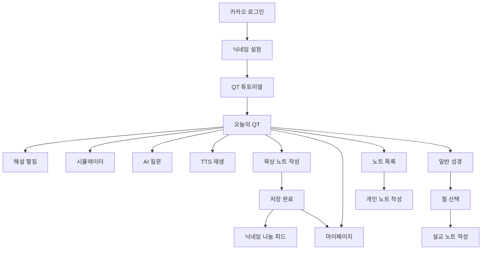

# QT-AI 화면 설계 스토리보드 초안

> 목적: 실제 개발용 상세 UI 명세가 아니라, 요구사항 명세서를 바탕으로 피그마 목업에 옮겨 서비스 흐름을 설명하기 위한 화면 설계 초안이다.

---

## 1. 화면 설계 방향

### 1.1 목업의 목표

- QT-AI가 어떤 앱인지 첫 화면부터 이해되게 한다.
- 사용자가 로그인 후 오늘의 QT를 읽고, 해설을 펼치고, 묵상 노트를 저장하고, 필요 시 공유하는 흐름을 보여준다.
- 일반 성경 조회, 노트, 마이페이지, 나눔, 관리자 콘솔은 MVP 범위를 설명할 수 있을 정도로 대표 화면만 구성한다.
- 실제 프로젝트 구현 화면이 아니므로 세부 API, DB 필드, 예외 케이스 전체를 다루지 않는다.

### 1.2 화면 톤

- 초심자 친화적이고 차분한 QT 보조 앱 느낌
- 커뮤니티 중심보다 개인 묵상 공간 중심
- AI 기능은 전면에 과시하지 않고, 필요한 순간에 보조 도구처럼 등장
- 자동 저장이 없다는 정책이 사용자가 이해되도록 임시저장/저장 버튼을 명확히 노출
- 닉네임 공유는 선택 행동이며 기본 비공개 상태를 강조

### 1.3 피그마 프레임 기준

| 구분 | 권장 크기 | 용도 |
| --- | --- | --- |
| Mobile App | 390 x 844 | 일반 사용자 앱 화면 |
| Mobile Modal/Sheet | 390 x 844 내부 오버레이 | AI 질문 창, 신고, 저장 완료 등 |
| Admin Web | 1440 x 1024 | 관리자 콘솔 |

---

## 2. 핵심 사용자 스토리

### Story 1. 첫 사용자 진입

1. 앱 실행
2. 카카오 로그인
3. 닉네임 설정
4. QT 튜토리얼 확인
5. 오늘의 QT 화면 진입

### Story 2. 오늘의 QT 묵상

1. 오늘의 QT 본문 읽기
2. 한 줄 요약 펼치기
3. 어려운 단어 풀이 확인
4. 절별 해설 확인
5. 시뮬레이터 보기
6. TTS 재생
7. 묵상 노트 작성
8. 임시저장 또는 저장

### Story 3. 사실 기반 AI 질문

1. QT 또는 성경 본문에서 AI 버튼 클릭
2. 우측 슬라이드 질문 창 열림
3. 단발 질문 입력
4. 사실 기반 응답 확인
5. 출처 확인
6. 창 닫기

### Story 4. 일반 성경과 설교 노트

1. 하단바에서 성경 진입
2. 성경 책/장 선택
3. 한/영 절 비교 조회
4. 절 클릭 또는 여러 절 선택
5. 설교 노트 작성
6. 임시저장 또는 저장

### Story 5. 개인 노트 작성

1. 하단바에서 노트 진입
2. 기도제목/회개/감사일기 중 선택
3. 제목과 본문 작성
4. 임시저장 또는 저장
5. 노트 목록에서 확인

### Story 6. 묵상 공유와 나눔

1. 저장된 묵상 노트 상세 진입
2. 공유 토글 ON
3. 닉네임 노출 안내 확인
4. 닉네임 나눔에 게시
5. 피드/상세에서 좋아요, 댓글, 신고 확인

### Story 7. 마이페이지 확인

1. 하단바에서 마이페이지 진입
2. 묵상 달력 확인
3. 주간/월간 통계 확인
4. 미션 진행률 확인
5. 알림 위젯 확인
6. 내 찬양 목록 및 회원 정보 확인

---

## 3. 전체 화면 목록

| ID | 화면명 | 영역 | 피그마 우선순위 |
| --- | --- | --- | --- |
| A-01 | 스플래시 | 온보딩 | 낮음 |
| A-02 | 카카오 로그인 | 온보딩 | 높음 |
| A-03 | 닉네임 설정 | 온보딩 | 높음 |
| A-04 | QT 튜토리얼 1 | 온보딩 | 높음 |
| A-05 | QT 튜토리얼 완료 | 온보딩 | 중간 |
| Q-01 | 오늘의 QT 기본 | 오늘의 QT | 최상 |
| Q-02 | 오늘의 QT 해설 펼침 | 오늘의 QT | 최상 |
| Q-03 | 시뮬레이터 보기 | 오늘의 QT | 높음 |
| Q-04 | AI 질문 슬라이드 | 오늘의 QT | 최상 |
| Q-05 | TTS 미니 플레이어 | 오늘의 QT | 높음 |
| Q-06 | 묵상 노트 작성 | 오늘의 QT | 최상 |
| Q-07 | 묵상 노트 저장 완료 | 오늘의 QT | 높음 |
| B-01 | 일반 성경 조회 | 성경 | 높음 |
| B-02 | 절 선택 상태 | 성경 | 높음 |
| B-03 | 설교 노트 작성 | 성경 | 높음 |
| N-01 | 노트 목록 | 노트 | 높음 |
| N-02 | 개인 노트 카테고리 선택 | 노트 | 중간 |
| N-03 | 기도제목 노트 작성 | 노트 | 높음 |
| N-04 | 회개 노트 작성 | 노트 | 중간 |
| N-05 | 감사일기 작성 | 노트 | 중간 |
| S-01 | 닉네임 나눔 피드 | 나눔 | 높음 |
| S-02 | 나눔 상세 | 나눔 | 높음 |
| S-03 | 신고 바텀시트 | 나눔 | 중간 |
| M-01 | 마이페이지 대시보드 | 마이페이지 | 최상 |
| M-02 | 알림 목록 | 마이페이지 | 중간 |
| M-03 | 내 찬양 목록 | 마이페이지 | 중간 |
| M-04 | 회원 정보/탈퇴 | 마이페이지 | 중간 |
| AD-01 | 관리자 대시보드 | 관리자 | 높음 |
| AD-02 | 오늘 QT 관리 | 관리자 | 높음 |
| AD-03 | AI 산출물 검증 | 관리자 | 높음 |
| AD-04 | 신고 처리 | 관리자 | 중간 |
| AD-05 | 찬양 큐레이션 관리 | 관리자 | 낮음 |

---

## 4. 하단 내비게이션 구조

| 탭 | 진입 화면 | 설명 |
| --- | --- | --- |
| QT | Q-01 오늘의 QT 기본 | 앱 진입 기본 화면 |
| 성경 | B-01 일반 성경 조회 | 자유 성경 조회와 설교 노트 진입 |
| 노트 | N-01 노트 목록 | 기도제목, 회개, 감사일기 작성 |
| 나눔 | S-01 닉네임 나눔 피드 | 공유된 묵상 기록 |
| 마이 | M-01 마이페이지 대시보드 | 달력, 통계, 알림, 찬양, 회원 정보 |

---

## 5. 대표 화면 상세

### A-02. 카카오 로그인

**화면 목적**  
로그인 없이는 어떤 기능도 사용할 수 없다는 정책을 자연스럽게 보여준다.

**구성 요소**

| 영역 | 내용 |
| --- | --- |
| 상단 | QT-AI 로고 또는 서비스명 |
| 중앙 | 짧은 소개 문구: "오늘의 QT를 쉽게 읽고 기록해요" |
| 하단 | 카카오로 시작하기 버튼 |
| 보조 | 개인정보/이용약관 링크 |

**상호작용**

- 카카오 로그인 성공 시 A-03 닉네임 설정 또는 A-04 튜토리얼로 이동
- 기존 회원이면 Q-01 오늘의 QT로 이동

### A-03. 닉네임 설정

**화면 목적**  
나눔 공간에 노출될 닉네임을 가입 시점에 확정한다.

**구성 요소**

| 영역 | 내용 |
| --- | --- |
| 제목 | "닉네임을 정해주세요" |
| 안내 | "나눔 공간에 글을 공유하면 닉네임이 함께 표시됩니다." |
| 입력 | 닉네임 입력 필드 |
| 상태 | 사용 가능/중복/형식 오류 |
| 버튼 | 다음 |

**상호작용**

- 중복 닉네임이면 다음 버튼 비활성화
- 완료 시 A-04 튜토리얼로 이동

### A-04. QT 튜토리얼

**화면 목적**  
QT가 익숙하지 않은 사용자에게 앱 사용 순서를 설명한다.

**구성 요소**

| 영역 | 내용 |
| --- | --- |
| 카드 1 | 오늘의 성경 본문을 읽어요 |
| 카드 2 | 어려운 말은 해설과 용어 풀이로 확인해요 |
| 카드 3 | 마음에 남은 내용을 묵상 노트로 기록해요 |
| 카드 4 | 필요할 때만 나눔 공간에 공유해요 |
| 버튼 | 시작하기 |

---

## 6. 오늘의 QT 화면군

### Q-01. 오늘의 QT 기본

**화면 목적**  
앱의 메인 화면. 사용자가 오늘의 본문을 바로 읽는다.

**구성 요소**

| 영역 | 내용 |
| --- | --- |
| 상단 앱바 | 날짜, 오늘의 QT 제목, TTS 아이콘 |
| 본문 헤더 | 성경 범위 예: 요한복음 15:1-8 |
| 본문 목록 | 절 번호, 한글 본문, 영어 본문 |
| 접힘 버튼 | 한 줄 요약, 해설, 용어 풀이 |
| 보조 버튼 | 시뮬레이터 보기 |
| 플로팅 버튼 | AI 질문 |
| 하단 고정 | 묵상 노트 쓰기 버튼 |
| 하단바 | QT, 성경, 노트, 나눔, 마이 |

**화면 메모**

- 해설은 기본 접힘 상태
- AI 버튼은 우측 하단에 작게 배치하되 본문을 가리지 않게 한다.
- 묵상 노트 쓰기는 오늘의 QT 화면에서만 강조한다.

### Q-02. 오늘의 QT 해설 펼침

**화면 목적**  
요약, 용어, 해설이 사용자가 원할 때만 나타나는 구조를 보여준다.

**구성 요소**

| 영역 | 내용 |
| --- | --- |
| 한 줄 요약 | 오늘 본문의 핵심 의미 |
| 용어 풀이 | 별표 표시된 단어와 뜻 |
| 절별 해설 | 절 아래 펼쳐지는 설명 |
| 출처 | 각 해설 하단 출처 표기 |
| 빈 상태 | "준비된 해설 없음" |

**상호작용**

- 요약/용어/해설 토글
- 준비되지 않은 절은 빈 상태 문구 노출

### Q-03. 시뮬레이터 보기

**화면 목적**  
오늘의 QT에만 제공되는 장면 시뮬레이터를 표현한다.

**구성 요소**

| 영역 | 내용 |
| --- | --- |
| 상단 | 클립 제목, 닫기 |
| 중앙 | 장면 일러스트/애니메이션 영역 |
| 하단 | 이전 장면, 재생/일시정지, 다음 장면 |
| 보조 | 연결 본문 범위 |

**화면 메모**

- 실제 구현용 애니메이션이 아니라 피그마 목업에서는 정지 이미지 또는 간단한 장면 카드로 충분하다.
- 일반 성경 화면에는 시뮬레이터 버튼을 배치하지 않는다.

### Q-04. AI 질문 슬라이드

**화면 목적**  
AI가 단발 질문만 받는다는 정책을 보여준다.

**구성 요소**

| 영역 | 내용 |
| --- | --- |
| 패널 헤더 | "사실 기반 질문" |
| 안내 | "단어, 시대상, 역사적 사실만 짧게 물어볼 수 있어요." |
| 현재 맥락 | 요한복음 15:2 |
| 입력창 | 질문 입력 |
| 버튼 | 질문하기 |
| 응답 | 짧은 답변 |
| 출처 | 응답 하단 출처 |
| 차단 상태 | "가치 판단형 질문은 답변할 수 없어요." |

**상호작용**

- 플로팅 AI 버튼 클릭 시 우측 슬라이드 인
- 질문 제출 후 단발 응답 표시
- 추가 대화 입력은 새 질문으로 처리되며 이전 대화 맥락을 유지하지 않는다는 느낌으로 구성

### Q-05. TTS 미니 플레이어

**화면 목적**  
본문과 해설 음성 재생 기능을 보여준다.

**구성 요소**

| 영역 | 내용 |
| --- | --- |
| 하단 미니 플레이어 | 재생/일시정지, 이전 절, 다음 절 |
| 언어 | 한국어/영어 선택 |
| 속도 | 0.8x, 1.0x, 1.2x |
| 상태 | "요한복음 15:1 재생 중" |

### Q-06. 묵상 노트 작성

**화면 목적**  
묵상 노트만 4섹션 구조를 가진다는 정책을 명확히 보여준다.

**구성 요소**

| 영역 | 내용 |
| --- | --- |
| 상단 | 묵상 노트, 오늘 QT 범위 |
| 공개 설정 | 기본 비공개, 공유 토글 |
| 섹션 1 | 느낀 점 |
| 섹션 2 | 기억할 구절 |
| 섹션 3 | 적용할 점 |
| 섹션 4 | 기도 |
| 하단 버튼 | 임시저장, 저장 |

**상호작용**

- 일부 섹션만 입력해도 저장 가능
- 임시저장 클릭 시 "임시저장됨" 토스트
- 저장 클릭 시 Q-07 저장 완료 상태
- 공유 토글 ON 시 닉네임 노출 안내

### Q-07. 묵상 노트 저장 완료

**화면 목적**  
저장 후 다음 행동을 보여준다.

**구성 요소**

| 영역 | 내용 |
| --- | --- |
| 메시지 | "저장 완료되었습니다" |
| 버튼 1 | 오늘의 QT로 돌아가기 |
| 버튼 2 | 나눔에 공유하기 |
| 버튼 3 | 마이페이지에서 기록 보기 |

---

## 7. 일반 성경 화면군

### B-01. 일반 성경 조회

**화면 목적**  
사용자가 성경 책·장·절을 자유롭게 조회한다.

**구성 요소**

| 영역 | 내용 |
| --- | --- |
| 상단 | 성경 책 선택, 장 선택 |
| 본문 | 한/영 절 비교 |
| 접힘 영역 | 준비된 해설 |
| 플로팅 버튼 | AI 질문 |
| TTS | 본문/해설 재생 |

**화면 메모**

- 오늘 QT 묵상 노트 버튼은 배치하지 않는다.
- 시뮬레이터 버튼은 배치하지 않는다.

### B-02. 절 선택 상태

**화면 목적**  
설교 노트 진입이 일반 성경 절 선택에서 시작됨을 보여준다.

**구성 요소**

| 영역 | 내용 |
| --- | --- |
| 선택 표시 | 선택된 절 하이라이트 |
| 하단 액션바 | 선택한 절 수, 설교 노트 작성 |
| 보조 | 선택 해제 |

### B-03. 설교 노트 작성

**화면 목적**  
설교 노트는 선택 구절 연결 + 1섹션 메모장 구조임을 보여준다.

**구성 요소**

| 영역 | 내용 |
| --- | --- |
| 연결 본문 | 선택한 구절 요약 |
| 제목 | 제목 입력 |
| 본문 | 자유 메모 입력 |
| 해설 | 준비된 해설 또는 "준비된 해설 없음" |
| 하단 버튼 | 임시저장, 저장 |

---

## 8. 노트 화면군

### N-01. 노트 목록

**화면 목적**  
사용자의 기록을 카테고리별로 찾을 수 있게 한다.

**구성 요소**

| 영역 | 내용 |
| --- | --- |
| 상단 | 노트 제목, 검색 |
| 탭 | 전체, 묵상, 설교, 기도, 회개, 감사 |
| 목록 | 제목, 카테고리, 저장 상태, 날짜 |
| 작성 버튼 | 기도제목, 회개, 감사일기 작성 |

**화면 메모**

- 묵상 노트 작성은 오늘의 QT 화면으로 유도한다.
- 설교 노트 작성은 성경 화면으로 유도한다.

### N-02. 개인 노트 카테고리 선택

**화면 목적**  
하단바 노트 영역에서는 개인 그룹 노트만 새로 작성한다는 구조를 보여준다.

**구성 요소**

| 영역 | 내용 |
| --- | --- |
| 선택 카드 | 기도제목 노트 |
| 선택 카드 | 회개 노트 |
| 선택 카드 | 감사일기 |

### N-03. 기도제목 노트 작성

**화면 목적**  
개인 노트는 성경 본문 연결 없이 1섹션으로 작성한다.

**구성 요소**

| 영역 | 내용 |
| --- | --- |
| 카테고리 | 기도제목 |
| 제목 | 제목 입력 |
| 본문 | 자유 입력 |
| 하단 버튼 | 임시저장, 저장 |

---

## 9. 닉네임 나눔 화면군

### S-01. 닉네임 나눔 피드

**화면 목적**  
조용한 블로그식 나눔 공간을 보여준다.

**구성 요소**

| 영역 | 내용 |
| --- | --- |
| 상단 | 닉네임 나눔 |
| 안내 | "공유를 선택한 묵상 기록만 보여요." |
| 피드 카드 | 닉네임, QT 범위, 묵상 일부, 좋아요 수, 댓글 수 |
| 필터 | 최신순 |

**화면 메모**

- 팔로우, 랭킹, 실시간 댓글 요소는 넣지 않는다.
- 익명 표시도 넣지 않는다.

### S-02. 나눔 상세

**화면 목적**  
공유된 묵상 노트 상세와 최소 반응을 보여준다.

**구성 요소**

| 영역 | 내용 |
| --- | --- |
| 작성자 | 닉네임 |
| 본문 정보 | QT 범위, 작성일 |
| 묵상 내용 | 4섹션 내용 |
| 반응 | 좋아요, 댓글 |
| 더보기 | 신고 |

### S-03. 신고 바텀시트

**화면 목적**  
부적절한 게시글/댓글 신고 흐름을 보여준다.

**구성 요소**

| 영역 | 내용 |
| --- | --- |
| 신고 사유 | 부적절한 내용, 도배, 기타 |
| 상세 입력 | 선택 입력 |
| 버튼 | 신고 접수 |

---

## 10. 마이페이지 화면군

### M-01. 마이페이지 대시보드

**화면 목적**  
묵상 이력과 앱 사용 현황을 한 화면에서 요약한다.

**구성 요소**

| 영역 | 내용 |
| --- | --- |
| 프로필 | 닉네임, 회원 정보 진입 |
| 묵상 달력 | 저장된 날짜 표시 |
| 통계 | 이번 주/이번 달 묵상 횟수 |
| 미션 | 월간 묵상 미션 진행률 |
| 알림 위젯 | 최근 알림 3건 |
| 내 찬양 | 저장한 찬양 목록 미리보기 |

### M-02. 알림 목록

**화면 목적**  
실시간 푸시가 아니라 로그형 인앱 알림임을 보여준다.

**구성 요소**

| 영역 | 내용 |
| --- | --- |
| 목록 | 좋아요, 댓글, 신고 처리, 공지 |
| 상태 | 읽음/미읽음 |
| 빈 상태 | "아직 알림이 없어요" |

### M-03. 내 찬양 목록

**화면 목적**  
운영자 큐레이션과 디바이스 음원을 구분한다.

**구성 요소**

| 영역 | 내용 |
| --- | --- |
| 탭 | 저장한 곡, 디바이스 음원 |
| 목록 | 곡명, 출처, 저장 해제 |
| 버튼 | 디바이스에서 불러오기 |

### M-04. 회원 정보/탈퇴

**화면 목적**  
MVP에 포함된 회원 탈퇴 진입을 보여준다.

**구성 요소**

| 영역 | 내용 |
| --- | --- |
| 닉네임 | 변경 또는 표시 |
| 로그인 공급자 | 카카오 |
| 자동 로그인 | 상태 표시 |
| 탈퇴 | 회원 탈퇴 버튼 |
| 탈퇴 안내 | 법적 보존 기간 후 삭제 안내 |

---

## 11. 관리자 콘솔 화면군

### AD-01. 관리자 대시보드

**화면 목적**  
운영자가 오늘의 QT, AI 산출물, 신고, 공지, 찬양을 관리하는 입구를 보여준다.

**구성 요소**

| 영역 | 내용 |
| --- | --- |
| 좌측 메뉴 | QT 관리, 해설 검증, 신고 처리, 찬양, 공지, 감사 로그 |
| 요약 카드 | 오늘 QT 상태, 검증 대기, 신고 대기, 공지 |
| 작업 목록 | 최근 운영 작업 |

### AD-02. 오늘 QT 관리

**화면 목적**  
날짜별 QT 본문 등록/수정 화면을 보여준다.

**구성 요소**

| 영역 | 내용 |
| --- | --- |
| 날짜 선택 | QT 날짜 |
| 본문 범위 | 성경 책, 장, 시작 절, 끝 절 |
| 상태 | 초안, 게시, 숨김 |
| 버튼 | 저장, 게시 |
| 감사 로그 | 최근 변경 이력 |

### AD-03. AI 산출물 검증

**화면 목적**  
검증 통과 콘텐츠만 사용자에게 노출된다는 구조를 보여준다.

**구성 요소**

| 영역 | 내용 |
| --- | --- |
| 필터 | 대기, 승인, 반려, 숨김 |
| 산출물 목록 | 해설, 시뮬레이터, Q&A 응답 |
| 상세 | 본문 좌표, 생성 결과, 출처 |
| 체크리스트 | 스키마, 금지 표현, 사실 정합성, 말투 |
| 버튼 | 승인, 반려, 검토 보류 |

**주의**

- 검증용 한국어 주석 원문은 관리자 화면에도 노출하지 않는 정책을 반영한다.

### AD-04. 신고 처리

**화면 목적**  
나눔 공간의 신고를 운영자가 처리한다.

**구성 요소**

| 영역 | 내용 |
| --- | --- |
| 신고 목록 | 상태, 대상, 사유, 접수일 |
| 상세 | 게시글/댓글 내용, 신고 상세 |
| 처리 | 숨김, 반려, 제재 검토 |
| 감사 로그 | 처리 관리자와 시각 |

---

## 12. 피그마 목업 제작 순서

### 1차 제작: 핵심 시연 흐름

| 순서 | 화면 |
| --- | --- |
| 1 | A-02 카카오 로그인 |
| 2 | A-03 닉네임 설정 |
| 3 | A-04 QT 튜토리얼 |
| 4 | Q-01 오늘의 QT 기본 |
| 5 | Q-02 오늘의 QT 해설 펼침 |
| 6 | Q-04 AI 질문 슬라이드 |
| 7 | Q-06 묵상 노트 작성 |
| 8 | Q-07 묵상 노트 저장 완료 |
| 9 | M-01 마이페이지 대시보드 |

### 2차 제작: MVP 보조 흐름

| 순서 | 화면 |
| --- | --- |
| 1 | B-01 일반 성경 조회 |
| 2 | B-02 절 선택 상태 |
| 3 | B-03 설교 노트 작성 |
| 4 | N-01 노트 목록 |
| 5 | N-03 기도제목 노트 작성 |
| 6 | S-01 닉네임 나눔 피드 |
| 7 | S-02 나눔 상세 |

### 3차 제작: 운영자 흐름

| 순서 | 화면 |
| --- | --- |
| 1 | AD-01 관리자 대시보드 |
| 2 | AD-02 오늘 QT 관리 |
| 3 | AD-03 AI 산출물 검증 |
| 4 | AD-04 신고 처리 |

---

## 13. 피그마 컴포넌트 후보

| 컴포넌트 | 사용 화면 |
| --- | --- |
| App Bar | 전체 모바일 화면 |
| Bottom Navigation | 로그인 후 전체 사용자 화면 |
| Verse Row | QT, 성경 |
| Expandable Explanation | QT, 성경 |
| Source Label | 해설, AI 응답 |
| Floating AI Button | QT, 성경 |
| AI Slide Panel | QT, 성경 |
| TTS Mini Player | QT, 성경 |
| Note Section Input | 묵상 노트 |
| Single Memo Input | 설교/기도/회개/감사 노트 |
| Save Action Bar | 모든 노트 작성 |
| Toast | 임시저장/저장 완료 |
| Share Toggle | 묵상 노트 |
| Feed Card | 나눔 |
| Calendar Heat Marker | 마이페이지 |
| Progress Bar | 미션 |
| Notification Item | 알림 |
| Admin Table | 관리자 |
| Validation Checklist | 관리자 검증 |

---

## 14. 목업에서 꼭 보여줘야 하는 정책

| 정책 | 화면 반영 방법 |
| --- | --- |
| 로그인 강제 | 로그인 전 기능 화면 없음 |
| 홈 화면 없음 | 로그인 후 바로 오늘의 QT 진입 |
| 해설 선택 열람 | 해설/용어/요약 접힘 상태 |
| 준비된 해설 없음 | 빈 상태 문구 |
| AI 단발 질문 | AI 패널에 단발 질문 안내 |
| 가치 판단 차단 | 차단 예시 상태 1개 제작 |
| TTS 적용 범위 | 본문/해설 화면에만 플레이어 |
| 자동저장 없음 | 노트 화면 하단에 임시저장/저장 버튼 명확히 표시 |
| 묵상 노트 4섹션 | Q-06에서 4개 입력 영역 |
| 개인 노트 1섹션 | N-03에서 본문 입력 1개 |
| 설교 노트 진입점 | 성경 절 선택 후 작성 |
| 기본 비공개 | 공유 토글 OFF 기본값 |
| 닉네임 노출 공유 | 공유 ON 시 닉네임 안내 |
| 익명 게시 없음 | 나눔 카드에 닉네임 표시 |
| 관리자 검증 | AI 검증 콘솔 화면 |

---

## 15. 피그마용 화면 연결 맵

---

## 16. 다음 작업 제안

피그마에 바로 옮기려면 다음 산출물을 순서대로 만들면 좋다.

1. `04_화면정의서.md`: 각 화면의 입력 항목, 버튼, 이동, 상태를 더 표 형태로 정리
2. `05_피그마_프레임_체크리스트.md`: 피그마에서 만들 프레임 이름과 완료 체크리스트
3. `06_목업_카피문구.md`: 버튼명, 안내문, 빈 상태, 토스트 문구 정리

