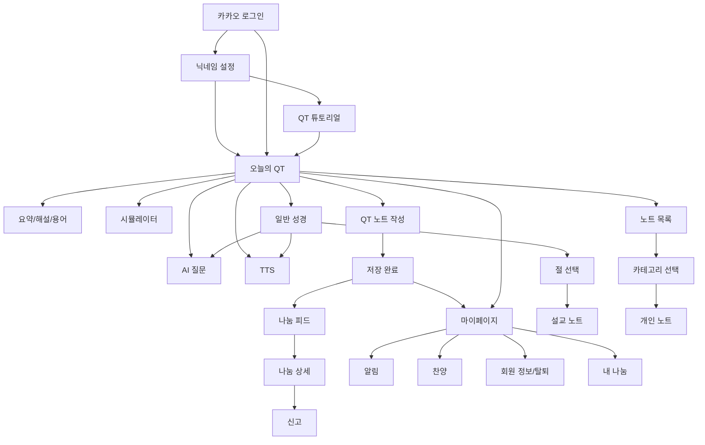

# QT-AI 화면 설계 스토리보드 v2.0

> 목적: 요구사항명세서와 ERD를 바탕으로 피그마/HTML 클릭 목업을 제작하기 위한 화면 흐름, 프레임 우선순위, 화면별 구성 요소, 주요 상태를 정의한다.  
> 기준 문서: `01.요구사항명세서_현재완성v1.md`, `02_ERD_문서_v2.md`, `04_화면정의서.md`

---

## 1. 목업 설계 목표

### 1.1 목업에서 반드시 보여줄 것

- 로그인 후 홈 없이 오늘의 QT로 진입하는 구조
- 오늘 QT 본문을 한글·영어 절 단위로 읽는 경험
- 요약, 해설, 용어 풀이가 기본 접힘 상태이며 사용자가 선택할 때만 펼쳐지는 경험
- QT 노트는 4섹션 구조이고 자동저장이 아니라 `임시저장`과 `저장`을 명확히 누르는 경험
- 마이페이지에서 묵상 달력, 통계, 미션, 알림, 기록 상태를 확인하는 경험
- 공유는 기본 비공개이며 닉네임 공개 안내 후에만 나눔 공간에 게시되는 경험
- AI, 시뮬레이터, TTS, 찬양, 커뮤니티, 관리자 기능은 개발 우선순위에 맞춰 별도 프레임으로 분리

### 1.2 목업 톤

- 초심자 친화적이고 차분한 QT 보조 앱
- 커뮤니티보다 개인 묵상과 기록 중심
- AI는 전면 기능이 아니라 본문 이해를 돕는 보조 기능
- 저장·공유·탈퇴·신고처럼 사용자가 불안해할 수 있는 행동은 결과와 영향을 분명히 안내
- 관리자 화면은 장식보다 상태 파악, 처리, 추적이 쉬운 운영 도구 톤

### 1.3 프레임 규격

| 구분 | 권장 크기 | 용도 |
|---|---:|---|
| Mobile App | 390 x 844 | 일반 사용자 앱 |
| Mobile Sheet/Modal | 390 x 844 내부 오버레이 | AI 질문, 신고, 공유 확인, 저장 완료 |
| Admin Web | 1440 x 1024 | 관리자 콘솔 |

---

## 2. 개발 우선순위와 목업 우선순위

### 2.1 P0 개발 필수 흐름

요구사항상 P0는 `F-04 → F-01 → F-08 → F-03 → F-13`이다.

| 순서 | 기능 | 목업 화면 |
|---:|---|---|
| 1 | F-04 회원 인증 | A-02, A-03, M-04 |
| 2 | F-01 성경·QT 본문 화면 | Q-01, B-01 |
| 3 | F-08 본문 요약·해설·용어 풀이 | Q-02 |
| 4 | F-03 QT 노트 작성·관리 | Q-06, Q-07 |
| 5 | F-13 마이페이지 | M-01 |

### 2.2 P1 이후 확장 흐름

| 우선순위 | 기능 | 목업 화면 |
|---|---|---|
| P1 | AI 콘텐츠 사전 생성, AI 품질 관리, 관리자 운영, AI Q&A, 튜토리얼 | A-04, Q-04, AD-01, AD-02, AD-03, AD-07, AD-08 |
| P2 | 자유 노트, 나눔, 알림, TTS | B-02, B-03, N-01, N-02, N-03, N-04, S-01, S-02, S-03, M-02, M-05, Q-05, AD-04, AD-06 |
| P3 | 시뮬레이터, 찬양 | Q-03, M-03, AD-05 |

---

## 3. 전체 사용자 흐름

### Flow 1. P0 핵심 시연

1. A-02 카카오 로그인
2. A-03 닉네임 설정
3. Q-01 오늘의 QT 기본
4. Q-02 요약·해설·용어 풀이 펼침
5. Q-06 QT 노트 작성
6. Q-07 저장 완료
7. M-01 마이페이지 대시보드
8. M-04 회원 정보/탈퇴

### Flow 2. 성경 조회와 설교 노트

1. B-01 일반 성경 조회
2. B-02 절 선택
3. B-03 설교 노트 작성
4. N-01 노트 목록

### Flow 3. 개인 노트

1. N-01 노트 목록
2. N-02 개인 노트 카테고리 선택
3. N-03 개인 노트 작성
4. N-01 노트 목록 복귀

### Flow 4. 나눔과 신고

1. Q-07 저장 완료 또는 노트 상세에서 공유 선택
2. 공유 확인 모달
3. S-01 닉네임 나눔 피드
4. S-02 나눔 상세
5. S-03 신고 바텀시트

### Flow 5. AI 보조 기능

1. Q-01 또는 B-01에서 AI 버튼
2. Q-04 AI 질문 슬라이드
3. 허용 질문 응답
4. 정책 차단 또는 한도 초과 상태

### Flow 6. 관리자 운영

1. AD-01 관리자 대시보드
2. AD-02 오늘 QT 관리
3. AD-03 AI 산출물 검증
4. AD-08 AI 운영 모니터링
5. AD-07 감사 로그
6. AD-04 신고 처리
7. AD-06 시스템 공지 관리
8. AD-05 찬양 큐레이션 관리

---

## 4. 하단 내비게이션

| 탭 | 진입 화면 | 역할 |
|---|---|---|
| QT | Q-01 오늘의 QT 기본 | 앱 기본 진입 화면 |
| 성경 | B-01 일반 성경 조회 | 자유 성경 조회, AI 질문, TTS, 설교 노트 진입 |
| 노트 | N-01 노트 목록 | 작성한 기록 탐색, 개인 노트 작성 |
| 나눔 | S-01 닉네임 나눔 피드 | 공유된 묵상 기록 확인 |
| 마이 | M-01 마이페이지 대시보드 | 달력, 통계, 알림, 찬양, 회원 정보 |

---

## 5. 화면 목록

| ID | 화면명 | 영역 | 개발 우선순위 | 목업 우선순위 |
|---|---|---|---|---|
| A-01 | 스플래시 | 온보딩 | P0 보조 | 낮음 |
| A-02 | 카카오 로그인 | 온보딩 | P0 | 최상 |
| A-03 | 닉네임 설정 | 온보딩 | P0 | 최상 |
| A-04 | QT 튜토리얼 | 온보딩 | P1 | 높음 |
| Q-01 | 오늘의 QT 기본 | QT | P0 | 최상 |
| Q-02 | 요약·해설·용어 펼침 | QT | P0 | 최상 |
| Q-03 | 시뮬레이터 보기 | QT | P3 | 중간 |
| Q-04 | AI 질문 슬라이드 | QT/성경 | P1 | 높음 |
| Q-05 | TTS 미니 플레이어 | QT/성경 | P2 | 중간 |
| Q-06 | QT 노트 작성 | QT | P0 | 최상 |
| Q-07 | QT 노트 저장 완료 | QT | P0 | 높음 |
| B-01 | 일반 성경 조회 | 성경 | P0 | 높음 |
| B-02 | 절 선택 상태 | 성경 | P2 | 중간 |
| B-03 | 설교 노트 작성 | 성경 | P2 | 중간 |
| N-01 | 노트 목록 | 노트 | P2 | 중간 |
| N-02 | 개인 노트 카테고리 선택 | 노트 | P2 | 낮음 |
| N-03 | 개인 노트 작성 | 노트 | P2 | 중간 |
| N-04 | 노트 상세/수정 | 노트 | P2 | 중간 |
| S-01 | 닉네임 나눔 피드 | 나눔 | P2 | 중간 |
| S-02 | 나눔 상세 | 나눔 | P2 | 중간 |
| S-03 | 신고 바텀시트 | 나눔 | P2 | 낮음 |
| M-01 | 마이페이지 대시보드 | 마이 | P0 | 최상 |
| M-02 | 알림 목록 | 마이 | P2 | 중간 |
| M-03 | 내 찬양 목록 | 마이 | P3 | 낮음 |
| M-04 | 회원 정보/탈퇴 | 마이 | P0 | 높음 |
| M-05 | 내 나눔 관리 | 마이/나눔 | P2 | 중간 |
| AD-01 | 관리자 대시보드 | 관리자 | P1 | 높음 |
| AD-02 | 오늘 QT 관리 | 관리자 | P1 | 높음 |
| AD-03 | AI 산출물 검증 | 관리자 | P1 | 높음 |
| AD-04 | 신고 처리 | 관리자 | P2 | 중간 |
| AD-05 | 찬양 큐레이션 관리 | 관리자 | P3 | 낮음 |
| AD-06 | 시스템 공지 관리 | 관리자 | P2 | 중간 |
| AD-07 | 감사 로그 | 관리자 | P1 | 높음 |
| AD-08 | AI 운영 모니터링 | 관리자 | P1 | 높음 |

---

## 6. 공통 상태 표현

| 상태 | 목업 표현 |
|---|---|
| 로딩 | 본문 또는 목록 영역 스켈레톤 |
| 빈 상태 | 짧은 이유와 다음 행동 1개 |
| 부분 실패 | 핵심 콘텐츠는 유지하고 실패 영역만 재시도 |
| 전체 실패 | 안내 문구와 재시도 버튼 |
| 오프라인 | 캐시 본문 우선 표시, 해설·AI·동기화 기능 제한 안내 |
| 권한 없음 | 접근 거부 화면 또는 볼 수 없는 콘텐츠 안내 |
| 토큰 만료 | 로그인 화면 이동 안내 |
| 저장 실패 | 입력값 유지, 저장되지 않았음 안내 |
| 삭제/숨김 접근 | “삭제되었거나 볼 수 없는 글입니다” 안내 |

---

## 7. 온보딩 화면군

### A-01. 스플래시

| 항목 | 내용 |
|---|---|
| 목적 | 토큰과 회원 상태를 확인하고 다음 화면으로 분기 |
| 구성 | 로고, 로딩 표시 |
| 분기 | 유효 토큰+튜토리얼 완료: Q-01 / 유효 토큰+튜토리얼 미완료: A-04 / 토큰 없음: A-02 |
| 예외 프레임 | 토큰 만료, 탈퇴 계정, 네트워크 실패 |

### A-02. 카카오 로그인

| 항목 | 내용 |
|---|---|
| 목적 | 로그인 강제 정책을 보여주고 카카오 로그인을 시작 |
| 구성 | 서비스명, 짧은 소개, 카카오로 시작하기, 약관/개인정보 링크 |
| 상태 | 기본, 로그인 실패, 네트워크 실패 |
| 이동 | 신규: A-03 / 기존: Q-01 또는 A-04 |
| 목업 메모 | 로그인 전 기능 화면 미리보기는 넣지 않는다. |

### A-03. 닉네임 설정

| 항목 | 내용 |
|---|---|
| 목적 | 나눔 공간에 노출될 닉네임 확정 |
| 구성 | 닉네임 입력, 사용 가능/중복/형식 오류 상태, 다음 버튼 |
| 상태 | 입력 전, 사용 가능, 중복, 형식 오류, 저장 실패 |
| 정책 | 닉네임은 공유글에 표시된다. 변경 정책 확정 전까지 변경 불가로 표현 |

### A-04. QT 튜토리얼

| 항목 | 내용 |
|---|---|
| 목적 | 초심자에게 QT 의미와 앱 사용 순서 안내 |
| 구성 | 오늘 본문 읽기, 해설 확인, 묵상 기록, 선택 공유 카드 |
| 상태 | 첫 실행, 다시보기, 완료 저장 실패 |
| 우선순위 | P1. P0 필수 흐름에는 넣지 않고 확장 프레임으로 제작 |

---

## 8. 오늘의 QT 화면군

### Q-01. 오늘의 QT 기본

| 항목 | 내용 |
|---|---|
| 목적 | 앱 메인 화면. 오늘의 QT 본문을 바로 읽게 함 |
| 데이터 | `qt_passages.PUBLISHED`, `qt_passage_verses`, `bible_verses` |
| 구성 | 날짜, QT 제목, 성경 범위, 한글/영어 본문, 해설 펼치기, TTS, AI, 시뮬레이터, QT 노트 쓰기 |
| 기본 상태 | 요약·해설·용어 접힘, QT 노트 CTA 고정 |
| 필수 프레임 | 정상, 오늘 QT 없음, 오프라인 캐시, 본문 조회 실패 |
| 목업 메모 | P0 프레임에서는 AI·TTS·시뮬레이터 아이콘을 비활성 또는 후순위로 표현 가능 |

### Q-02. 요약·해설·용어 펼침

| 항목 | 내용 |
|---|---|
| 목적 | 사용자가 요청할 때만 본문 이해 보조 콘텐츠 제공 |
| 노출 가능 | 승인된 해설, 승인된 용어, 출처가 있는 콘텐츠 |
| 미노출 | 검증중, 반려, 숨김, 출처 누락 콘텐츠 |
| 구성 | 한 줄 요약, 용어 풀이, 절별 해설, 출처 라벨 |
| 필수 프레임 | 해설 있음, 준비된 해설 없음, 해설 조회 실패, 출처 누락 미노출 |
| 정책 | 사용자 화면에서 실시간 AI 해설 생성은 제공하지 않는다. |

### Q-03. 시뮬레이터 보기

| 항목 | 내용 |
|---|---|
| 목적 | 오늘 QT 본문 장면을 검증된 스크립트 기반으로 보여줌 |
| 적용 | 오늘 QT에만 적용 |
| 미적용 | 일반 성경, 자유 노트 |
| 구성 | 클립 제목, 장면 영역, 이전/재생/다음, 연결 본문 |
| 상태 | 재생 가능, 준비되지 않음, 검증중, 재생 실패 |
| 우선순위 | P3 |

### Q-04. AI 질문 슬라이드

| 항목 | 내용 |
|---|---|
| 목적 | 단어·시대상·역사적 사실에 한정한 단발 질문 제공 |
| 진입 | Q-01, B-01의 AI 버튼 |
| 허용 | 단어 뜻, 역사적 사실, 시대 배경, 본문 이해 보조 |
| 차단 | 가치 판단, 신앙 상태 평가, 선택 대행, 단정적 설교 요청 |
| 구성 | 질문 입력, 현재 본문 맥락, 답변, 출처, 차단 안내 |
| 필수 프레임 | 입력 전, 답변 성공, 정책 차단, 한도 초과, 외부 AI 장애, AI 답변 신고 |
| 로그 | `ai_qa_requests.status`, `ai_qa_requests.blocked_reason`을 상태 안내에 사용 |
| 정책 | 이전 질문 맥락을 유지하지 않는다. |
| 우선순위 | P1 |

### Q-05. TTS 미니 플레이어

| 항목 | 내용 |
|---|---|
| 목적 | 본문과 해설을 음성으로 재생 |
| 적용 | QT 본문, 일반 성경 본문, 해설 |
| 미적용 | 노트, 나눔 게시글 |
| 구성 | 재생/일시정지, 이전 절, 다음 절, 언어, 속도 |
| 상태 | 재생 전, 재생중, 일시정지, 음성 로딩 실패, TTS 미지원 |
| 우선순위 | P2 |

### Q-06. QT 노트 작성

| 항목 | 내용 |
|---|---|
| 목적 | 오늘 QT에 연결된 4섹션 묵상 노트 작성 |
| 데이터 | `notes.category=MEDITATION`, `notes.status`, `notes.visibility` |
| 구성 | 오늘 QT 범위, 기본 비공개, 공유 토글, 느낀 점, 기억할 구절, 적용할 점, 기도, 임시저장, 저장 |
| 상태 | 신규, 임시저장 불러오기, 저장 확정본 편집, 저장중, 저장 실패 |
| 제약 | 같은 사용자+같은 QT 본문에 활성 묵상 노트 1건 |
| 목업 메모 | 자동저장처럼 보이는 UI를 넣지 않는다. |

### Q-07. QT 노트 저장 완료

| 항목 | 내용 |
|---|---|
| 목적 | 저장 결과와 다음 행동 제시 |
| 구성 | 저장 완료, 저장 시각, 오늘 QT로 돌아가기, 나눔에 공유하기, 마이페이지에서 보기 |
| 상태 | 저장 완료, 공유 확인 모달, 공유 실패 |
| 정책 | 공유 전 닉네임 노출 안내 필수 |

---

## 9. 성경·노트 화면군

### B-01. 일반 성경 조회

| 항목 | 내용 |
|---|---|
| 목적 | 성경 권·장·절 자유 조회 |
| 구성 | 권 선택, 장 선택, 한글/영어 본문, AI 버튼, TTS |
| 상태 | 정상 조회, 권/장 변경중, 빈 장, 조회 실패, 오프라인 캐시 |
| 정책 | 시뮬레이터 없음. QT 노트 쓰기 CTA 없음 |

### B-02. 절 선택 상태

| 항목 | 내용 |
|---|---|
| 목적 | 설교 노트에 연결할 절 선택 |
| 구성 | 선택 절 하이라이트, 선택 수, 설교 노트 작성 액션, 선택 해제 |
| 상태 | 단일 선택, 다중 선택, 선택 해제, 다른 장 이동 전 확인 |
| 예외 | 구절 조회 실패 시 설교 노트 진입 차단 |

### B-03. 설교 노트 작성

| 항목 | 내용 |
|---|---|
| 목적 | 성경 좌표가 연결된 1섹션 노트 작성 |
| 필수 | 제목 또는 본문 중 하나, 성경 좌표 |
| 구성 | 연결 구절, 제목, 본문, 임시저장, 저장, 공유 설정 |
| 상태 | 신규, 임시저장, 저장 완료 후 B-01 성경 읽기로 복귀, 구절 조회 실패, 저장 실패 |
| 저장 후 이동 | 설교 노트는 별도 완료 화면 없이 저장 토스트를 띄우고 B-01 일반 성경 조회로 돌아간다. |

### N-01. 노트 목록

| 항목 | 내용 |
|---|---|
| 목적 | 작성한 기록을 카테고리와 검색으로 탐색 |
| 구성 | 검색, 전체/QT/설교/기도/회개/감사 탭, 노트 카드, 하단 플로팅 개인 노트 작성 버튼 |
| 상태 | 목록 있음, 빈 목록, 검색 결과 없음, 조회 실패 |
| 정책 | 노트는 QT 노트 1종과 자유 노트 4종, 총 5개 카테고리로 조회. 노트 탭에서 직접 새로 작성할 수 있는 것은 기도·회개·감사 3종이며, QT 노트 작성은 Q-01/Q-06, 설교 노트 작성은 B-01/B-02/B-03 흐름으로만 진입 |

### N-02. 개인 노트 카테고리 선택

| 항목 | 내용 |
|---|---|
| 목적 | 본문 좌표 없는 개인 노트 3종 중 작성 유형 선택 |
| 선택 | 기도제목, 회개 노트, 감사일기 |
| 이동 | 선택 후 N-03 |

### N-03. 개인 노트 작성

| 항목 | 내용 |
|---|---|
| 목적 | 본문 좌표 없이 1섹션 개인 노트 작성 |
| 구성 | 카테고리, 제목, 본문, 기본 비공개, 공유 설정, 임시저장, 저장 |
| 상태 | 신규, 임시저장, 저장 완료, 저장 실패, 공유 실패 |
| 정책 | 시뮬레이터와 TTS 미제공 |

### N-04. 노트 상세/수정

| 항목 | 내용 |
|---|---|
| 목적 | 저장된 QT 노트와 자유 노트를 상세 조회하고 작성자 수정/삭제를 처리 |
| 진입 | N-01 노트 카드, M-01 묵상 달력 기록 |
| 구성 | 카테고리, 연결 본문, 저장 상태, 본문, 공유 상태, 수정 저장, 삭제 |
| 상태 | 상세, 수정중, 삭제 확인, 저장 충돌, 공유본 유지 |
| 삭제 영향 | 원본 노트 삭제 시 `notes.deleted_at` 기록, QT 완료 달력 갱신, 공유 스냅샷은 자동 변경하지 않음 |

---

## 10. 나눔 화면군

### S-01. 닉네임 나눔 피드

| 항목 | 내용 |
|---|---|
| 목적 | 공유를 선택한 묵상 기록을 닉네임 기반으로 탐색 |
| 노출 | `sharing_posts.PUBLISHED` |
| 구성 | 검색, 전체/QT/설교/기도/회개/감사 필터, 닉네임, 원본 노트 카테고리, 본문 일부, 좋아요 상태(빈 하트/채운 하트), 좋아요 수, 댓글 수, 최신순 |
| 상태 | 목록 있음, 빈 피드, 조회 실패, 좋아요 처리 실패 |
| 정책 | 비공개 노트, 숨김 글, 삭제 글은 노출하지 않는다. 익명 표시 없음 |

### S-02. 나눔 상세

| 항목 | 내용 |
|---|---|
| 목적 | 공유 시점 스냅샷과 댓글 확인 |
| 구성 | 닉네임/날짜/구절 정보 열의 좋아요 하트와 신고 아이콘, 노트 스냅샷, 댓글 제목 옆 댓글 수, 댓글 |
| 좋아요 | 내가 누른 글은 채운 하트, 누르지 않은 글은 빈 하트로 표시 |
| 신고 | 신고 아이콘 선택 시 본문을 밀어내지 않고 바텀시트로 신고 사유 입력 |
| 상태 | 댓글 ON, 댓글 OFF, 댓글 삭제, 좋아요 취소/실패, 중복 신고, 원본 노트 삭제됨, 숨김/삭제 글 접근 |
| 데이터 판단 | `comments_enabled`, `source_note_deleted_at`을 화면 상태 판단에 사용 |
| 정책 | 원본 노트 수정·삭제와 자동 동기화하지 않는다. |

### S-03. 신고 바텀시트

| 항목 | 내용 |
|---|---|
| 목적 | 게시글, 댓글, AI 응답 신고 |
| 대상 | POST, COMMENT, AI_QA_REQUEST, AI_ASSET |
| 구성 | 신고 사유, 상세 내용, 제출 |
| 상태 | 사유 미선택, 접수중, 접수 완료, 중복 신고, 접수 실패 |
| 완료 | 처리 결과는 인앱 알림으로 제공 가능 |

---

## 11. 마이페이지 화면군

### M-01. 마이페이지 대시보드

| 항목 | 내용 |
|---|---|
| 목적 | 묵상 이력과 앱 사용 현황 요약 |
| 구성 | 프로필, 묵상 달력, 주/월 통계, 미션 진행률, 내 나눔, 알림 위젯, 내 찬양, 회원 정보 |
| 상태 | 정상, 기록 없음, 통계 실패, 알림 실패, 미션 실패 |
| 정책 | 기록 없는 날짜 클릭 시 빈 노트를 자동 생성하지 않는다. |

### M-02. 알림 목록

| 항목 | 내용 |
|---|---|
| 목적 | 좋아요, 댓글, 신고 결과, 시스템 공지 확인 |
| 유형 | LIKE, COMMENT, REPORT_RESULT, NOTICE |
| 구성 | 읽음/미읽음 상태, 알림 제목, 내용, 발생 시각, `notifications.link_type/link_id` |
| 상태 | 알림 있음, 빈 알림, 링크 대상 삭제/숨김, 조회 실패 |

### M-03. 내 찬양 목록

| 항목 | 내용 |
|---|---|
| 목적 | 저장한 큐레이션 곡과 로컬 디바이스 음원 확인 |
| 구성 | 저장 곡 목록, 저장 해제, 디바이스 음원 불러오기, 로컬 재생 |
| 상태 | 찬양 있음, 빈 목록, 외부 링크 무효, 권한 거부, 로컬 파일 접근 실패 |
| 정책 | 서버에 가사와 음원 파일을 저장하지 않는다. 디바이스 음원은 로컬 접근만 허용 |
| 우선순위 | P3 |

### M-04. 회원 정보/탈퇴

| 항목 | 내용 |
|---|---|
| 목적 | 회원 정보 확인과 탈퇴 처리 |
| 구성 | 닉네임, 로그인 정보, 튜토리얼 다시보기, 자동 로그인 상태, 탈퇴 |
| 상태 | 정상, 탈퇴 안내, 복구 불가 확인, 처리중, 실패, 완료 |
| 정책 | 탈퇴 후 이전 데이터 복구 불가 안내 필수 |

### M-05. 내 나눔 관리

| 항목 | 내용 |
|---|---|
| 목적 | 본인이 현재 공유 중인 글과 반응 조회, 공유 상태 관리 |
| 데이터 | `sharing_posts.member_id`, `sharing_posts.status`, `likes`, `comments` |
| 구성 | 공유글 카드, 공개 상태, 좋아요/댓글 수, 카드 선택 시 상세 이동, 공개 중단, 공유글 삭제 |
| 상태 | 공유글 있음, 빈 목록, 조회 실패, 공개 중단 실패, 삭제 실패 |
| 정책 | 목록에는 현재 공개 중인 공유글만 표시한다. 공개 중단 또는 공유글 삭제가 완료된 글은 목록에서 제거된다. 원본 노트는 삭제하지 않으며, 두 액션 모두 카드별로 실행하고 확인 후 처리 |

---

## 12. 관리자 화면군

| 권한 | 목업에서 확인할 노출 차이 |
|---|---|
| OPERATOR | QT 게시, 신고 처리, 공지 발행, 사용자 제재 |
| REVIEWER | AI 산출물 검증, 반려 사유 관리 |
| CONTENT_CREATOR | 검증용 한국어 주석과 제작 메타 확인 |
| SYSTEM_BATCH | 화면 로그인 없이 사전 생성/집계 배치 실행 |

### AD-01. 관리자 대시보드

| 항목 | 내용 |
|---|---|
| 목적 | 운영자가 처리해야 할 상태를 요약 |
| 구성 | 오늘 QT 상태, 검증 대기, 신고 대기, 공지 상태, AI 지표 요약, 감사 로그 최근 항목 |
| 데이터 | `admin_users.admin_role` |
| 상태 | 정상, 권한 없음, 일부 위젯 실패 |

### AD-02. 오늘 QT 관리

| 항목 | 내용 |
|---|---|
| 목적 | 날짜별 QT 본문 범위 등록·수정·게시 |
| 구성 | 날짜, 제목, 성경 권/장/시작 절/끝 절, DRAFT/PUBLISHED/HIDDEN |
| 상태 | 목록, 등록, 수정, 날짜 중복, 범위 오류, 저장 실패 |
| 감사 로그 | 등록, 수정, 게시, 숨김 |

### AD-03. AI 산출물 검증

| 항목 | 내용 |
|---|---|
| 목적 | 해설·시뮬레이터·Q&A 응답의 품질 관리 |
| 구성 | 산출물 목록, 상태, 생성 지시 버전, 검증 체크리스트 버전, 실패 사유, 출처 표시, 재생성 이력 |
| 액션 | 승인, 반려, 숨김, AI 재생성 트리거, 평가 셋 후보 등록 |
| 상태 | 검증중, 승인, 반려, 숨김, 버전 누락 |
| 정책 | 검증용 한국어 주석 원문은 일반 관리자에게 노출하지 않는다. |

### AD-04. 신고 처리

| 항목 | 내용 |
|---|---|
| 목적 | 신고된 게시글·댓글·AI 응답 검토 |
| 구성 | 신고 목록, 대상 타입, 사유, 상세 내용, 처리 상태, 처리 액션 |
| 처리 | 유지, 비공개, 삭제, 사용자 제재, 반려 |
| 상태 | RECEIVED, REVIEWING, RESOLVED, REJECTED, 처리 실패 |

### AD-05. 찬양 큐레이션 관리

| 항목 | 내용 |
|---|---|
| 목적 | 운영자 큐레이션 곡 메타데이터 관리 |
| 구성 | 곡명, 아티스트, 외부 링크, ACTIVE/HIDDEN |
| 금지 | 가사 저장, 음원 업로드, 사용자 디바이스 음원 업로드 |
| 우선순위 | P3 |

### AD-06. 시스템 공지 관리

| 항목 | 내용 |
|---|---|
| 목적 | 시스템 공지 작성·발행과 인앱 알림 생성 관리 |
| 구성 | 제목, 본문, 게시 상태, 게시 시작 시각, 발행 버튼 |
| 상태 | 초안, 게시, 숨김, 발행 실패, 알림 생성 실패 |
| 연동 | 발행 시 M-02 알림 목록에 NOTICE 유형으로 노출 |

### AD-07. 감사 로그

| 항목 | 내용 |
|---|---|
| 목적 | 관리자와 시스템 배치의 주요 변경 이력 확인 |
| 구성 | 작업자, 작업 유형, 대상 타입, 대상 ID, 변경 내용, 시각 |
| 대상 | QT 변경, 해설 상태 변경, AI 재생성, 신고 처리, 공지 발행, 찬양 변경, 사용자 제재, 체크리스트 버전 변경 |
| AI 대상 | AI Q&A 차단, 자동 검증 실패, 평가 셋 반영, 반려 사유 |
| 정책 | 수정·삭제 액션 없음 |

### AD-08. AI 운영 모니터링

| 항목 | 내용 |
|---|---|
| 목적 | AI 생성·검증 품질과 운영 리스크 지표 확인 |
| 지표 | 검증 실패율, 반려 사유 분포, 재생성 횟수, 차단 Q&A 유형, 검증 대기 건수, 체크리스트 버전별 통과율 |
| 액션 | 실패 건 상세, AD-03 이동, 평가 셋 후보 이동, 재생성 대상 확인 |
| 상태 | 정상, 집계 지연, 집계 실패, 데이터 없음 |

---

## 13. 피그마 제작 체크리스트

### 13.1 P0 프레임

| 순서 | 프레임 |
|---:|---|
| 1 | A-02 로그인 기본 |
| 2 | A-02 로그인 실패 |
| 3 | A-03 닉네임 입력 전 |
| 4 | A-03 닉네임 중복 오류 |
| 5 | Q-01 오늘 QT 정상 |
| 6 | Q-01 오늘 QT 없음 |
| 7 | Q-02 해설 있음 |
| 8 | Q-02 준비된 해설 없음 |
| 9 | B-01 성경 조회 정상 |
| 10 | Q-06 QT 노트 신규 작성 |
| 11 | Q-06 저장 실패 |
| 12 | Q-07 저장 완료 |
| 13 | M-01 마이페이지 정상 |
| 14 | M-01 기록 없음 |
| 15 | M-04 탈퇴 확인 |

### 13.2 P1 프레임

| 순서 | 프레임 |
|---:|---|
| 1 | A-04 튜토리얼 |
| 2 | Q-04 AI 입력 전 |
| 3 | Q-04 AI 답변 성공 |
| 4 | Q-04 정책 차단 |
| 5 | Q-04 AI 답변 신고 |
| 6 | AD-01 관리자 대시보드 |
| 7 | AD-02 오늘 QT 관리 |
| 8 | AD-03 AI 산출물 검증 |
| 9 | AD-07 감사 로그 |
| 10 | AD-08 AI 운영 모니터링 |

### 13.3 P2/P3 프레임

| 우선순위 | 프레임 |
|---|---|
| P2 | Q-05 TTS, B-02 절 선택, B-03 설교 노트, N-01 노트 목록, N-02 개인 노트 선택, N-03 개인 노트, N-04 노트 상세/수정, S-01 나눔 피드, S-02 나눔 상세, S-03 신고, M-02 알림, M-05 내 나눔 관리, AD-04 신고 처리, AD-06 공지 관리 |
| P3 | Q-03 시뮬레이터, M-03 내 찬양 목록, AD-05 찬양 큐레이션 |

---

## 14. 목업에서 빠지면 안 되는 정책

| 정책 | 반영 화면 |
|---|---|
| 로그인 강제 | A-02 |
| 홈 화면 없음 | A-02 이후 Q-01 |
| P0 우선순위 | 13.1 P0 프레임 |
| 해설 선택 열람 | Q-01, Q-02 |
| 준비된 해설 없음 | Q-02 |
| 출처 없는 해설 미노출 | Q-02, AD-03 |
| 자동저장 없음 | Q-06, B-03, N-03 |
| QT 노트 4섹션 | Q-06 |
| 자유 노트 1섹션 | B-03, N-03 |
| 노트 수정/삭제 | N-04 |
| 기본 비공개 | Q-06, N-03 |
| 닉네임 노출 공유 | Q-07, S-01, S-02, M-05 |
| 공유본 스냅샷 | N-04, S-02, M-05 |
| AI 단발 질문 | Q-04 |
| 가치 판단 차단 | Q-04 |
| 검증 통과 산출물만 노출 | Q-02, Q-03, AD-03 |
| 시뮬레이터는 오늘 QT만 | Q-03, B-01 |
| TTS는 본문/해설만 | Q-05 |
| 시스템 공지 발행 | AD-06, M-02 |
| 감사 로그 | AD-07 |
| AI 운영 모니터링 | AD-08 |
| 디바이스 음원 서버 업로드 금지 | M-03, AD-05 |

---

## 15. 화면 연결 맵

