# QT-AI — 시퀀스 다이어그램 v1.0

> **문서 버전:** v1.0  
> **작성일:** 2026-05-17  
> **작성 관점:** 백엔드 아키텍처 / 기능 구현 흐름 정의  
> **기준 문서:** `01.요구사항명세서_현재완성v1.md`, `02_ERD_문서_v2.md`, `04_화면정의서.md`, `05_API_명세서_v1.md`, `06_아키텍처_정의서_v1.md`

---

## 1. 문서 목적

본 문서는 QT-AI 개발자가 기능 흐름을 바로 구현할 수 있도록 화면, API, Service, DB, 외부 연동 간 호출 순서를 기능별로 정리한다.

본 문서는 다음 원칙을 따른다.

- API 경로, 권한, 상태값은 `05_API_명세서_v1.md`를 따른다.
- 테이블명, 컬럼명, 상태 전이는 `02_ERD_문서_v2.md`를 따른다.
- Controller는 Service를 호출하고, Repository를 직접 호출하지 않는다.
- 트랜잭션은 Service 공개 메서드에 둔다.
- 외부 AI/Kakao 호출은 `external/**` 계층을 통해 수행한다.
- 명세에 없는 동작은 임의 확정하지 않고 `확인 필요`로 남긴다.

---

## 2. 공통 참여자 정의

| 참여자 | 의미 |
|---|---|
| `User` | 일반 사용자 |
| `Admin` | 관리자 사용자 |
| `Client` | 모바일 앱 또는 웹 클라이언트 |
| `AdminClient` | 관리자 콘솔 |
| `Security` | Spring Security Filter / 인증·인가 |
| `Controller` | API Controller |
| `Service` | 도메인 Application Service |
| `Repository` | Spring Data JPA / Query Repository |
| `MySQL` | MySQL 8.0 |
| `Redis` | Refresh Token, Idempotency, Rate Limit 저장소 |
| `Kakao` | Kakao OAuth Provider |
| `LLM` | 외부 AI Provider |
| `Batch` | Spring Scheduler 또는 Spring Batch |

---

## 3. 공통 인증/인가 흐름

### 3.1 카카오 로그인 및 토큰 발급

**관련 화면:** A-01, A-02, A-03  
**관련 API:** `GET /oauth2/authorization/kakao`, `GET /oauth2/callback/kakao`, `GET /api/v1/me/session`  
**관련 테이블:** `members`, `member_auth_providers`, `admin_users`, `service_accounts` 제외

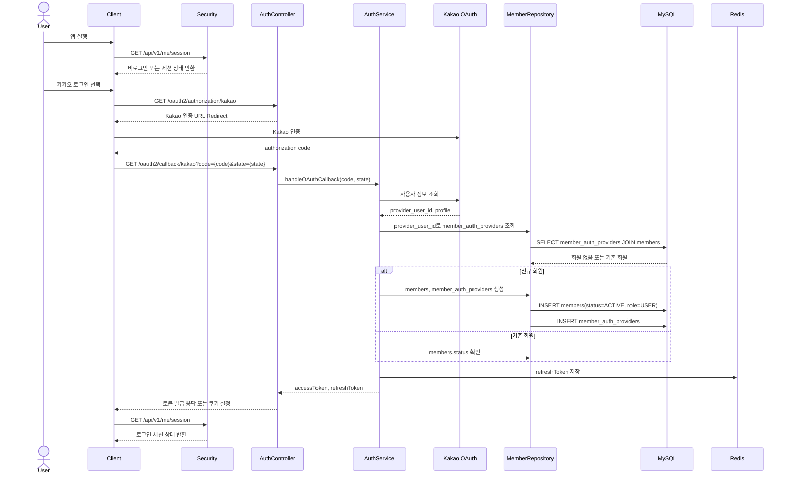

**구현 메모**

- 신규 회원은 `members.status=ACTIVE`, `members.role=USER`로 생성한다.
- Refresh Token은 아키텍처 문서 기준으로 HttpOnly Cookie + Redis 저장을 MVP 권장안으로 둔다.
- `members.SUSPENDED` 회원의 로그인 허용 범위는 화면정의서에서 정책 확정 필요로 남아 있다.

**확인 필요**

- Kakao 콜백 이후 클라이언트 리다이렉트 URI와 토큰 전달 방식.
- 제재 회원(`SUSPENDED`)이 로그인은 가능하되 참여 기능만 제한되는지, 로그인 자체가 차단되는지.

### 3.2 Access Token 만료 및 재발급

**관련 API:** `POST /api/v1/auth/token/refresh`, `POST /api/v1/auth/logout`

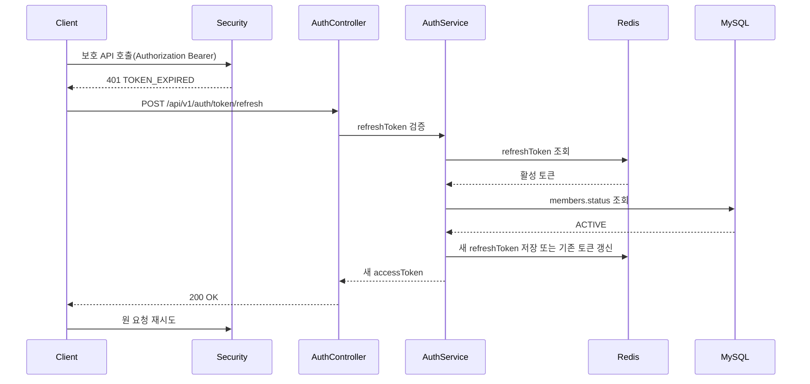

**구현 메모**

- 로그아웃, 탈퇴, 제재 시 Redis의 활성 Refresh Token을 무효화한다.
- `/api/v1/me/session`은 토큰이 있으면 회원 상태를 반환하는 선택 인증 API다.

---

## 4. 오늘의 QT 조회 흐름

### 4.1 오늘 QT 기본 화면 진입

**관련 화면:** Q-01  
**관련 API:** `GET /api/v1/qt/today?date={yyyy-MM-dd}`, `GET /api/v1/qt/{qtPassageId}`  
**관련 테이블:** `qt_passages`, `qt_passage_verses`, `bible_verses`, `notes`

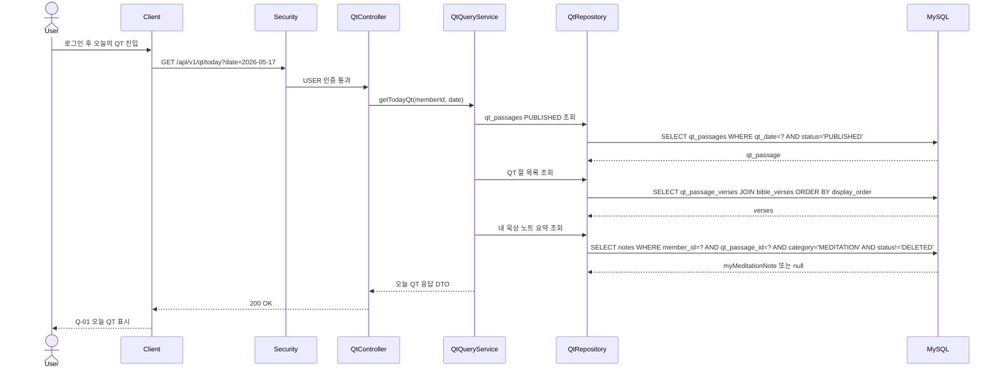

**구현 메모**

- 미게시 본문은 `404 NOT_FOUND`로 처리한다.
- 사용자 화면은 로그인 후 홈 화면 없이 오늘의 QT로 진입한다.
- 오프라인 캐시 본문 표시는 클라이언트 UX 정책이며 서버 API 흐름에는 포함하지 않는다.

**확인 필요**

- 클라이언트 로컬 캐시 저장 범위와 만료 정책.
- `GET /api/v1/qt/today`에서 `date` 파라미터 생략 시 서버 기준일을 사용할지 여부.

### 4.2 요약/해설/용어 펼침

**관련 화면:** Q-02  
**관련 API:** `GET /api/v1/qt/{qtPassageId}/study-content`  
**관련 테이블:** `verse_explanations`, `glossary_terms`, `ai_generated_assets`, `ai_validation_logs`

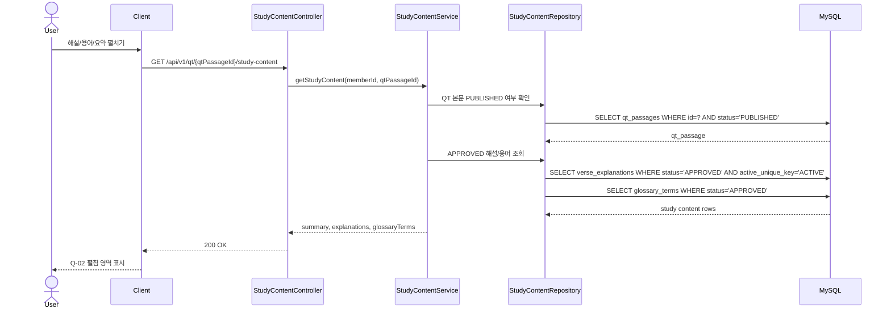

**구현 메모**

- 화면정의서 기준 실시간 AI 해설 생성 버튼은 제공하지 않는다.
- 사용자 노출 기준은 `APPROVED` 상태 콘텐츠다.

---

## 5. QT 노트 작성·저장·공유 흐름

### 5.1 QT 노트 작성 화면 진입 및 임시 노트 조회

**관련 화면:** Q-06  
**관련 API:** `GET /api/v1/notes/draft?category=MEDITATION&qtPassageId={id}`  
**관련 테이블:** `notes`, `note_verses`, `qt_passages`

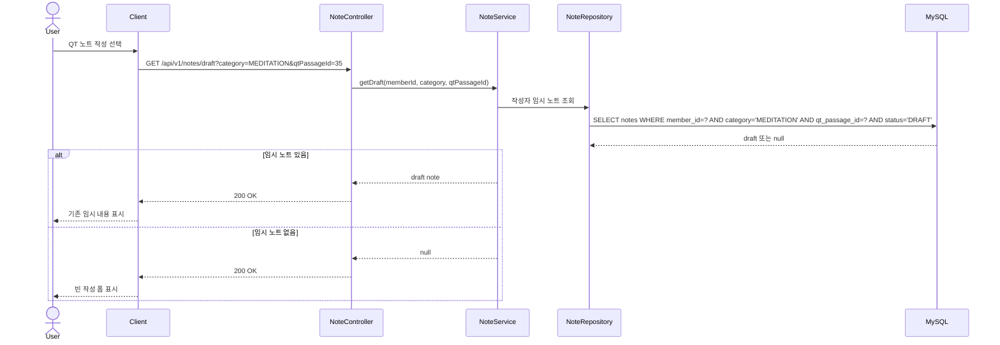

**구현 메모**

- 화면정의서 기준 자동저장은 없다. `임시저장`과 `저장` 버튼만 상태 전이를 만든다.
- `DRAFT` 노트는 작성자만 접근 가능하다.

### 5.2 노트 생성/수정 및 저장 확정

**관련 화면:** Q-06, B-03, N-03, N-04  
**관련 API:** `POST /api/v1/notes`, `PATCH /api/v1/notes/{noteId}`  
**관련 테이블:** `notes`, `note_verses`

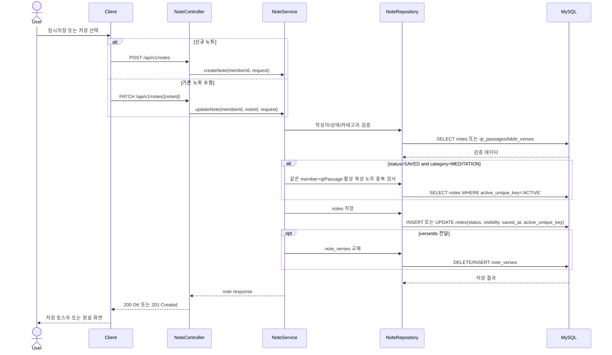

**상태 전이**

| 대상 | 전이 |
|---|---|
| `notes.status` | `DRAFT -> SAVED`, `SAVED -> DRAFT`, `DRAFT/SAVED -> DELETED` |
| `notes.active_unique_key` | 저장 확정된 활성 QT 묵상 노트만 `ACTIVE`, 삭제 또는 비활성화 시 `NULL` |

**구현 메모**

- QT 묵상 노트 1건 제약은 DB 유니크 제약과 Service 검증을 함께 사용한다.
- `MEDITATION`의 `verseIds`는 `qtPassageId`의 구절 범위 안에서만 허용한다.
- `SERMON`은 자유 구절 선택을 허용한다.
- `PRAYER`, `REPENTANCE`, `GRATITUDE`는 구절 없이 저장 가능하다.
- 이미 생성된 `sharing_posts`의 스냅샷은 노트 수정 시 자동 변경하지 않는다.

### 5.3 노트 공유

**관련 화면:** Q-07, N-04  
**관련 API:** `POST /api/v1/notes/{noteId}/share`  
**관련 테이블:** `notes`, `sharing_posts`

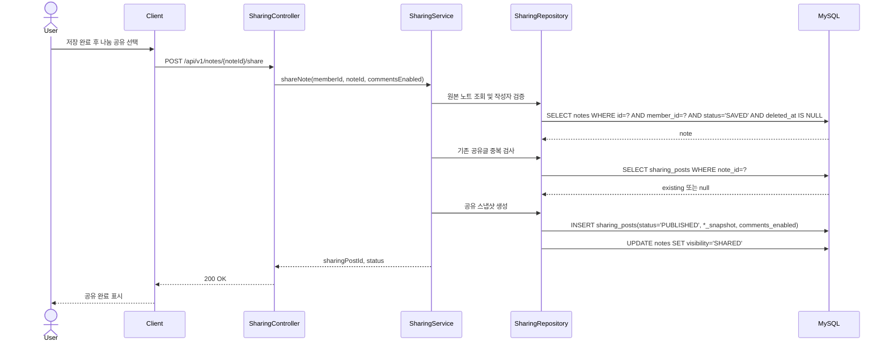

**구현 메모**

- 공유 대상 노트는 `notes.status=SAVED`, `notes.deleted_at IS NULL`이어야 한다.
- 공유 시점의 닉네임, 제목, 본문, 구절을 `sharing_posts` 스냅샷 컬럼에 복사한다.
- 원본 노트가 이후 수정되어도 공유글은 자동 변경하지 않는다.

**확인 필요**

- 이미 공유된 노트에 대해 재공유 요청이 들어온 경우 기존 게시글 반환인지, `409 INVALID_STATUS_TRANSITION`인지 확정 필요.

### 5.4 노트 삭제와 나눔 영향

**관련 API:** `DELETE /api/v1/notes/{noteId}`  
**관련 테이블:** `notes`, `sharing_posts`

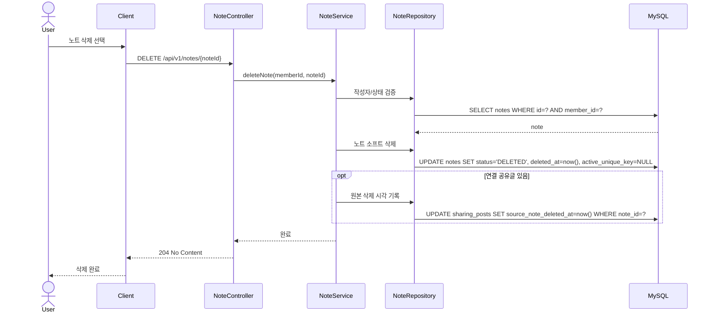

**구현 메모**

- 공유글 스냅샷은 자동 삭제하지 않는다.
- `active_unique_key=NULL` 처리를 누락하면 같은 사용자+같은 QT 본문에 묵상 노트를 재작성할 수 없다.

---

## 6. 일반 성경 조회 및 자유 노트 흐름

### 6.1 일반 성경 조회

**관련 화면:** B-01, B-02  
**관련 API:** `GET /api/v1/bible/books`, `GET /api/v1/bible/verses`  
**관련 테이블:** `bible_books`, `bible_verses`

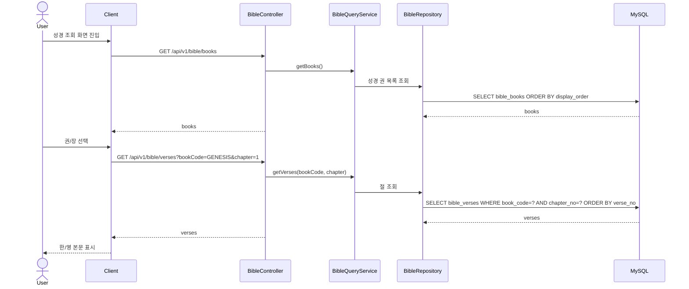

### 6.2 설교/개인 자유 노트 저장

**관련 화면:** B-03, N-02, N-03  
**관련 API:** `GET /api/v1/note-categories`, `POST /api/v1/notes`  
**관련 테이블:** `notes`, `note_verses`

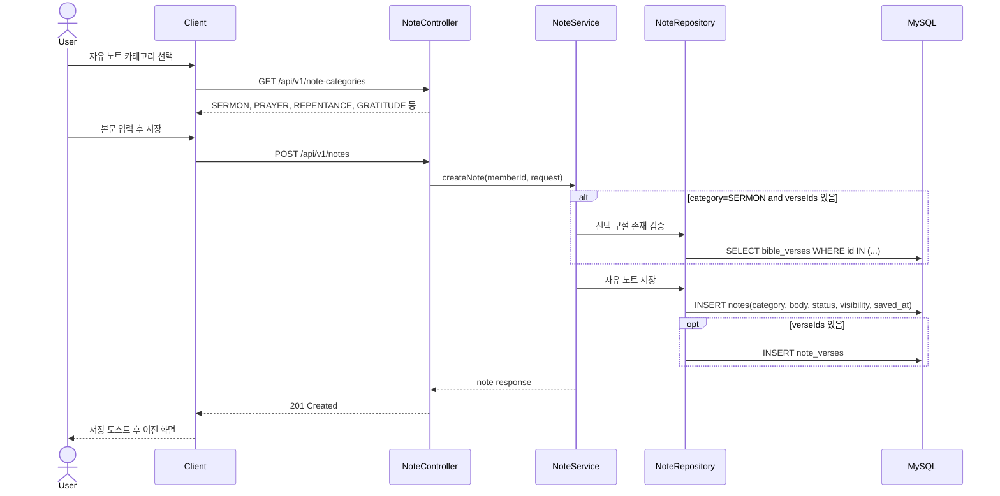

**구현 메모**

- 설교 노트는 구절 선택 가능, 개인 노트는 본문 좌표 없이 저장 가능하다.
- 자유 노트는 `active_unique_key=NULL`을 유지한다.

---

## 7. 닉네임 나눔, 댓글, 좋아요, 신고 흐름

### 7.1 나눔 피드와 상세 조회

**관련 화면:** S-01, S-02  
**관련 API:** `GET /api/v1/sharing-posts`, `GET /api/v1/sharing-posts/{postId}`, `GET /api/v1/sharing-posts/{postId}/comments`  
**관련 테이블:** `sharing_posts`, `comments`, `likes`

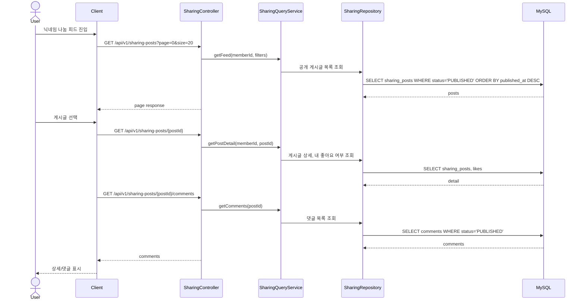

### 7.2 좋아요 생성/취소와 알림

**관련 API:** `POST /api/v1/sharing-posts/{postId}/like`, `DELETE /api/v1/sharing-posts/{postId}/like`  
**관련 테이블:** `likes`, `sharing_posts`, `notifications`

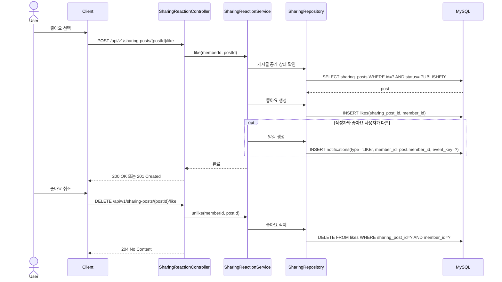

**구현 메모**

- 좋아요 중복은 `uk_likes_post_member` DB 유니크 제약을 우선한다.
- 알림 중복 방지는 `notifications.event_key` 사용을 검토한다.

### 7.3 댓글 작성과 알림

**관련 API:** `POST /api/v1/sharing-posts/{postId}/comments`, `DELETE /api/v1/comments/{commentId}`  
**관련 테이블:** `comments`, `sharing_posts`, `notifications`

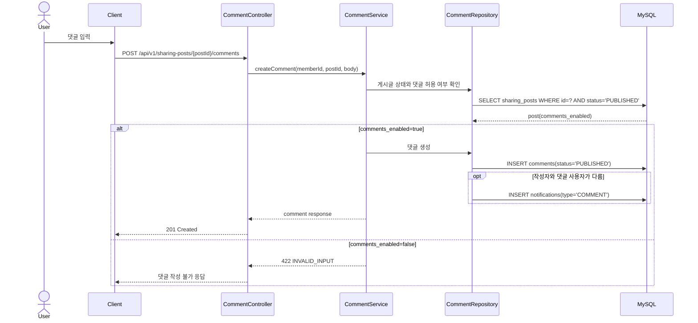

### 7.4 신고 접수

**관련 화면:** S-03, Q-04  
**관련 API:** `POST /api/v1/reports`  
**관련 테이블:** `reports`

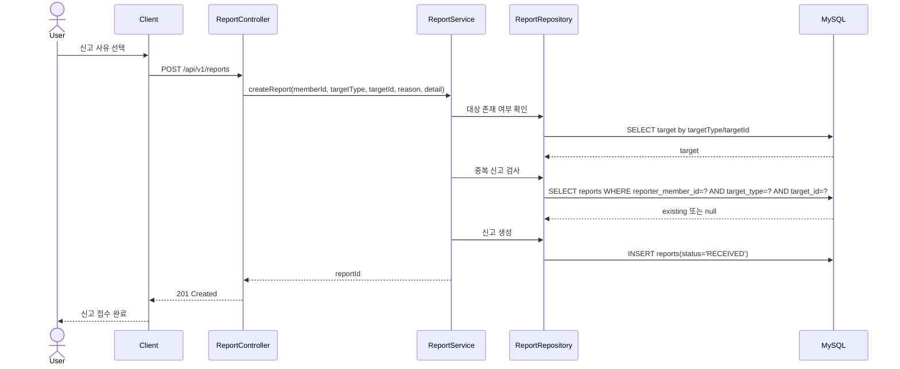

**구현 메모**

- 중복 신고는 `(reporter_member_id, target_type, target_id)` 유니크 제약과 Service 검증을 함께 사용한다.
- `targetType`은 `POST`, `COMMENT`, `AI_QA_REQUEST`, `AI_ASSET`를 사용한다.

---

## 8. AI Q&A 흐름

### 8.1 질문 요청, 비동기 처리, 폴링

**관련 화면:** Q-04  
**관련 API:** `POST /api/v1/ai/qa-requests`, `GET /api/v1/ai/qa-requests/{requestId}`  
**관련 테이블:** `ai_qa_requests`, `ai_generation_jobs`, `ai_generated_assets`, `ai_validation_logs`

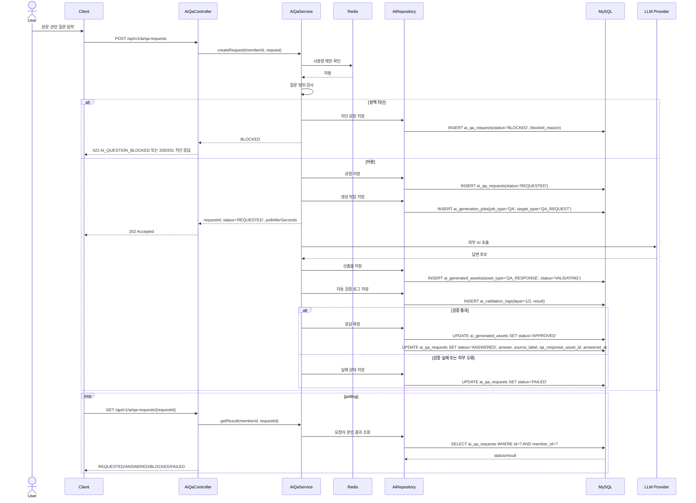

**상태 전이**

| 대상 | 전이 |
|---|---|
| `ai_qa_requests.status` | `REQUESTED -> ANSWERED | BLOCKED | FAILED` |
| `ai_generation_jobs.status` | `QUEUED -> RUNNING -> SUCCEEDED | FAILED` |
| `ai_generated_assets.status` | `VALIDATING -> APPROVED | REJECTED` |

**구현 메모**

- API 명세 기준 기본은 비동기 처리다.
- 서버가 5초 이내 검증까지 완료한 경우에만 `201 Created`와 `status=ANSWERED`를 즉시 반환할 수 있다.
- 차단된 질문은 사용자 노출 응답 산출물을 만들지 않는다.
- Q&A도 `ai_generation_jobs.job_type=QA` 작업을 생성해야 한다.

**확인 필요**

- `POST /api/v1/ai/qa-requests`에서 차단 시 HTTP 상태를 항상 `422`로 할지, 차단 결과 객체를 성공 응답으로 내려줄지 최종 API 테스트 기준 확정 필요.
- 비동기 처리를 요청 스레드 안에서 짧게 수행할지, 별도 큐/스케줄러로 분리할지 구현 방식 확정 필요.
- API 예시의 `contextType=QT_PASSAGE`와 ERD `ai_qa_requests.context_type=QT, BIBLE` 설명 중 최종 enum 기준 확정 필요.

---

## 9. 마이페이지, 알림, 찬양 흐름

### 9.1 마이페이지 대시보드 조회

**관련 화면:** M-01  
**관련 API:** `GET /api/v1/me/dashboard`, `GET /api/v1/me/meditation-calendar`  
**관련 테이블:** `notes`, `notifications`, `member_mission_progress`, `sharing_posts`, `member_praise_songs`

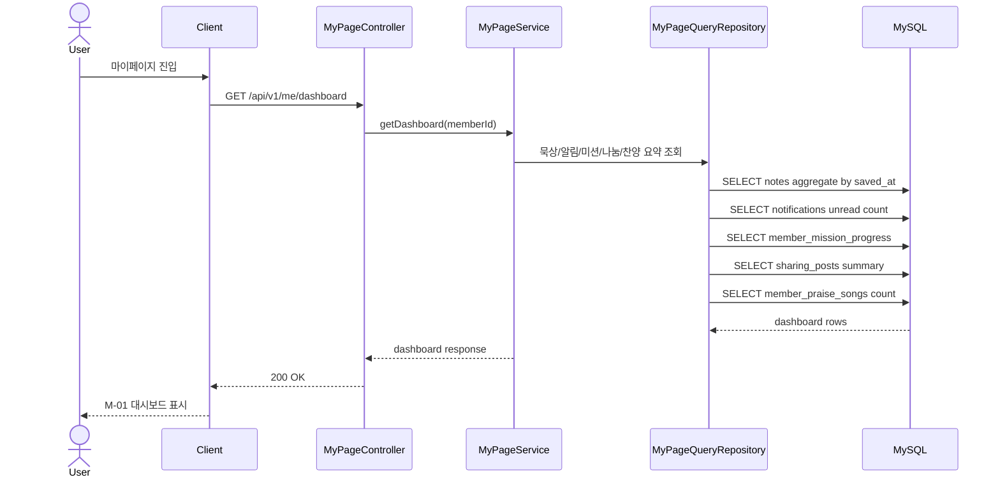

### 9.2 알림 목록 및 읽음 처리

**관련 화면:** M-02  
**관련 API:** `GET /api/v1/notifications`, `PATCH /api/v1/notifications/{notificationId}/read`  
**관련 테이블:** `notifications`, `notices`

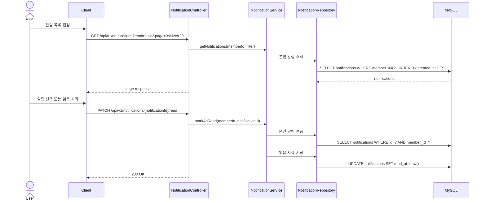

### 9.3 찬양 큐레이션 및 내 찬양 저장

**관련 화면:** M-03  
**관련 API:** `GET /api/v1/praise-songs`, `GET /api/v1/me/praise-songs`, `POST /api/v1/me/praise-songs`, `DELETE /api/v1/me/praise-songs/{id}`  
**관련 테이블:** `praise_songs`, `member_praise_songs`

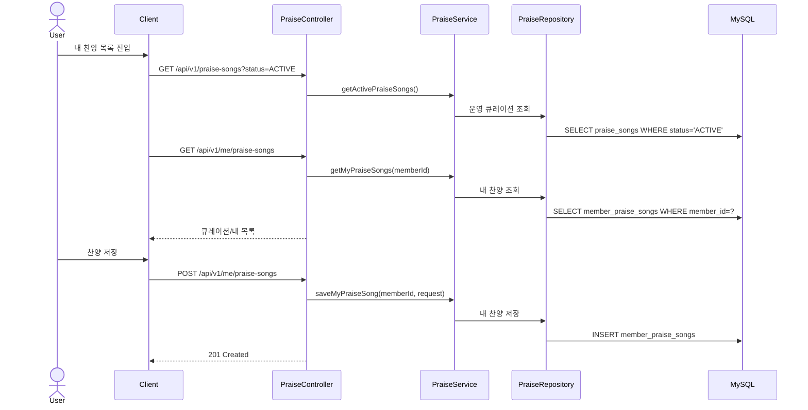

**확인 필요**

- 디바이스 로컬 음원 권한 처리와 서버 저장 필드 매핑의 상세 정책.
- 동일 곡 중복 저장 허용 여부와 유니크 제약 적용 범위.

---

## 10. 관리자 운영 흐름

### 10.1 관리자 QT 본문 등록·게시

**관련 화면:** AD-02  
**관련 API:** `POST /api/v1/admin/qt-passages`, `PATCH /api/v1/admin/qt-passages/{id}`, `POST /api/v1/admin/qt-passages/{id}/publish`, `POST /api/v1/admin/qt-passages/{id}/hide`  
**관련 테이블:** `qt_passages`, `qt_passage_verses`, `bible_verses`, `audit_logs`

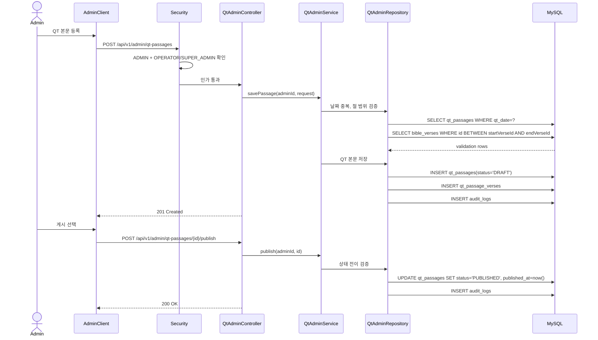

**구현 메모**

- 관리자 API는 `members.role=ADMIN`과 `admin_users.admin_role`을 모두 검사한다.
- QT 날짜는 `qt_passages.qt_date` 유니크 제약 대상이다.

### 10.2 AI 사전 생성 배치

**관련 기능:** F-02, F-08, F-12, F-14  
**관련 API:** `POST /api/v1/system/ai/generation-jobs`, `POST /api/v1/system/ai/assets`, `POST /api/v1/system/ai/validation-logs`  
**관련 테이블:** `ai_prompt_versions`, `ai_generation_jobs`, `ai_generated_assets`, `ai_validation_logs`, `verse_explanations`, `simulator_clips`

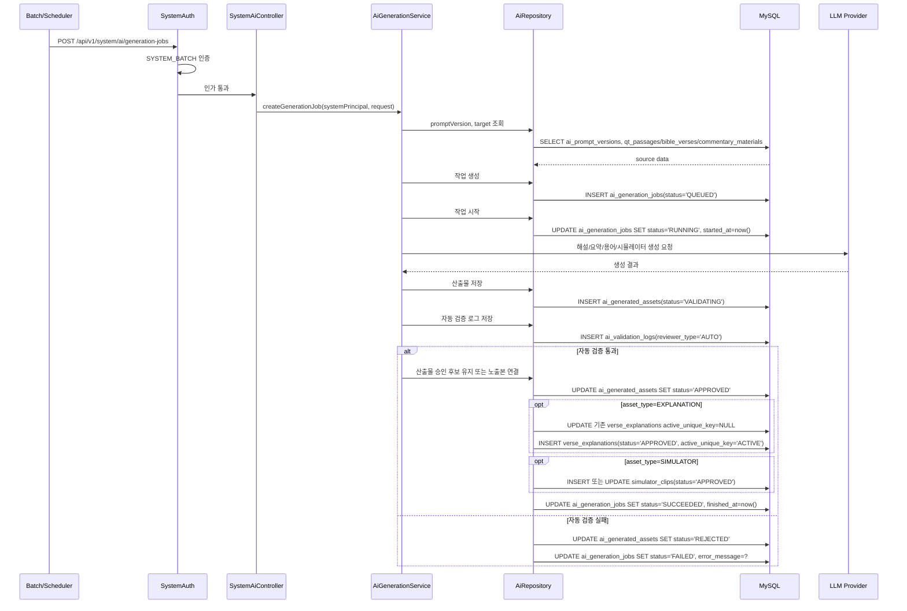

**구현 메모**

- 아키텍처 문서에는 검증 통과 시 `verse_explanations` 또는 `simulator_clips`에 사용자 노출본을 연결한다고 되어 있다.
- API 문서에는 관리자 수동 승인 API도 존재한다. 자동 검증 후 즉시 승인/노출할 범위와 관리자 검토 필수 범위는 운영 정책에 맞춰 분리해야 한다.

**확인 필요**

- 해설/요약/용어/시뮬레이터별 자동 승인 가능 범위.
- `SUMMARY`, `GLOSSARY` 산출물이 최종적으로 어느 노출 테이블 또는 JSON 구조에 저장되는지 상세 매핑.

### 10.3 관리자 AI 산출물 승인·반려·재생성

**관련 화면:** AD-03, AD-08  
**관련 API:** `GET /api/v1/admin/ai/assets`, `POST /api/v1/admin/ai/assets/{assetId}/approve`, `POST /api/v1/admin/ai/assets/{assetId}/reject`, `POST /api/v1/admin/ai/assets/{assetId}/regenerate`  
**관련 테이블:** `ai_generated_assets`, `ai_validation_logs`, `ai_validation_checklist_versions`, `verse_explanations`, `simulator_clips`, `audit_logs`

```mermaid
sequenceDiagram
    actor Admin as Admin
    participant AdminClient as AdminClient
    participant Security as Security
    participant AiAdminApi as AiAssetAdminController
    participant ReviewService as AiAssetReviewService
    participant Repo as AiRepository
    participant MySQL as MySQL

    Admin->>AdminClient: AI 산출물 검증 화면 진입
    AdminClient->>Security: GET /api/v1/admin/ai/assets?status=VALIDATING
    Security->>Security: ADMIN + REVIEWER/SUPER_ADMIN 확인
    Security->>AiAdminApi: 인가 통과
    AiAdminApi->>ReviewService: getAssets(filter)
    ReviewService->>Repo: 산출물 목록 조회
    Repo->>MySQL: SELECT ai_generated_assets JOIN latest ai_validation_logs
    MySQL-->>Repo: assets
    AiAdminApi-->>AdminClient: page response
    Admin->>AdminClient: 승인 선택
    AdminClient->>AiAdminApi: POST /api/v1/admin/ai/assets/{assetId}/approve
    AiAdminApi->>ReviewService: approve(adminId, assetId, checklistVersionId, activateForTarget)
    ReviewService->>Repo: 활성 체크리스트와 최신 검증 로그 확인
    Repo->>MySQL: SELECT ai_validation_checklist_versions WHERE id=? AND status='ACTIVE'
    Repo->>MySQL: SELECT ai_validation_logs WHERE ai_asset_id=? AND checklist_version_id=?
    alt 승인 조건 충족
        ReviewService->>Repo: 산출물 승인
        Repo->>MySQL: UPDATE ai_generated_assets SET status='APPROVED'
        opt activateForTarget=true and asset_type=EXPLANATION
            Repo->>MySQL: UPDATE 기존 verse_explanations active_unique_key=NULL
            Repo->>MySQL: INSERT 또는 UPDATE verse_explanations(status='APPROVED', active_unique_key='ACTIVE')
        end
        opt activateForTarget=true and asset_type=SIMULATOR
            Repo->>MySQL: INSERT 또는 UPDATE simulator_clips(status='APPROVED')
        end
        Repo->>MySQL: INSERT audit_logs(action_type='AI_ASSET_APPROVE')
        AiAdminApi-->>AdminClient: 200 OK
    else 승인 조건 미충족
        ReviewService-->>AiAdminApi: CHECKLIST_VERSION_REQUIRED 또는 AI_VALIDATION_FAILED
        AiAdminApi-->>AdminClient: 409 또는 422
    end
```

**구현 메모**

- 승인/반려/숨김/재생성/평가 후보 등록은 모두 `audit_logs`에 기록한다.
- 절별 해설 승인 시 기존 ACTIVE 해설의 `active_unique_key=NULL` 처리 후 신규 승인본을 `APPROVED + ACTIVE`로 연결한다.

### 10.4 신고 처리

**관련 화면:** AD-04  
**관련 API:** `GET /api/v1/admin/reports`, `POST /api/v1/admin/reports/{reportId}/resolve`, `POST /api/v1/admin/reports/{reportId}/reject`  
**관련 테이블:** `reports`, `sharing_posts`, `comments`, `ai_qa_requests`, `ai_generated_assets`, `notifications`, `audit_logs`

```mermaid
sequenceDiagram
    actor Admin as Admin
    participant AdminClient as AdminClient
    participant Security as Security
    participant ReportAdminApi as ReportAdminController
    participant ReportAdminService as ReportAdminService
    participant Repo as ReportRepository
    participant MySQL as MySQL

    Admin->>AdminClient: 신고 목록 조회
    AdminClient->>Security: GET /api/v1/admin/reports?status=RECEIVED
    Security->>Security: ADMIN + OPERATOR/SUPER_ADMIN 확인
    Security->>ReportAdminApi: 인가 통과
    ReportAdminApi->>ReportAdminService: getReports(filter)
    ReportAdminService->>Repo: 신고 목록 조회
    Repo->>MySQL: SELECT reports WHERE status IN (...)
    MySQL-->>Repo: reports
    ReportAdminApi-->>AdminClient: page response
    Admin->>AdminClient: 처리 선택
    AdminClient->>ReportAdminApi: POST /api/v1/admin/reports/{reportId}/resolve
    ReportAdminApi->>ReportAdminService: resolve(adminId, reportId, action, notifyReporter)
    ReportAdminService->>Repo: 신고와 대상 조회
    Repo->>MySQL: SELECT reports WHERE id=?
    Repo->>MySQL: SELECT target by target_type/target_id
    alt action=HIDE_TARGET
        Repo->>MySQL: UPDATE sharing_posts/comments/ai_generated_assets SET status='HIDDEN'
    end
    ReportAdminService->>Repo: 신고 처리 완료
    Repo->>MySQL: UPDATE reports SET status='RESOLVED', processed_by_admin_id=?, processed_at=now()
    opt notifyReporter=true
        Repo->>MySQL: INSERT notifications(type='REPORT_RESULT')
    end
    Repo->>MySQL: INSERT audit_logs
    ReportAdminApi-->>AdminClient: 200 OK
```

**상태 전이**

| 대상 | 전이 |
|---|---|
| `reports.status` | `RECEIVED -> REVIEWING -> RESOLVED | REJECTED` |
| `sharing_posts.status` | `PUBLISHED -> HIDDEN | DELETED` |
| `comments.status` | `PUBLISHED -> HIDDEN | DELETED` |
| `ai_generated_assets.status` | `APPROVED -> HIDDEN` |

**확인 필요**

- 신고 처리에서 `RECEIVED -> REVIEWING` 중간 상태를 별도 API로 제공할지, resolve/reject 처리 시 내부적으로 생략할지.
- AI Q&A 요청 자체(`ai_qa_requests`)를 숨김 처리할지, 연결 산출물(`ai_generated_assets`)만 숨김 처리할지.

### 10.5 시스템 공지 발행과 알림 생성

**관련 화면:** AD-06, M-02  
**관련 API:** `POST /api/v1/admin/notices`, `POST /api/v1/admin/notices/{id}/publish`  
**관련 테이블:** `notices`, `notifications`, `audit_logs`

```mermaid
sequenceDiagram
    actor Admin as Admin
    participant AdminClient as AdminClient
    participant NoticeApi as NoticeAdminController
    participant NoticeService as NoticeAdminService
    participant Repo as NoticeRepository
    participant MySQL as MySQL

    Admin->>AdminClient: 공지 작성
    AdminClient->>NoticeApi: POST /api/v1/admin/notices
    NoticeApi->>NoticeService: createNotice(adminId, request)
    NoticeService->>Repo: 공지 초안 저장
    Repo->>MySQL: INSERT notices(status='DRAFT')
    Repo->>MySQL: INSERT audit_logs
    NoticeApi-->>AdminClient: 201 Created
    Admin->>AdminClient: 공지 발행
    AdminClient->>NoticeApi: POST /api/v1/admin/notices/{id}/publish
    NoticeApi->>NoticeService: publishNotice(adminId, noticeId)
    NoticeService->>Repo: 공지 상태 변경
    Repo->>MySQL: UPDATE notices SET status='PUBLISHED', published_at=now()
    NoticeService->>Repo: 공지 알림 생성
    Repo->>MySQL: INSERT notifications(type='NOTICE', notice_id, link_type, link_id)
    Repo->>MySQL: INSERT audit_logs
    NoticeApi-->>AdminClient: 200 OK
```

**확인 필요**

- 공지 발행 시 전체 회원에게 즉시 `notifications`를 개별 생성할지, 목록 조회 시 공지 기반으로 동적 생성할지.
- 대량 알림 생성 시 배치 분리 여부.

---

## 11. 회원 정보와 탈퇴 흐름

### 11.1 프로필 수정과 닉네임 중복 확인

**관련 화면:** A-03, M-04  
**관련 API:** `GET /api/v1/members/nickname/check`, `PATCH /api/v1/me/profile`  
**관련 테이블:** `members`

```mermaid
sequenceDiagram
    actor User as User
    participant Client as Client
    participant MemberApi as MemberController
    participant MemberService as MemberService
    participant Repo as MemberRepository
    participant MySQL as MySQL

    User->>Client: 닉네임 입력
    Client->>MemberApi: GET /api/v1/members/nickname/check?nickname=하늘QT
    MemberApi->>MemberService: checkNickname(nickname)
    MemberService->>Repo: 닉네임 중복 조회
    Repo->>MySQL: SELECT members WHERE nickname=?
    MySQL-->>Repo: existing 또는 null
    MemberApi-->>Client: 사용 가능 여부
    User->>Client: 프로필 저장
    Client->>MemberApi: PATCH /api/v1/me/profile
    MemberApi->>MemberService: updateProfile(memberId, request)
    MemberService->>Repo: 본인 회원 조회 및 닉네임 중복 재검증
    Repo->>MySQL: SELECT/UPDATE members
    MemberApi-->>Client: 200 OK
```

### 11.2 회원 탈퇴

**관련 화면:** M-04  
**관련 API:** `POST /api/v1/me/withdraw`  
**관련 테이블:** `members`, `notifications`, `sharing_posts`, `ai_qa_requests`, Redis token

```mermaid
sequenceDiagram
    actor User as User
    participant Client as Client
    participant MemberApi as MemberController
    participant WithdrawalService as MemberWithdrawalService
    participant Repo as MemberRepository
    participant MySQL as MySQL
    participant Redis as Redis

    User->>Client: 탈퇴 확인
    Client->>MemberApi: POST /api/v1/me/withdraw
    MemberApi->>WithdrawalService: withdraw(memberId)
    WithdrawalService->>Repo: 회원 상태 변경
    Repo->>MySQL: UPDATE members SET status='WITHDRAWN'
    WithdrawalService->>Redis: 활성 토큰 무효화
    WithdrawalService->>Repo: 노출 차단/개인정보 익명화 대상 처리
    Repo->>MySQL: UPDATE sharing_posts or member related display fields as policy
    WithdrawalService-->>MemberApi: 완료
    MemberApi-->>Client: 200 OK 또는 204 No Content
    Client-->>User: 로그인 화면 이동
```

**구현 메모**

- 아키텍처 문서 기준 탈퇴는 단일 트랜잭션 물리 삭제가 아니다.
- `members.status=WITHDRAWN`, 토큰 무효화, 노출 차단, 개인정보 익명화/보존 만료 후 정리 배치로 단계 분리한다.

**확인 필요**

- 탈퇴 API의 성공 HTTP 상태 코드.
- 나눔 스냅샷의 닉네임 표시 익명화 범위.
- Q&A 원문 보존/익명화 정책 버전과 보존 기간.

---

## 12. TTS 흐름

### 12.1 클라이언트 TTS 우선 재생

**관련 화면:** Q-05, B-01  
**관련 API:** 서버 저장 없음. 필요 시 `POST /api/v1/tts/play-events`  
**관련 테이블:** API/ERD 확정 없음

```mermaid
sequenceDiagram
    actor User as User
    participant Client as Client
    participant DeviceTts as Device TTS
    participant Api as Optional TTS Event API

    User->>Client: TTS 재생 선택
    Client->>Client: 기기 TTS 지원 여부 확인
    alt 지원
        Client->>DeviceTts: 본문/해설 텍스트 재생
        DeviceTts-->>Client: 재생 상태
        opt 재생 이벤트 저장 필요
            Client->>Api: POST /api/v1/tts/play-events
            Api-->>Client: 204 No Content
        end
        Client-->>User: 미니 플레이어 표시
    else 미지원
        Client-->>User: 기능 사용 불가 안내
    end
```

**확인 필요**

- `POST /api/v1/tts/play-events`의 요청/응답 스키마와 저장 테이블.
- TTS 이벤트를 MVP에서 구현할지 여부.

---

## 13. 구현 우선순위 기준 시퀀스 묶음

| 우선순위 | 구현 흐름 | 관련 섹션 |
|---|---|---|
| P0 | 로그인, 오늘 QT 조회, 학습 콘텐츠 조회, QT 노트 저장, 마이페이지 | 3, 4, 5, 9 |
| P1 | 관리자 QT 관리, AI 사전 생성/검증, AI Q&A | 8, 10 |
| P2 | 자유 노트, 나눔, 댓글/좋아요/신고, 알림, 찬양 | 6, 7, 9 |
| P3 | 시뮬레이터, TTS, 추가 운영 모니터링 | 4.2, 10.2, 12 |

---

## 14. 확인 필요 목록

| 구분 | 확인 필요 항목 | 영향 |
|---|---|---|
| 인증 | Kakao 콜백 후 토큰 전달 방식과 리다이렉트 URI | 클라이언트 로그인 구현 |
| 권한 | `SUSPENDED` 회원 로그인 허용 범위 | Security, 참여 기능 제한 |
| QT 조회 | `GET /api/v1/qt/today`의 date 생략 처리 기준 | API 기본값 |
| 캐시 | 오프라인 본문 캐시 범위와 만료 정책 | 클라이언트 저장소 |
| 노트 공유 | 이미 공유된 노트 재공유 응답 정책 | API 오류/멱등성 |
| AI Q&A | 차단 질문의 HTTP 상태 코드와 성공 envelope 여부 | 프론트 예외 처리 |
| AI Q&A | 비동기 처리 방식: 요청 스레드, 내부 이벤트, 스케줄러, 큐 | 백엔드 구조 |
| AI Q&A | `contextType` enum 기준: API 예시 `QT_PASSAGE` vs ERD 설명 `QT, BIBLE` | 요청 DTO, DB enum 매핑 |
| AI 생성 | 자동 승인 가능한 산출물 범위 | 운영 정책, 관리자 검수 |
| AI 생성 | `SUMMARY`, `GLOSSARY` 최종 저장 위치 | ERD/API 필드 매핑 |
| 신고 | `RECEIVED -> REVIEWING` 전이 API 제공 여부 | 관리자 UX |
| 신고 | AI Q&A 신고 시 숨김 대상 | AI 응답 노출 정책 |
| 공지 | 공지 발행 시 알림 개별 생성 또는 동적 생성 | 대량 처리 성능 |
| 탈퇴 | 성공 HTTP 상태 코드, 스냅샷 익명화 범위 | API/개인정보 정책 |
| TTS | `POST /api/v1/tts/play-events` 구현 여부와 스키마 | MVP 범위 |

---

## 15. 변경 이력

| 버전 | 날짜 | 작성자 | 주요 변경 |
|---|---|---|---|
| v1.0 | 2026-05-17 | Backend Architect | 요구사항, ERD, 화면정의서, API 명세서, 아키텍처 정의서 기준 기능별 Mermaid 시퀀스 초안 작성 |
