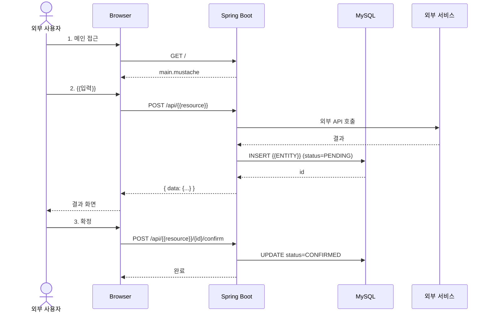
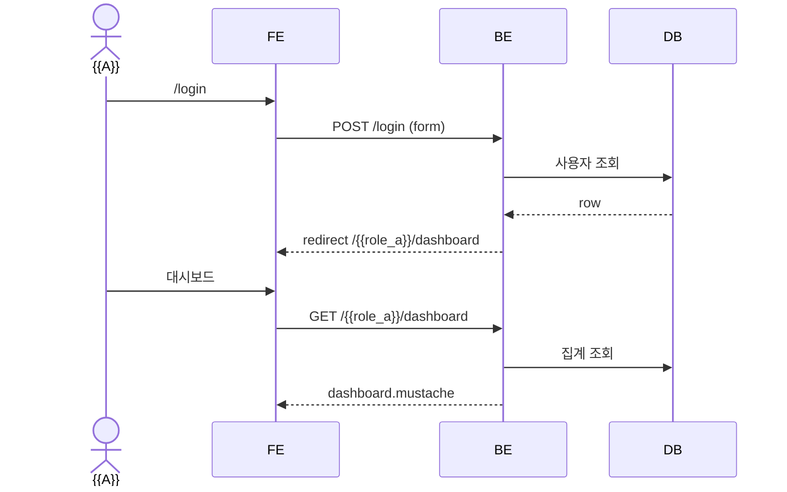
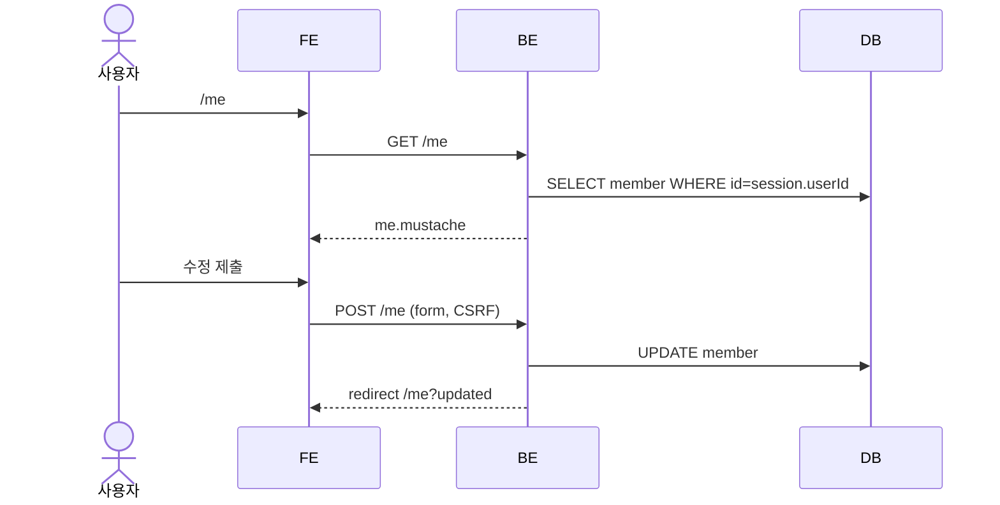

# {{EMOJI}} {{PROJECT_NAME}} — 화면 흐름 시퀀스 다이어그램 v1.0

> **문서 버전:** v1.0
> **작성일:** YYYY-MM-DD
> **연관 문서:** API 명세서 v1.0 / 화면 기능 정의서 v1.0

---

## 목차
1. 외부 사용자 — {{기능 1}} 흐름
2. 외부 사용자 — {{기능 2}} 흐름 (폴백)
3. ROLE_{{A}} — 로그인·대시보드·핵심 업무 흐름
4. ROLE_{{B}} — 로그인·대시보드·핵심 업무 흐름
5. ROLE_{{C}} — 로그인·대시보드·핵심 업무 흐름
6. ROLE_ADMIN — 관리자 CRUD 대표 흐름
7. 내 정보관리(MyPage) 흐름

---

## 1. 외부 사용자 — {{기능 1}} 흐름

### 🎯 목적
{{유스케이스 한 줄 설명}}

### 📌 주요 상태 변화
- {{ENTITY}}: NONE → PENDING → CONFIRMED

### 🔄 시퀀스 다이어그램

### 📝 흐름 설명
1. ...
2. ...
3. ...

---

## 2. 외부 사용자 — {{기능 2}} 흐름 (폴백)

### 🎯 목적
{{폴백 경로 설명}}

### 📌 주요 상태 변화
### 🔄 시퀀스 다이어그램
### 📝 흐름 설명

---

## 3. ROLE_{{A}} — 로그인·대시보드·핵심 업무 흐름

### 🎯 목적
### 📌 주요 상태 변화
### 🔄 시퀀스 다이어그램

### 📝 흐름 설명

### 📋 사이드바 메뉴 (ROLE_{{A}})
- 대시보드
- {{리소스1}} 관리
- {{리소스2}} 조회
- 내 정보관리
- 로그아웃

---

<!-- ROLE_B, ROLE_C, ROLE_ADMIN 섹션을 같은 패턴으로 복제 -->

---

## 7. 내 정보관리(MyPage) 흐름 (공통)

### 🎯 목적
모든 로그인 사용자가 자신의 정보를 조회·수정할 수 있는 통합 흐름.

### 📌 주요 상태 변화

### 🔄 시퀀스 다이어그램

### 📝 흐름 설명

---

## 📌 변경 이력

| 버전 | 날짜 | 작성자 | 주요 변경 |
| --- | --- | --- | --- |
| v1.0 | YYYY-MM-DD | Lead | 초기 작성 |
